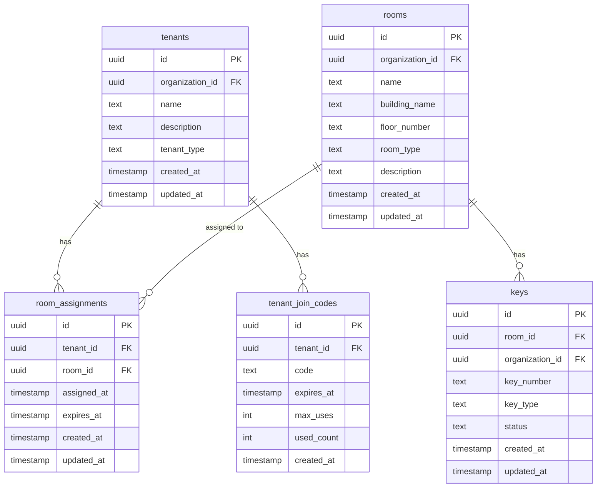

# データベース設計

## ER図

## リレーションシップの説明

### 1. Tenants ↔ Room Assignments (1:N)
- 1つのテナントは複数の部屋割り当てを持つことができる
- 割り当ては期間管理され、履歴として保持される

### 2. Rooms ↔ Room Assignments (1:N)
- 1つの部屋は複数のテナントに時系列で割り当てられる可能性がある
- 現在の割り当ては `expires_at IS NULL` または `expires_at > NOW()` で判定

### 3. Rooms ↔ Keys (1:N)
- 1つの部屋は複数の鍵を持つことができる
- 鍵は部屋に固定的に関連付けられる

### 4. Organization による分離
- すべてのリソースは `organization_id` でマルチテナント分離される
- Row Level Security (RLS) ポリシーで強制される

---

## テーブル設計

### 1. rooms テーブル

| カラム名 | 型 | 制約 | 説明 |
|---------|-----|------|------|
| id | UUID | PRIMARY KEY | 部屋ID |
| organization_id | UUID | NOT NULL | 組織ID |
| name | TEXT | NOT NULL | 部屋名 |
| building_name | TEXT | NOT NULL | 建物名 |
| floor_number | TEXT | NOT NULL | 階数（例: "1F", "B1", "3階"） |
| room_type | TEXT | NOT NULL | 部屋タイプ |
| description | TEXT | NOT NULL DEFAULT '' | 説明 |
| created_at | TIMESTAMP WITH TIME ZONE | NOT NULL | 作成日時 |
| updated_at | TIMESTAMP WITH TIME ZONE | NOT NULL | 更新日時 |

#### インデックス
- `idx_rooms_organization_id`: organization_id
- `idx_rooms_room_type`: room_type
- `idx_rooms_organization_name`: (organization_id, name) UNIQUE

#### room_type ENUM値
- `classroom` - 教室
- `meeting_room` - 会議室
- `laboratory` - 実験室
- `office` - オフィス
- `workshop` - 作業室
- `storage` - 倉庫

---

### 2. keys テーブル

| カラム名 | 型 | 制約 | 説明 |
|---------|-----|------|------|
| id | UUID | PRIMARY KEY | 鍵ID |
| room_id | UUID | NOT NULL, FK → rooms(id) | 部屋ID |
| organization_id | UUID | NOT NULL | 組織ID |
| key_number | TEXT | NOT NULL | 鍵番号（例: "K-101-A"） |
| key_type | TEXT | NOT NULL | 鍵タイプ |
| status | TEXT | NOT NULL DEFAULT 'available' | 鍵ステータス |
| created_at | TIMESTAMP WITH TIME ZONE | NOT NULL | 作成日時 |
| updated_at | TIMESTAMP WITH TIME ZONE | NOT NULL | 更新日時 |

#### インデックス
- `idx_keys_room_id`: room_id
- `idx_keys_organization_id`: organization_id
- `idx_keys_status`: status
- `idx_keys_organization_key_number`: (organization_id, key_number) UNIQUE

#### key_type ENUM値
- `physical` - 物理的な鍵
- `card` - カードキー
- `digital` - デジタルキー（スマートロックなど）

#### status ENUM値
- `available` - 利用可能
- `in_use` - 貸出中
- `lost` - 紛失
- `damaged` - 破損

---

### 3. room_assignments テーブル

| カラム名 | 型 | 制約 | 説明 |
|---------|-----|------|------|
| id | UUID | PRIMARY KEY | 割り当てID |
| tenant_id | UUID | NOT NULL, FK → tenants(id) | テナントID |
| room_id | UUID | NOT NULL, FK → rooms(id) | 部屋ID |
| assigned_at | TIMESTAMP WITH TIME ZONE | NOT NULL | 割り当て日時 |
| expires_at | TIMESTAMP WITH TIME ZONE | | 有効期限（NULLは無期限） |
| created_at | TIMESTAMP WITH TIME ZONE | NOT NULL | 作成日時 |
| updated_at | TIMESTAMP WITH TIME ZONE | NOT NULL | 更新日時 |

#### インデックス
- `idx_room_assignments_tenant_id`: tenant_id
- `idx_room_assignments_room_id`: room_id
- `idx_room_assignments_assigned_at`: assigned_at
- `idx_room_assignments_expires_at`: expires_at
- `idx_room_assignments_active`: (tenant_id, room_id) WHERE expires_at IS NULL OR expires_at > CURRENT_TIMESTAMP

#### 制約
- `room_assignments_date_check`: expires_at IS NULL OR expires_at > assigned_at
