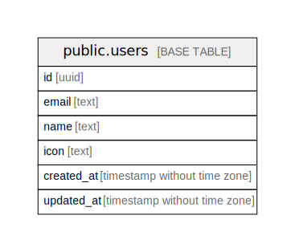

# keyhub

## Tables

| Name | Columns | Comment | Type |
| ---- | ------- | ------- | ---- |
| [public.users](public.users.md) | 6 |  | BASE TABLE |
| [public.user_identities](public.user_identities.md) | 6 |  | BASE TABLE |
| [public.sessions](public.sessions.md) | 7 |  | BASE TABLE |
| [public.oauth_states](public.oauth_states.md) | 5 |  | BASE TABLE |
| [public.tenants](public.tenants.md) | 7 |  | BASE TABLE |
| [public.tenant_join_codes](public.tenant_join_codes.md) | 7 |  | BASE TABLE |
| [public.tenant_memberships](public.tenant_memberships.md) | 6 |  | BASE TABLE |
| [public.console_sessions](public.console_sessions.md) | 4 |  | BASE TABLE |

## Stored procedures and functions

| Name | ReturnType | Arguments | Type |
| ---- | ------- | ------- | ---- |
| public.uuid_nil | uuid |  | FUNCTION |
| public.uuid_ns_dns | uuid |  | FUNCTION |
| public.uuid_ns_url | uuid |  | FUNCTION |
| public.uuid_ns_oid | uuid |  | FUNCTION |
| public.uuid_ns_x500 | uuid |  | FUNCTION |
| public.uuid_generate_v1 | uuid |  | FUNCTION |
| public.uuid_generate_v1mc | uuid |  | FUNCTION |
| public.uuid_generate_v3 | uuid | namespace uuid, name text | FUNCTION |
| public.uuid_generate_v4 | uuid |  | FUNCTION |
| public.uuid_generate_v5 | uuid | namespace uuid, name text | FUNCTION |
| public.update_updated_at_column | trigger |  | FUNCTION |
| public.current_membership_id | uuid |  | FUNCTION |
| public.current_tenant_id | uuid |  | FUNCTION |
| public.current_organization_id | uuid |  | FUNCTION |

## Relations

---

> Generated by [tbls](https://github.com/k1LoW/tbls)
