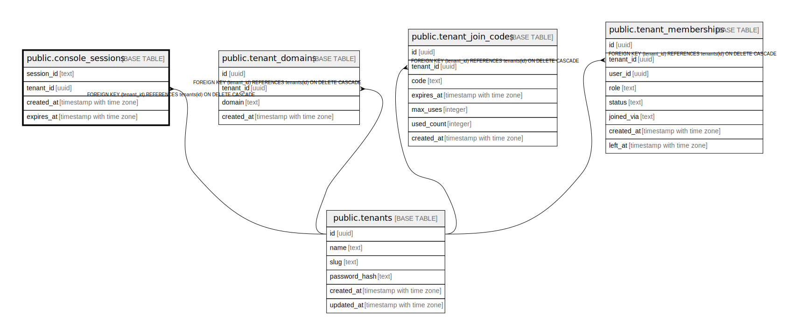

# public.console_sessions

## Description

## Columns

| Name | Type | Default | Nullable | Children | Parents | Comment |
| ---- | ---- | ------- | -------- | -------- | ------- | ------- |
| session_id | text |  | false |  |  |  |
| tenant_id | uuid |  | false |  | [public.tenants](public.tenants.md) |  |
| created_at | timestamp with time zone | CURRENT_TIMESTAMP | false |  |  |  |
| expires_at | timestamp with time zone |  | false |  |  |  |

## Constraints

| Name | Type | Definition |
| ---- | ---- | ---------- |
| console_sessions_tenant_id_fkey | FOREIGN KEY | FOREIGN KEY (tenant_id) REFERENCES tenants(id) ON DELETE CASCADE |
| console_sessions_pkey | PRIMARY KEY | PRIMARY KEY (session_id) |

## Indexes

| Name | Definition |
| ---- | ---------- |
| console_sessions_pkey | CREATE UNIQUE INDEX console_sessions_pkey ON public.console_sessions USING btree (session_id) |
| idx_console_sessions_tenant | CREATE INDEX idx_console_sessions_tenant ON public.console_sessions USING btree (tenant_id) |
| idx_console_sessions_expires | CREATE INDEX idx_console_sessions_expires ON public.console_sessions USING btree (expires_at) |

## Relations

---

> Generated by [tbls](https://github.com/k1LoW/tbls)
