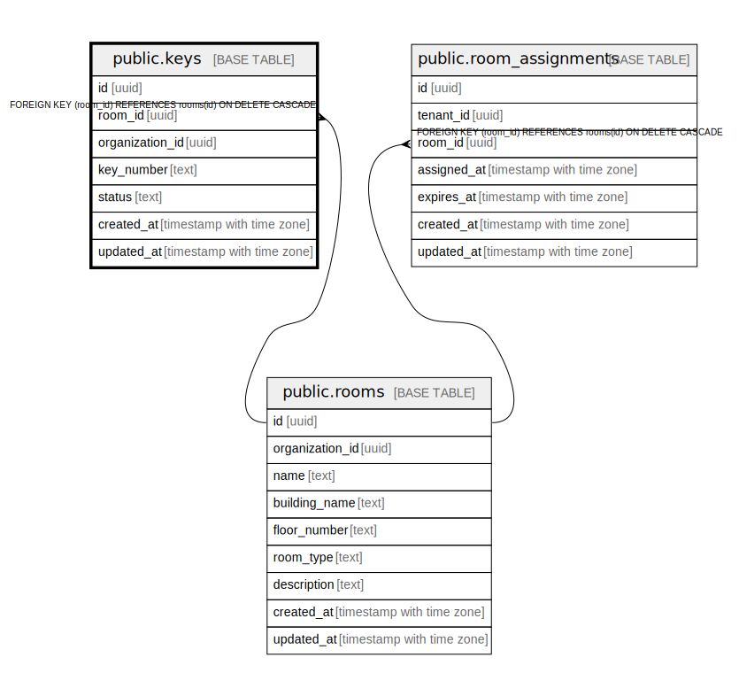

# public.keys

## Description

## Columns

| Name | Type | Default | Nullable | Children | Parents | Comment |
| ---- | ---- | ------- | -------- | -------- | ------- | ------- |
| id | uuid | uuid_generate_v4() | false |  |  |  |
| room_id | uuid |  | false |  | [public.rooms](public.rooms.md) |  |
| organization_id | uuid | '550e8400-e29b-41d4-a716-446655440000'::uuid | false |  |  |  |
| key_number | text |  | false |  |  |  |
| status | text | 'available'::text | false |  |  |  |
| created_at | timestamp with time zone | CURRENT_TIMESTAMP | false |  |  |  |
| updated_at | timestamp with time zone | CURRENT_TIMESTAMP | false |  |  |  |

## Constraints

| Name | Type | Definition |
| ---- | ---- | ---------- |
| keys_status_check | CHECK | CHECK ((status = ANY (ARRAY['available'::text, 'in_use'::text, 'lost'::text, 'damaged'::text]))) |
| keys_room_id_fkey | FOREIGN KEY | FOREIGN KEY (room_id) REFERENCES rooms(id) ON DELETE CASCADE |
| keys_pkey | PRIMARY KEY | PRIMARY KEY (id) |

## Indexes

| Name | Definition |
| ---- | ---------- |
| keys_pkey | CREATE UNIQUE INDEX keys_pkey ON public.keys USING btree (id) |

## Triggers

| Name | Definition |
| ---- | ---------- |
| refresh_keys_updated_at | CREATE TRIGGER refresh_keys_updated_at BEFORE UPDATE ON public.keys FOR EACH ROW EXECUTE FUNCTION update_updated_at_column() |

## Relations

---

> Generated by [tbls](https://github.com/k1LoW/tbls)
