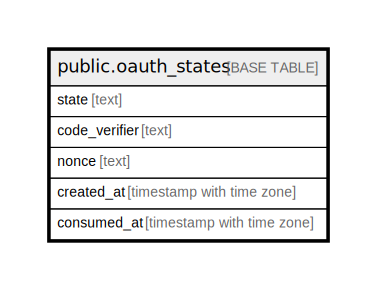

# public.oauth_states

## Description

## Columns

| Name | Type | Default | Nullable | Children | Parents | Comment |
| ---- | ---- | ------- | -------- | -------- | ------- | ------- |
| state | text |  | false |  |  |  |
| code_verifier | text |  | false |  |  |  |
| nonce | text |  | false |  |  |  |
| created_at | timestamp with time zone | CURRENT_TIMESTAMP | false |  |  |  |
| consumed_at | timestamp with time zone |  | true |  |  |  |

## Constraints

| Name | Type | Definition |
| ---- | ---- | ---------- |
| oauth_states_pkey | PRIMARY KEY | PRIMARY KEY (state) |

## Indexes

| Name | Definition |
| ---- | ---------- |
| oauth_states_pkey | CREATE UNIQUE INDEX oauth_states_pkey ON public.oauth_states USING btree (state) |
| idx_oauth_states_created | CREATE INDEX idx_oauth_states_created ON public.oauth_states USING btree (created_at) |

## Relations

---

> Generated by [tbls](https://github.com/k1LoW/tbls)
