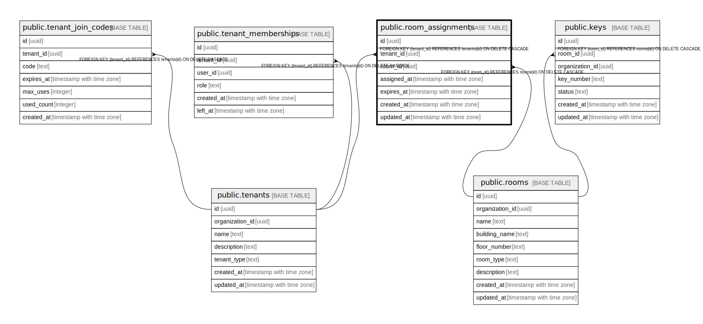

# public.room_assignments

## Description

## Columns

| Name | Type | Default | Nullable | Children | Parents | Comment |
| ---- | ---- | ------- | -------- | -------- | ------- | ------- |
| id | uuid | uuid_generate_v4() | false |  |  |  |
| tenant_id | uuid |  | false |  | [public.tenants](public.tenants.md) |  |
| room_id | uuid |  | false |  | [public.rooms](public.rooms.md) |  |
| assigned_at | timestamp with time zone | CURRENT_TIMESTAMP | false |  |  |  |
| expires_at | timestamp with time zone |  | true |  |  |  |
| created_at | timestamp with time zone | CURRENT_TIMESTAMP | false |  |  |  |
| updated_at | timestamp with time zone | CURRENT_TIMESTAMP | false |  |  |  |

## Constraints

| Name | Type | Definition |
| ---- | ---- | ---------- |
| room_assignments_date_check | CHECK | CHECK (((expires_at IS NULL) OR (expires_at > assigned_at))) |
| room_assignments_tenant_id_fkey | FOREIGN KEY | FOREIGN KEY (tenant_id) REFERENCES tenants(id) ON DELETE CASCADE |
| room_assignments_room_id_fkey | FOREIGN KEY | FOREIGN KEY (room_id) REFERENCES rooms(id) ON DELETE CASCADE |
| room_assignments_pkey | PRIMARY KEY | PRIMARY KEY (id) |

## Indexes

| Name | Definition |
| ---- | ---------- |
| room_assignments_pkey | CREATE UNIQUE INDEX room_assignments_pkey ON public.room_assignments USING btree (id) |

## Triggers

| Name | Definition |
| ---- | ---------- |
| refresh_room_assignments_updated_at | CREATE TRIGGER refresh_room_assignments_updated_at BEFORE UPDATE ON public.room_assignments FOR EACH ROW EXECUTE FUNCTION update_updated_at_column() |

## Relations

---

> Generated by [tbls](https://github.com/k1LoW/tbls)
