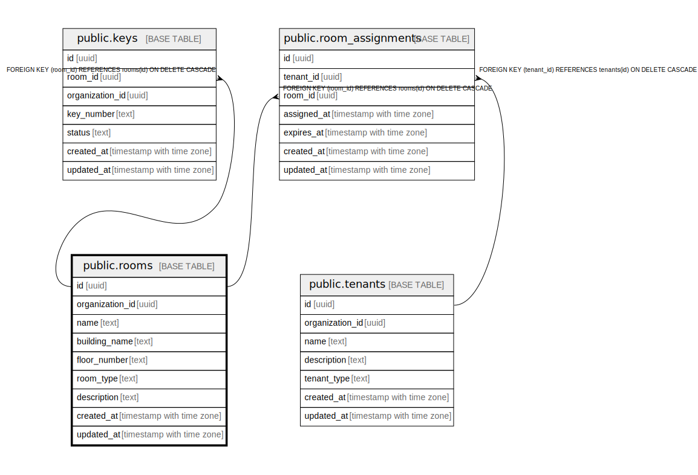

# public.rooms

## Description

## Columns

| Name | Type | Default | Nullable | Children | Parents | Comment |
| ---- | ---- | ------- | -------- | -------- | ------- | ------- |
| id | uuid | uuid_generate_v4() | false | [public.keys](public.keys.md) [public.room_assignments](public.room_assignments.md) |  |  |
| organization_id | uuid | '550e8400-e29b-41d4-a716-446655440000'::uuid | false |  |  |  |
| name | text |  | false |  |  |  |
| building_name | text |  | false |  |  |  |
| floor_number | text |  | false |  |  |  |
| room_type | text |  | false |  |  |  |
| description | text | ''::text | false |  |  |  |
| created_at | timestamp with time zone | CURRENT_TIMESTAMP | false |  |  |  |
| updated_at | timestamp with time zone | CURRENT_TIMESTAMP | false |  |  |  |

## Constraints

| Name | Type | Definition |
| ---- | ---- | ---------- |
| rooms_room_type_check | CHECK | CHECK ((room_type = ANY (ARRAY['classroom'::text, 'meeting_room'::text, 'laboratory'::text, 'office'::text, 'workshop'::text, 'storage'::text]))) |
| rooms_pkey | PRIMARY KEY | PRIMARY KEY (id) |

## Indexes

| Name | Definition |
| ---- | ---------- |
| rooms_pkey | CREATE UNIQUE INDEX rooms_pkey ON public.rooms USING btree (id) |

## Triggers

| Name | Definition |
| ---- | ---------- |
| refresh_rooms_updated_at | CREATE TRIGGER refresh_rooms_updated_at BEFORE UPDATE ON public.rooms FOR EACH ROW EXECUTE FUNCTION update_updated_at_column() |

## Relations

---

> Generated by [tbls](https://github.com/k1LoW/tbls)
