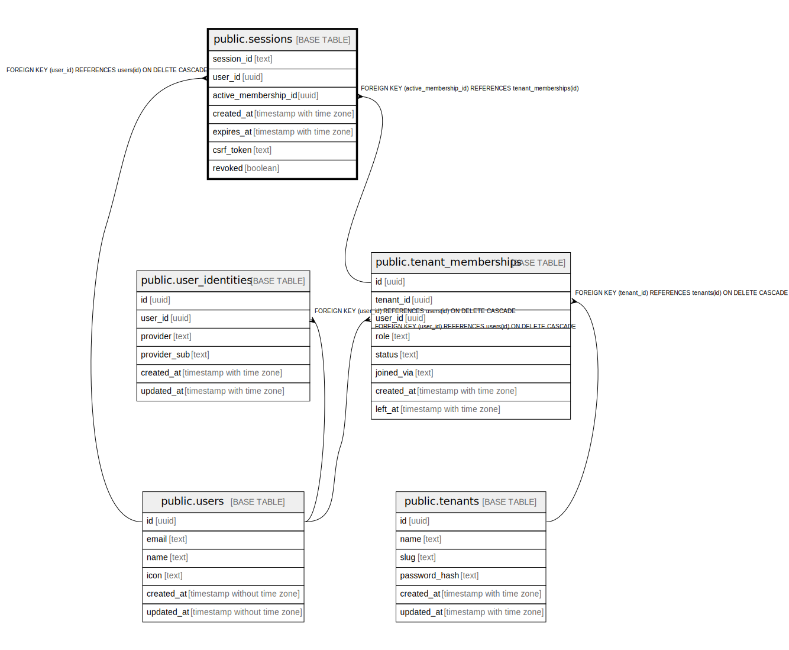

# public.sessions

## Description

## Columns

| Name | Type | Default | Nullable | Children | Parents | Comment |
| ---- | ---- | ------- | -------- | -------- | ------- | ------- |
| session_id | text |  | false |  |  |  |
| user_id | uuid |  | false |  | [public.users](public.users.md) |  |
| active_membership_id | uuid |  | true |  | [public.tenant_memberships](public.tenant_memberships.md) |  |
| created_at | timestamp with time zone | CURRENT_TIMESTAMP | false |  |  |  |
| expires_at | timestamp with time zone |  | false |  |  |  |
| csrf_token | text |  | true |  |  |  |
| revoked | boolean | false | false |  |  |  |

## Constraints

| Name | Type | Definition |
| ---- | ---- | ---------- |
| sessions_user_id_fkey | FOREIGN KEY | FOREIGN KEY (user_id) REFERENCES users(id) ON DELETE CASCADE |
| sessions_pkey | PRIMARY KEY | PRIMARY KEY (session_id) |
| fk_sessions_active_membership | FOREIGN KEY | FOREIGN KEY (active_membership_id) REFERENCES tenant_memberships(id) |

## Indexes

| Name | Definition |
| ---- | ---------- |
| sessions_pkey | CREATE UNIQUE INDEX sessions_pkey ON public.sessions USING btree (session_id) |
| idx_sessions_user | CREATE INDEX idx_sessions_user ON public.sessions USING btree (user_id) |
| idx_sessions_expires | CREATE INDEX idx_sessions_expires ON public.sessions USING btree (expires_at) |
| idx_sessions_active_membership | CREATE INDEX idx_sessions_active_membership ON public.sessions USING btree (active_membership_id) |

## Relations

---

> Generated by [tbls](https://github.com/k1LoW/tbls)
