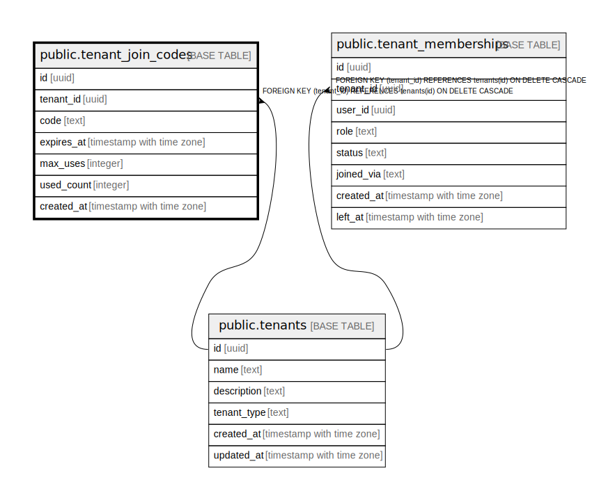

# public.tenant_join_codes

## Description

## Columns

| Name | Type | Default | Nullable | Children | Parents | Comment |
| ---- | ---- | ------- | -------- | -------- | ------- | ------- |
| id | uuid | uuid_generate_v4() | false |  |  |  |
| tenant_id | uuid |  | false |  | [public.tenants](public.tenants.md) |  |
| code | text |  | false |  |  |  |
| expires_at | timestamp with time zone |  | true |  |  |  |
| max_uses | integer | 0 | false |  |  |  |
| used_count | integer | 0 | false |  |  |  |
| created_at | timestamp with time zone | CURRENT_TIMESTAMP | false |  |  |  |

## Constraints

| Name | Type | Definition |
| ---- | ---- | ---------- |
| tenant_join_codes_tenant_id_fkey | FOREIGN KEY | FOREIGN KEY (tenant_id) REFERENCES tenants(id) ON DELETE CASCADE |
| tenant_join_codes_pkey | PRIMARY KEY | PRIMARY KEY (id) |
| tenant_join_codes_code_key | UNIQUE | UNIQUE (code) |

## Indexes

| Name | Definition |
| ---- | ---------- |
| tenant_join_codes_pkey | CREATE UNIQUE INDEX tenant_join_codes_pkey ON public.tenant_join_codes USING btree (id) |
| tenant_join_codes_code_key | CREATE UNIQUE INDEX tenant_join_codes_code_key ON public.tenant_join_codes USING btree (code) |
| idx_join_codes_tenant | CREATE INDEX idx_join_codes_tenant ON public.tenant_join_codes USING btree (tenant_id) |
| idx_join_codes_exp | CREATE INDEX idx_join_codes_exp ON public.tenant_join_codes USING btree (expires_at) |

## Relations

---

> Generated by [tbls](https://github.com/k1LoW/tbls)
