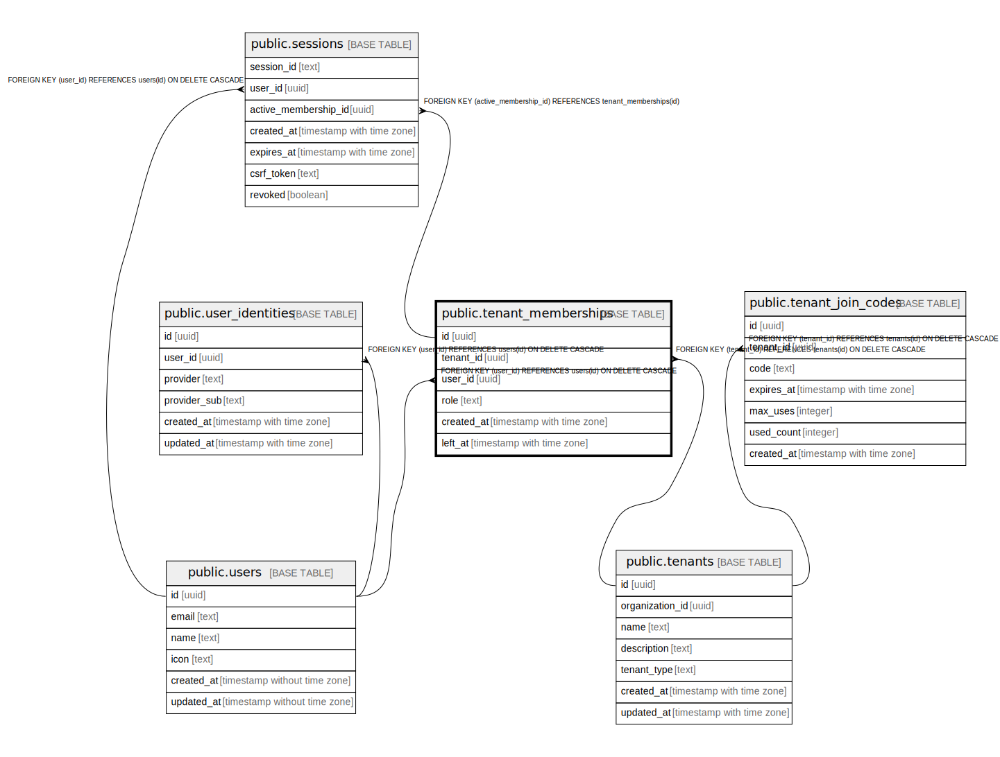

# public.tenant_memberships

## Description

## Columns

| Name | Type | Default | Nullable | Children | Parents | Comment |
| ---- | ---- | ------- | -------- | -------- | ------- | ------- |
| id | uuid | uuid_generate_v4() | false | [public.sessions](public.sessions.md) |  |  |
| tenant_id | uuid |  | false |  | [public.tenants](public.tenants.md) |  |
| user_id | uuid |  | false |  | [public.users](public.users.md) |  |
| role | text | 'member'::text | false |  |  |  |
| created_at | timestamp with time zone | CURRENT_TIMESTAMP | false |  |  |  |
| left_at | timestamp with time zone |  | true |  |  |  |

## Constraints

| Name | Type | Definition |
| ---- | ---- | ---------- |
| tenant_memberships_role_check | CHECK | CHECK ((role = ANY (ARRAY['admin'::text, 'member'::text]))) |
| tenant_memberships_user_id_fkey | FOREIGN KEY | FOREIGN KEY (user_id) REFERENCES users(id) ON DELETE CASCADE |
| tenant_memberships_tenant_id_fkey | FOREIGN KEY | FOREIGN KEY (tenant_id) REFERENCES tenants(id) ON DELETE CASCADE |
| tenant_memberships_pkey | PRIMARY KEY | PRIMARY KEY (id) |
| tenant_memberships_tenant_id_user_id_key | UNIQUE | UNIQUE (tenant_id, user_id) |

## Indexes

| Name | Definition |
| ---- | ---------- |
| tenant_memberships_pkey | CREATE UNIQUE INDEX tenant_memberships_pkey ON public.tenant_memberships USING btree (id) |
| tenant_memberships_tenant_id_user_id_key | CREATE UNIQUE INDEX tenant_memberships_tenant_id_user_id_key ON public.tenant_memberships USING btree (tenant_id, user_id) |
| idx_memberships_user | CREATE INDEX idx_memberships_user ON public.tenant_memberships USING btree (user_id) |
| idx_memberships_user_left_tenant | CREATE INDEX idx_memberships_user_left_tenant ON public.tenant_memberships USING btree (user_id, left_at, tenant_id) WHERE (left_at IS NULL) |
| idx_memberships_tenant_left | CREATE INDEX idx_memberships_tenant_left ON public.tenant_memberships USING btree (tenant_id, left_at) WHERE (left_at IS NULL) |

## Relations

---

> Generated by [tbls](https://github.com/k1LoW/tbls)
