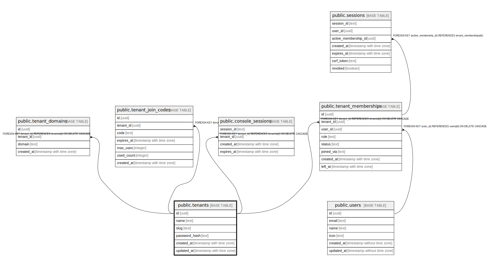

# public.tenants

## Description

## Columns

| Name | Type | Default | Nullable | Children | Parents | Comment |
| ---- | ---- | ------- | -------- | -------- | ------- | ------- |
| id | uuid | uuid_generate_v4() | false | [public.tenant_domains](public.tenant_domains.md) [public.tenant_join_codes](public.tenant_join_codes.md) [public.tenant_memberships](public.tenant_memberships.md) [public.console_sessions](public.console_sessions.md) |  |  |
| name | text |  | false |  |  |  |
| slug | text |  | true |  |  |  |
| password_hash | text |  | false |  |  |  |
| created_at | timestamp with time zone | CURRENT_TIMESTAMP | false |  |  |  |
| updated_at | timestamp with time zone | CURRENT_TIMESTAMP | false |  |  |  |

## Constraints

| Name | Type | Definition |
| ---- | ---- | ---------- |
| tenants_pkey | PRIMARY KEY | PRIMARY KEY (id) |
| tenants_name_key | UNIQUE | UNIQUE (name) |
| tenants_slug_key | UNIQUE | UNIQUE (slug) |

## Indexes

| Name | Definition |
| ---- | ---------- |
| tenants_pkey | CREATE UNIQUE INDEX tenants_pkey ON public.tenants USING btree (id) |
| tenants_name_key | CREATE UNIQUE INDEX tenants_name_key ON public.tenants USING btree (name) |
| tenants_slug_key | CREATE UNIQUE INDEX tenants_slug_key ON public.tenants USING btree (slug) |
| idx_tenants_name_ci | CREATE UNIQUE INDEX idx_tenants_name_ci ON public.tenants USING btree (lower(name)) |

## Triggers

| Name | Definition |
| ---- | ---------- |
| refresh_tenants_updated_at | CREATE TRIGGER refresh_tenants_updated_at BEFORE UPDATE ON public.tenants FOR EACH ROW EXECUTE FUNCTION update_updated_at_column() |

## Relations

---

> Generated by [tbls](https://github.com/k1LoW/tbls)
