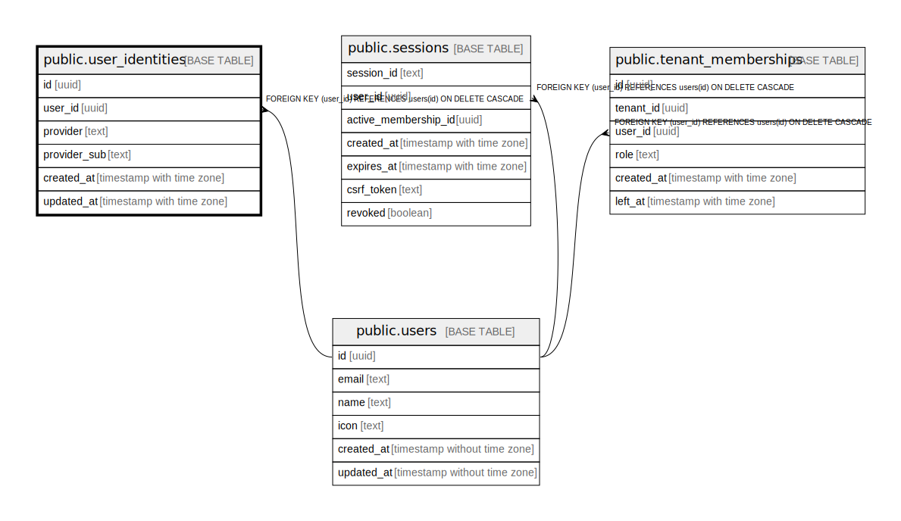

# public.user_identities

## Description

## Columns

| Name | Type | Default | Nullable | Children | Parents | Comment |
| ---- | ---- | ------- | -------- | -------- | ------- | ------- |
| id | uuid | uuid_generate_v4() | false |  |  |  |
| user_id | uuid |  | false |  | [public.users](public.users.md) |  |
| provider | text |  | false |  |  |  |
| provider_sub | text |  | false |  |  |  |
| created_at | timestamp with time zone | CURRENT_TIMESTAMP | false |  |  |  |
| updated_at | timestamp with time zone | CURRENT_TIMESTAMP | false |  |  |  |

## Constraints

| Name | Type | Definition |
| ---- | ---- | ---------- |
| user_identities_user_id_fkey | FOREIGN KEY | FOREIGN KEY (user_id) REFERENCES users(id) ON DELETE CASCADE |
| user_identities_pkey | PRIMARY KEY | PRIMARY KEY (id) |
| user_identities_provider_provider_sub_key | UNIQUE | UNIQUE (provider, provider_sub) |

## Indexes

| Name | Definition |
| ---- | ---------- |
| user_identities_pkey | CREATE UNIQUE INDEX user_identities_pkey ON public.user_identities USING btree (id) |
| user_identities_provider_provider_sub_key | CREATE UNIQUE INDEX user_identities_provider_provider_sub_key ON public.user_identities USING btree (provider, provider_sub) |

## Triggers

| Name | Definition |
| ---- | ---------- |
| refresh_user_identities_updated_at | CREATE TRIGGER refresh_user_identities_updated_at BEFORE UPDATE ON public.user_identities FOR EACH ROW EXECUTE FUNCTION update_updated_at_column() |

## Relations

---

> Generated by [tbls](https://github.com/k1LoW/tbls)
