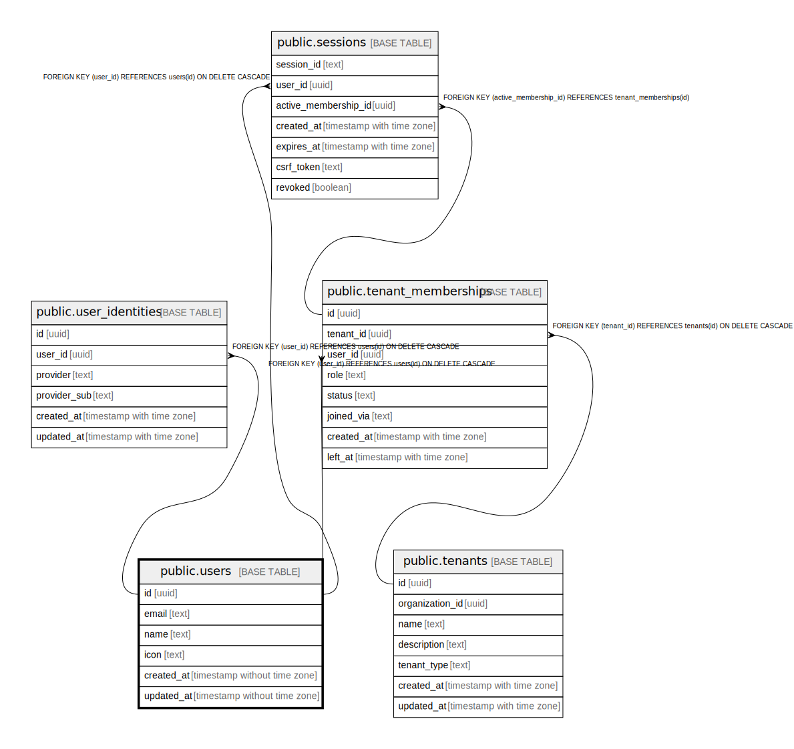

# public.users

## Description

## Columns

| Name | Type | Default | Nullable | Children | Parents | Comment |
| ---- | ---- | ------- | -------- | -------- | ------- | ------- |
| id | uuid | uuid_generate_v4() | false | [public.user_identities](public.user_identities.md) [public.sessions](public.sessions.md) [public.tenant_memberships](public.tenant_memberships.md) |  |  |
| email | text |  | false |  |  |  |
| name | text |  | false |  |  |  |
| icon | text |  | false |  |  |  |
| created_at | timestamp without time zone | CURRENT_TIMESTAMP | false |  |  |  |
| updated_at | timestamp without time zone | CURRENT_TIMESTAMP | false |  |  |  |

## Constraints

| Name | Type | Definition |
| ---- | ---- | ---------- |
| users_pkey | PRIMARY KEY | PRIMARY KEY (id) |
| users_email_key | UNIQUE | UNIQUE (email) |

## Indexes

| Name | Definition |
| ---- | ---------- |
| users_pkey | CREATE UNIQUE INDEX users_pkey ON public.users USING btree (id) |
| users_email_key | CREATE UNIQUE INDEX users_email_key ON public.users USING btree (email) |

## Triggers

| Name | Definition |
| ---- | ---------- |
| refresh_users_updated_at | CREATE TRIGGER refresh_users_updated_at BEFORE UPDATE ON public.users FOR EACH ROW EXECUTE FUNCTION update_updated_at_column() |

## Relations

---

> Generated by [tbls](https://github.com/k1LoW/tbls)
