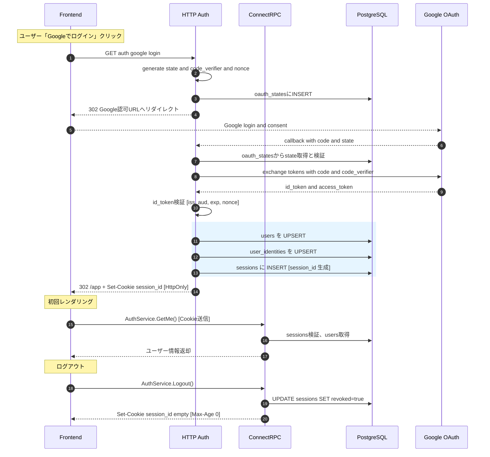
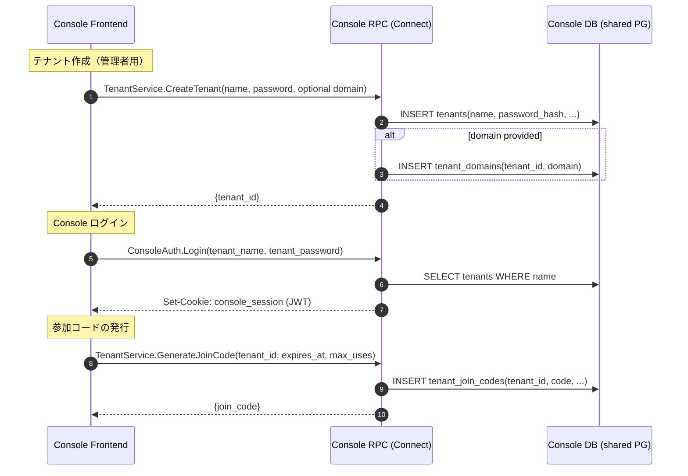
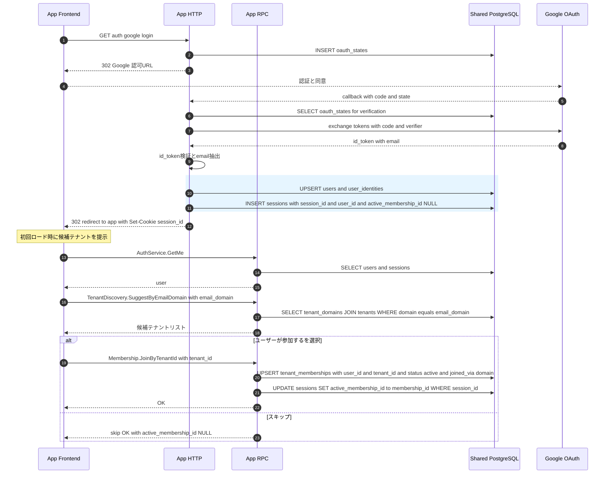
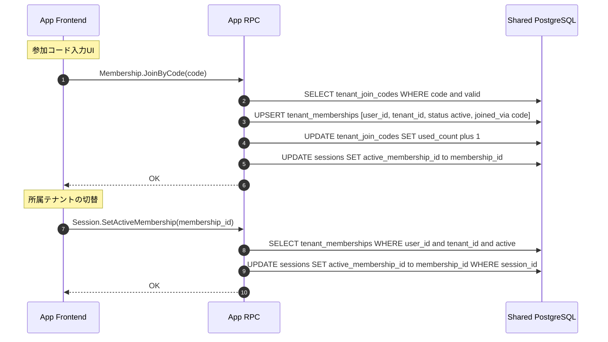
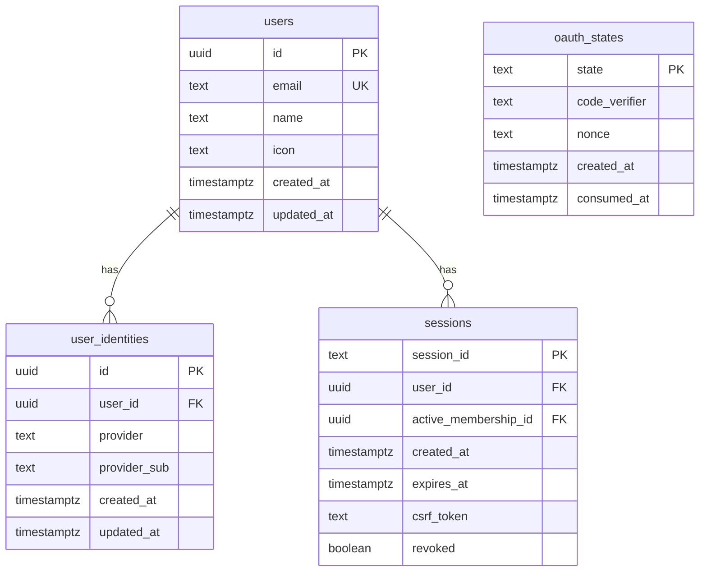
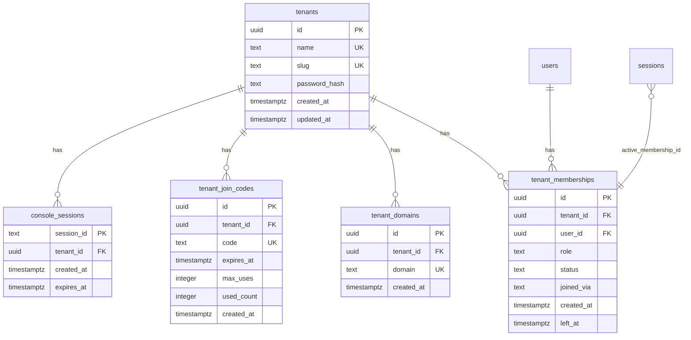

# KeyHub 統合ドキュメント

このドキュメントは、KeyHubプロジェクトのdocsディレクトリ配下にある全てのドキュメントを統合し、体系的に整理したものです。

## 目次

1. [システム概要](#1-システム概要)
2. [認証システム（App）](#2-認証システムapp)
3. [マルチテナント機能（Console）](#3-マルチテナント機能console)
4. [データベース設計](#4-データベース設計)
5. [API設計](#5-api設計)
6. [セキュリティ](#6-セキュリティ)

---

## 1. システム概要

KeyHubは、Google OAuth 2.0/OIDCを使用した認証システムと、マルチテナント機能を備えたWebアプリケーションです。

### アーキテクチャ構成

- **App側**: エンドユーザー向けアプリケーション
  - Google OAuth 2.0 + OIDC認証
  - セッション管理（HttpOnly Cookie）
  - ConnectRPC APIサービス

- **Console側**: 管理者向けコンソール
  - テナント管理機能
  - JWT + Cookie認証
  - 参加コード発行・管理

- **共有DB**: PostgreSQL（RLSによるテナント境界強制）

---

## 2. 認証システム（App）

### 2.1 認証フロー概要

#### 方針と用語

- OAuth 2.0 と OIDC（OpenID Connect）で Google ログインを実装
- フローは Authorization Code + PKCE
- リダイレクト処理は HTTP、業務APIは ConnectRPC
- IDトークンはサーバーで必ず検証（iss/aud/exp/nonce）
- Accessトークンは自サービスの認証には使わない
- Refreshトークンは取得・保存しない（Google API は呼ばない前提）

#### アーキテクチャ

- HTTPハンドラ: `/auth/google/login`, `/auth/google/callback`
- セッション: `HttpOnly+Secure` クッキーで配布（`session_id`）
- ConnectRPC: `AuthService.GetMe`, `AuthService.Logout` ほか業務API

### 2.2 全体ワークフロー



### 2.3 運用・セキュリティ設定

- **TTL/GC**: `oauth_states` は10〜15分、`sessions` は `expires_at` と `revoked=true` を定期清掃
- **クッキー**: `HttpOnly + Secure + SameSite=Lax(または None)`
- **CSRF**: `csrf_token` 発行・検証（必要なエンドポイントに限定）
- **端末管理**: `ip/user_agent` を保持。必要なら device 情報付与
- **IDトークン検証**: JWK で署名、`iss/aud/exp/nonce` を厳格に確認
- **CORS**: 必要最小限（Origin固定、credentials有効時のヘッダ制御）

### 2.4 画面・体験設計

- **初回ログイン後ダイアログ**: 「あなたのメールドメインと一致するテナントが見つかりました: Kogakuin University。参加しますか？ [参加] [スキップ]」+「参加コードをお持ちの場合はこちら」入力欄
- **ヘッダーのテナント切替**: 所属複数時はセレクタで `active_membership` を切替 → APIは常に `active_membership` をコンテキストに動作
- **スキップ時**: `active_membership_id=NULL` でもアプリを使えるが、テナント限定機能は非表示/エンプティステート

---

## 3. マルチテナント機能（Console）

### 3.1 要件概要

- console で `tenant`（学校/企業）を作成し、任意でドメイン（例: `kogakuin.ac.jp`）を紐づけ可能
- app 側の Google ログイン時、ユーザーのメールドメインから候補テナントを自動提示。ただし加入は任意（スキップ可）
- ドメインが一意に判別できない（例: `gmail.com`）場合は、console 発行の参加コード（join_code）を app で入力 → 特定テナントに加入
- ユーザーは複数テナントに所属可。app セッションは active_membership を 1 つ保持（切替可能）
- console ログインは JWT+Cookie（`tenant_name` と `tenant_password`）
- app でテナント所属が確定したら、console 側にもユーザーが登録される（同DB or RPCで反映）
- 将来拡張: `tenant_admins (tenant_id, user_id, role)` を導入可能

### 3.2 Console側フロー



### 3.3 App側フロー（テナント参加）



### 3.4 参加コード・テナント切替フロー



---

## 4. データベース設計

### 4.1 コアテーブル（認証基盤）

#### ER図



#### テーブル詳細

##### users

| カラム | 型 | 説明 |
| --- | --- | --- |
| id | uuid | ユーザーの主キー。`uuid_generate_v4()`で自動生成 |
| email | text | Googleから取得するメールアドレス。lowerでユニーク制約 |
| name | text | Googleプロフィールの表示名 |
| icon | text | Googleプロフィール画像URL |
| created_at | timestamptz | レコード作成時刻 |
| updated_at | timestamptz | 最終更新時刻 |

##### user_identities

| カラム | 型 | 説明 |
| --- | --- | --- |
| id | uuid | 主キー |
| user_id | uuid | users.idへの外部キー。削除時はCASCADE |
| provider | text | 連携元プロバイダ。Google固定 |
| provider_sub | text | Googleの`sub`（一意のユーザーID） |
| created_at / updated_at | timestamptz | 作成・更新時刻 |

備考: 現状は Google API を呼ばないため refresh_token は保存しない

##### sessions

| カラム | 型 | 説明 |
| --- | --- | --- |
| session_id | text | セッションを識別するランダム文字列（クッキーに保存） |
| user_id | uuid | users.idへの外部キー |
| active_membership_id | uuid | tenant_memberships.idへの外部キー。NULL許容：テナント未選択 |
| created_at | timestamptz | セッション開始時刻 |
| expires_at | timestamptz | 期限切れ時刻。GC対象 |
| csrf_token | text | フォームPOST等のCSRF対策 |
| revoked | boolean | 手動ログアウトなどで無効化された場合true |

##### oauth_states

| カラム | 型 | 説明 |
| --- | --- | --- |
| state | text | OAuth CSRF対策のランダム文字列 |
| code_verifier | text | PKCEのcode_verifier |
| nonce | text | IDトークン検証用nonce |
| created_at | timestamptz | 作成時刻。通常10〜15分で削除 |
| consumed_at | timestamptz | 使用済み時刻。再利用防止 |

### 4.2 マルチテナントテーブル

#### ER図



#### テーブル詳細

##### tenants

| カラム | 型 | 説明 |
| --- | --- | --- |
| id | uuid | 主キー。`uuid_generate_v4()` による自動採番 |
| name | text | テナント表示名。必須。ユニーク。lower(name)にも一意インデックス |
| slug | text | 任意のURL用スラッグ。ユニーク。空値可 |
| password_hash | text | 認証用ハッシュ値。必須 |
| created_at | timestamptz | 作成時刻。`now()` デフォルト |
| updated_at | timestamptz | 更新時刻。`now()` デフォルト |

##### tenant_domains

| カラム | 型 | 説明 |
| --- | --- | --- |
| id | uuid | 主キー。`uuid_generate_v4()` 自動採番 |
| tenant_id | uuid | 外部キー。`tenants(id)`。CASCADE削除 |
| domain | text | メールドメイン。ユニーク。正規化（lowercase）推奨 |
| created_at | timestamptz | 作成時刻。`now()` デフォルト |

##### tenant_join_codes

| カラム | 型 | 説明 |
| --- | --- | --- |
| id | uuid | 主キー。`uuid_generate_v4()` 自動採番 |
| tenant_id | uuid | 外部キー。`tenants(id)`。CASCADE削除 |
| code | text | 参加コード。ユニーク。例: 8〜12桁ランダム |
| expires_at | timestamptz | 期限切れ時刻。NULL可（無期限） |
| max_uses | integer | 最大利用回数。`0` は無制限。デフォルト `0` |
| used_count | integer | 使用済み回数。デフォルト `0` |
| created_at | timestamptz | 作成時刻。`now()` デフォルト |

##### tenant_memberships

| カラム | 型 | 説明 |
| --- | --- | --- |
| id | uuid | 主キー。`uuid_generate_v4()` 自動採番 |
| tenant_id | uuid | 外部キー。`tenants(id)`。CASCADE削除 |
| user_id | uuid | 外部キー。`users(id)`。CASCADE削除 |
| role | text | 役割。`admin` / `member`。デフォルト `member` |
| status | text | 状態。`active` / `invited` / `suspended` / `left`。デフォルト `active` |
| joined_via | text | 参加経路。`domain` / `code` / `manual`。NULL可 |
| created_at | timestamptz | 作成時刻。`now()` デフォルト |
| left_at | timestamptz | 退会時刻。NULL可 |

備考:
- UNIQUE: `(tenant_id, user_id)`（同一テナントに二重参加を防止）
- INDEX: `(user_id)`（ユーザーから所属一覧を引く用途）

##### console_sessions

| カラム | 型 | 説明 |
| --- | --- | --- |
| session_id | text | 主キー |
| tenant_id | uuid | 外部キー。`tenants(id)`。CASCADE削除 |
| created_at | timestamptz | 作成時刻。`now()` デフォルト |
| expires_at | timestamptz | 期限。必須 |

---

## 5. API設計

### 5.1 API と DB対応

| APIエンドポイント | 操作 | 関連テーブル |
| --- | --- | --- |
| GET /auth/google/login | INSERT | oauth_states |
| GET /auth/google/callback | UPSERT/INSERT | users, user_identities, sessions, oauth_states |
| AuthService.GetMe | SELECT | sessions, users |
| AuthService.Logout | UPDATE (revoked=true) | sessions |

### 5.2 RPCインターフェース

| サービス | メソッド | 目的 |
| --- | --- | --- |
| App.AuthService | GetMe, Logout | 認証状態/ログアウト |
| App.TenantDiscovery | SuggestByEmailDomain(domain) → tenants[] | ドメインから候補取得 |
| App.Membership | JoinByTenantId, JoinByCode, ListMyTenants | 所属/参加コード/所属一覧 |
| App.Session | SetActiveMembership(membership_id) | アクティブメンバーシップ切替 |
| Console.Auth | Login(name, password) | console ログイン（JWT+Cookie） |
| Console.TenantService | CreateTenant, AddDomain, RemoveDomain, GenerateJoinCode, ListMembers | テナント管理 |

---

## 6. セキュリティ

### 6.1 セキュリティ＆一意性ポリシー

- `tenant_domains.domain` は lowercase 一意に（正規化）
- 参加コードは十分なエントロピーと期限、可能ならハッシュ保存（生コードは一度だけ表示）
- `tenant_memberships (tenant_id, user_id)` を UNIQUE にし二重参加を防止
- `sessions.active_membership_id` の整合性は外部キーで強制（ロジック簡略化）

### 6.2 Row Level Security (RLS)

#### 概要

KeyHubのマルチテナント機能では、PostgreSQLの**Row Level Security (RLS)** を使用してテナント間のデータ分離を実現します。各データベース接続は特定のテナントコンテキストを持ち、そのテナントに属するデータのみにアクセスできます。

#### RLSの仕組み

##### セッションコンテキストの設定

アプリケーションは、データベース接続確立後に現在のメンバーシップIDを設定します。

```sql
-- アプリケーション側で実行（リクエストごと）
SET app.membership_id = 'ユーザーのactive_membership_id';
```

##### ヘルパー関数

RLSポリシーで使用する2つのヘルパー関数を`app`スキーマに定義：

**app.current_membership_id()**

```sql
CREATE OR REPLACE FUNCTION app.current_membership_id()
RETURNS uuid LANGUAGE sql STABLE AS $$
  SELECT current_setting('app.membership_id', true)::uuid
$$;
```

**app.current_tenant_id()**

```sql
CREATE OR REPLACE FUNCTION app.current_tenant_id()
RETURNS uuid LANGUAGE sql STABLE AS $$
  SELECT tm.tenant_id
  FROM tenant_memberships tm
  WHERE tm.id = app.current_membership_id()
$$;
```

##### RLSポリシーの適用

各テーブルにRLSを有効化：

```sql
ALTER TABLE tenants ENABLE ROW LEVEL SECURITY;
ALTER TABLE tenant_domains ENABLE ROW LEVEL SECURITY;
ALTER TABLE tenant_join_codes ENABLE ROW LEVEL SECURITY;
ALTER TABLE tenant_memberships ENABLE ROW LEVEL SECURITY;
```

各テーブルにポリシーを定義：

```sql
-- tenantsテーブル
CREATE POLICY tenant_is_current ON tenants
  USING (id = app.current_tenant_id());

-- tenant_domainsテーブル
CREATE POLICY tenant_is_current ON tenant_domains
  USING (tenant_id = app.current_tenant_id());

-- tenant_join_codesテーブル
CREATE POLICY tenant_is_current ON tenant_join_codes
  USING (tenant_id = app.current_tenant_id());

-- tenant_membershipsテーブル
CREATE POLICY tenant_is_current ON tenant_memberships
  USING (tenant_id = app.current_tenant_id());
```

#### 動作例

```sql
-- セッション設定（会社Xのメンバーシップ）
SET app.membership_id = '111';

-- テナント情報を取得
SELECT * FROM tenants;
-- 結果: 会社X（tenant_id: aaa）のみ表示

-- ドメイン一覧を取得
SELECT * FROM tenant_domains;
-- 結果: 会社Xに紐づくドメインのみ表示

-- コンテキスト未設定の場合
SELECT * FROM tenants;
-- 結果: 0件（RLSポリシーにより全て除外）
```

#### ロール分離（推奨設計）

```sql
-- アプリケーション用ロール（RLSポリシーが適用される）
CREATE ROLE keyhub_app;
GRANT SELECT, INSERT, UPDATE, DELETE ON ALL TABLES IN SCHEMA public TO keyhub_app;

-- 管理用ロール（RLSをバイパス、全テナントにアクセス可能）
CREATE ROLE keyhub_console;
ALTER ROLE keyhub_console BYPASSRLS;
GRANT ALL ON ALL TABLES IN SCHEMA public TO keyhub_console;
```

#### マイグレーション情報

RLS関連の設定は以下のマイグレーションファイルで実装：
- ファイル: `backend/db/migrations/20251007061025_add_rls_functions_and_policies.sql`
- 実装内容:
  1. `app`スキーマの作成
  2. ヘルパー関数の定義
  3. テーブルへのRLS有効化
  4. ポリシーの作成

---

## まとめ

KeyHubは、堅牢な認証システムとマルチテナント機能を中核とした、スケーラブルなWebアプリケーションプラットフォームです。

### 主要な技術的特徴

1. **セキュアな認証**
   - Google OAuth 2.0 + OIDC
   - PKCE対応
   - HttpOnly Cookie セッション管理

2. **マルチテナント対応**
   - ドメインベース自動検出
   - 参加コード方式
   - RLSによるデータ分離

3. **拡張性の高い設計**
   - ConnectRPC API
   - PostgreSQL RLS
   - 将来の拡張を考慮した DB設計

4. **運用性**
   - TTL/GCによる自動クリーンアップ
   - 監査ログ対応
   - デバイス管理機能

本ドキュメントは、開発者がシステム全体を理解し、効率的に開発・運用できることを目的として作成されました。