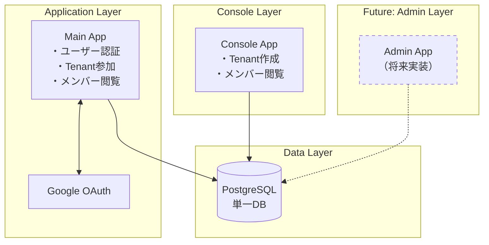
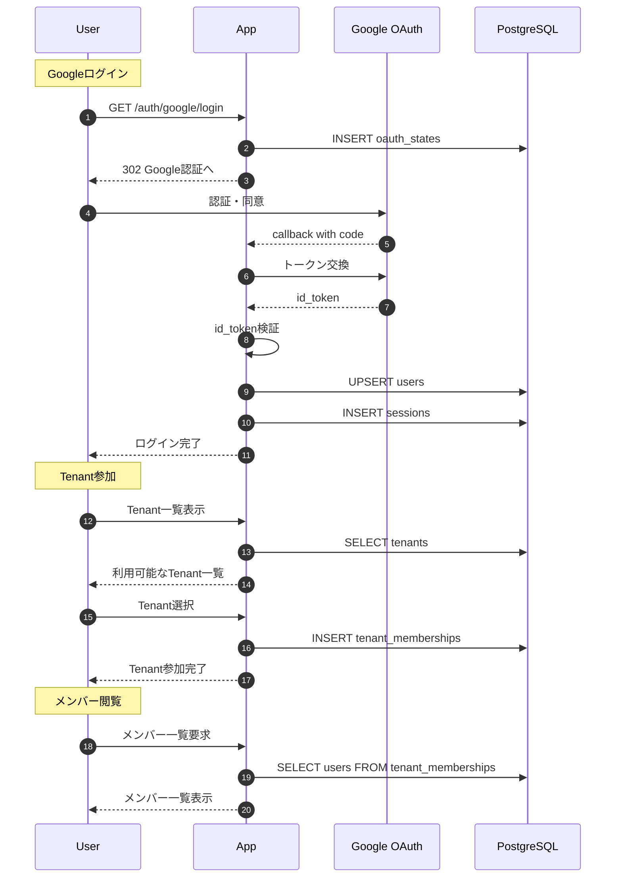
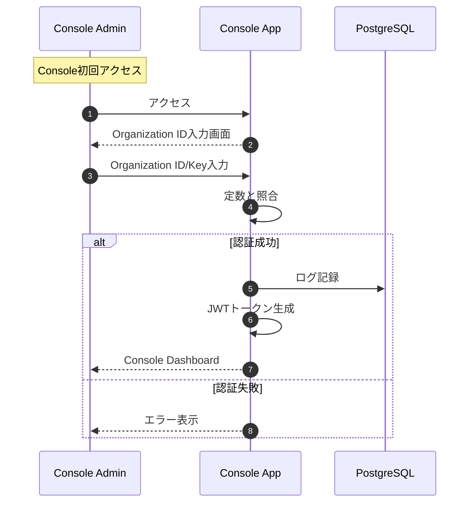
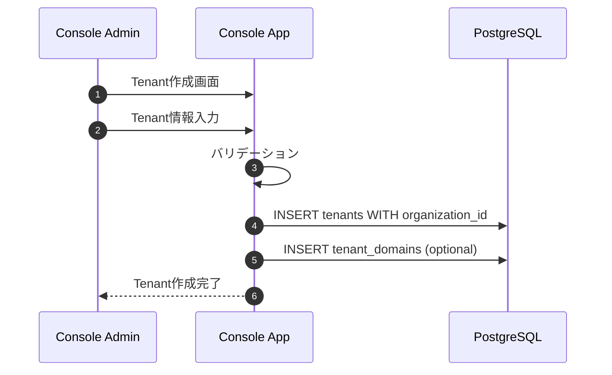
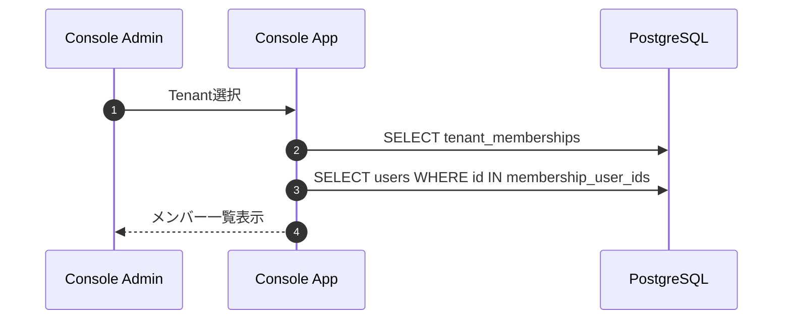
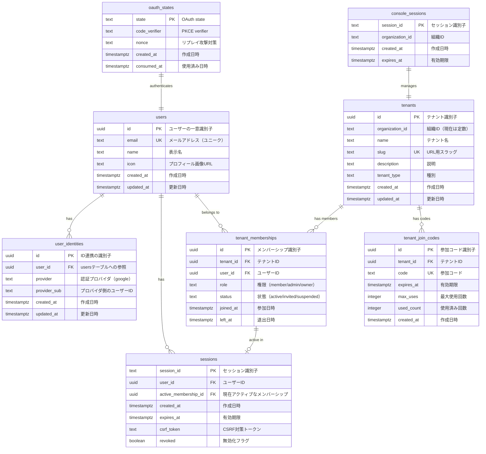
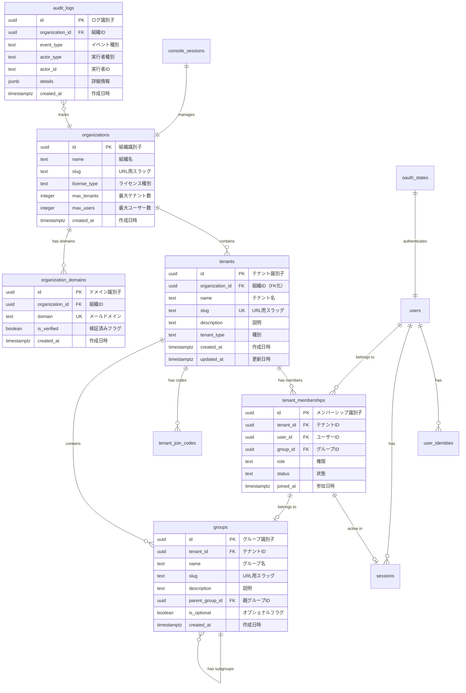

# KeyHub 統合ドキュメント v2

このドキュメントは、KeyHubプロジェクトの簡略化された実装と、将来的な拡張を考慮した設計を記述したものです。

## 目次

1. [システム概要](#1-システム概要)
2. [認証システム（App）](#2-認証システムapp)
3. [Console管理システム](#3-console管理システム)
4. [データベース設計](#4-データベース設計)
5. [API設計](#5-api設計)
6. [セキュリティ](#6-セキュリティ)
7. [将来の拡張ポイント](#7-将来の拡張ポイント)

---

## 1. システム概要

KeyHubは、Google OAuth 2.0/OIDCを使用した認証システムと、組織管理機能を備えたWebアプリケーションです。現在の実装はシンプルに保ちながら、将来的なマルチデータベース構成への拡張を考慮した設計となっています。

### 1.1 アーキテクチャ構成



### 1.2 現在の実装範囲

- **App側**: エンドユーザー向けアプリケーション
  - Google OAuth 2.0 + OIDC認証
  - Tenant参加機能
  - メンバー一覧表示

- **Console側**: 組織管理者向けコンソール
  - Organization ID認証（定数）
  - Tenant作成・管理
  - メンバー一覧閲覧

- **共有DB**: PostgreSQL（将来的に分離可能な設計）

### 1.3 用語定義

| 用語 | 説明 | 現在の実装 | 将来の拡張 |
|------|------|------------|------------|
| **Organization** | 最上位組織（会社・大学） | 定数として1つ | Admin DBで管理 |
| **Tenant** | 部門・研究室 | Console作成 | Organization配下 |
| **User** | エンドユーザー | Google認証 | 複数Organization対応 |
| **Group** | Tenant内の小グループ | 未実装 | オプション機能 |

---

## 2. 認証システム（App）

### 2.1 認証フロー概要

App側の認証フローは既存の実装を維持し、Tenant参加機能を強化します。

#### 2.1.1 基本方針

- OAuth 2.0 と OIDC で Google ログインを実装
- フローは Authorization Code + PKCE
- セッションは HttpOnly Cookie で管理
- Tenant参加は認証後の別ステップ

### 2.2 ユーザー認証とTenant参加フロー



### 2.3 Tenant参加の実装詳細

#### 2.3.1 参加方式

1. **ドメインベース自動提案**（現在実装）
   - メールドメインからTenantを提案
   - ユーザーが承認して参加

2. **参加コード方式**（現在実装）
   - Console発行のコードで参加
   - ドメインが判別できない場合に使用

3. **公開Tenant一覧**（新規追加）
   - すべてのTenantを表示
   - ユーザーが選択して参加

---

## 3. Console管理システム

### 3.1 Console認証

#### 3.1.1 Organization ID認証

```go
// 環境変数または設定ファイルで定義
const ORGANIZATION_ID = "ORG-DEFAULT-001"
const ORGANIZATION_KEY = "org_key_example_12345"

// Console認証フロー
func ConsoleLogin(orgID, orgKey string) error {
    if orgID != ORGANIZATION_ID || orgKey != ORGANIZATION_KEY {
        return ErrInvalidOrganization
    }
    // セッション作成
    return createConsoleSession(orgID)
}
```

#### 3.1.2 Console認証フロー



### 3.2 Tenant管理機能

#### 3.2.1 Tenant作成



#### 3.2.2 メンバー閲覧



### 3.3 Console機能一覧

| 機能 | 説明 | 権限 |
|------|------|------|
| Tenant作成 | 新規Tenant作成とドメイン設定 | Organization Admin |
| Tenant一覧 | 全Tenantの閲覧 | Organization Admin |
| メンバー閲覧 | 各Tenantのメンバー表示 | Organization Admin |
| 参加コード発行 | Tenant参加用コード生成 | Organization Admin |
| 統計表示 | 使用統計の基本表示 | Organization Admin |

---

## 4. データベース設計

### 4.1 現在実装予定のER図



### 4.2 将来拡張時の完全ER図



### 4.3 テーブル詳細説明

#### 4.3.1 認証・ユーザー管理テーブル（現在実装）

##### users テーブル
**目的**: システムに登録されたユーザーの基本情報を管理

| カラム名 | データ型 | 制約 | 説明 | 例 |
|---------|---------|------|------|-----|
| id | UUID | PK, NOT NULL | ユーザーの一意識別子。自動生成される | `a1b2c3d4-e5f6-7890-abcd-ef1234567890` |
| email | TEXT | NOT NULL, UNIQUE | Googleアカウントのメールアドレス。ログインに使用 | `user@example.com` |
| name | TEXT | - | ユーザーの表示名。Googleプロフィールから取得 | `山田太郎` |
| icon | TEXT | - | プロフィール画像のURL。Googleプロフィールから取得 | `https://lh3.googleusercontent.com/...` |
| created_at | TIMESTAMPTZ | NOT NULL | アカウント作成日時 | `2024-01-15 10:30:00+09` |
| updated_at | TIMESTAMPTZ | NOT NULL | 最終更新日時。プロフィール変更時に更新 | `2024-01-20 15:45:00+09` |

**使用例**:
- ユーザーがGoogleログインすると自動作成
- プロフィール表示で参照
- メンバー一覧表示で利用

##### user_identities テーブル
**目的**: 外部認証プロバイダとの連携情報を管理（将来的に複数プロバイダ対応）

| カラム名 | データ型 | 制約 | 説明 | 例 |
|---------|---------|------|------|-----|
| id | UUID | PK, NOT NULL | レコード識別子 | `b2c3d4e5-f6a7-8901-bcde-f23456789012` |
| user_id | UUID | FK(users.id), NOT NULL | 対応するユーザー | `a1b2c3d4-e5f6-7890-abcd-ef1234567890` |
| provider | TEXT | NOT NULL | 認証プロバイダ名 | `google` |
| provider_sub | TEXT | NOT NULL | プロバイダ側のユーザー識別子 | `1234567890987654321` |
| created_at | TIMESTAMPTZ | NOT NULL | 連携開始日時 | `2024-01-15 10:30:00+09` |
| updated_at | TIMESTAMPTZ | NOT NULL | 最終更新日時 | `2024-01-15 10:30:00+09` |

**使用例**:
- 同じユーザーが複数の認証方法を使う場合の管理
- Google以外の認証プロバイダ追加時の拡張

##### sessions テーブル
**目的**: ユーザーのログインセッションを管理

| カラム名 | データ型 | 制約 | 説明 | 例 |
|---------|---------|------|------|-----|
| session_id | TEXT | PK, NOT NULL | セッション識別子。ランダム文字列 | `sess_abc123xyz789...` |
| user_id | UUID | FK(users.id), NOT NULL | ログインユーザー | `a1b2c3d4-e5f6-7890-abcd-ef1234567890` |
| active_membership_id | UUID | FK(tenant_memberships.id) | 現在選択中のテナント | `c3d4e5f6-a7b8-9012-cdef-345678901234` |
| created_at | TIMESTAMPTZ | NOT NULL | セッション開始日時 | `2024-01-15 10:30:00+09` |
| expires_at | TIMESTAMPTZ | NOT NULL | セッション有効期限（7日後） | `2024-01-22 10:30:00+09` |
| csrf_token | TEXT | - | CSRF対策用トークン | `csrf_token_abc123...` |
| revoked | BOOLEAN | DEFAULT FALSE | ログアウト済みフラグ | `false` |

**使用例**:
- ログイン状態の維持
- アクティブなテナントの記憶
- セキュリティ（CSRF対策、有効期限管理）

##### oauth_states テーブル
**目的**: OAuth認証フローの一時的な状態を保存（セキュリティ対策）

| カラム名 | データ型 | 制約 | 説明 | 例 |
|---------|---------|------|------|-----|
| state | TEXT | PK, NOT NULL | CSRF対策の一意な文字列 | `state_random123...` |
| code_verifier | TEXT | NOT NULL | PKCE認証用の検証コード | `verifier_abc456...` |
| nonce | TEXT | NOT NULL | IDトークン検証用のnonce | `nonce_xyz789...` |
| created_at | TIMESTAMPTZ | NOT NULL | 作成日時 | `2024-01-15 10:29:00+09` |
| consumed_at | TIMESTAMPTZ | - | 使用済み日時（再利用防止） | `2024-01-15 10:30:00+09` |

**使用例**:
- Google OAuth認証の開始から完了までの状態管理
- 10-15分で自動削除される一時データ

#### 4.3.2 組織・テナント管理テーブル（現在実装）

##### tenants テーブル
**目的**: 部門や研究室などの組織単位を管理

| カラム名 | データ型 | 制約 | 説明 | 例 |
|---------|---------|------|------|-----|
| id | UUID | PK, NOT NULL | テナントの一意識別子 | `d4e5f6a7-b8c9-0123-defa-456789012345` |
| organization_id | TEXT | DEFAULT 'ORG-DEFAULT-001' | 所属組織ID（現在は固定値、将来FK化） | `ORG-DEFAULT-001` |
| name | TEXT | NOT NULL | テナント名 | `情報学部` |
| slug | TEXT | UNIQUE | URL用の識別子 | `info-dept` |
| description | TEXT | - | テナントの説明 | `情報学部の研究・教育部門` |
| tenant_type | TEXT | DEFAULT 'department' | テナントの種別 | `department`, `laboratory`, `division` |
| created_at | TIMESTAMPTZ | NOT NULL | 作成日時 | `2024-01-10 09:00:00+09` |
| updated_at | TIMESTAMPTZ | NOT NULL | 更新日時 | `2024-01-10 09:00:00+09` |

**使用例**:
- Console Appでテナント作成
- ユーザーが参加するテナントの選択
- メンバー管理の単位

##### tenant_join_codes テーブル
**目的**: テナントへの参加用招待コードを管理

| カラム名 | データ型 | 制約 | 説明 | 例 |
|---------|---------|------|------|-----|
| id | UUID | PK, NOT NULL | レコード識別子 | `f6a7b8c9-d0e1-2345-fabc-678901234567` |
| tenant_id | UUID | FK(tenants.id), NOT NULL | 対象テナント | `d4e5f6a7-b8c9-0123-defa-456789012345` |
| code | TEXT | NOT NULL, UNIQUE | 参加コード（8-12文字） | `JOIN2024XYZ` |
| expires_at | TIMESTAMPTZ | - | 有効期限（nullは無期限） | `2024-12-31 23:59:59+09` |
| max_uses | INTEGER | DEFAULT 0 | 最大使用回数（0は無制限） | `100` |
| used_count | INTEGER | DEFAULT 0 | 現在の使用回数 | `25` |
| created_at | TIMESTAMPTZ | NOT NULL | 作成日時 | `2024-01-10 10:00:00+09` |

**使用例**:
- メールドメインが判別できない場合の参加方法
- 期間限定の招待キャンペーン
- 人数制限付きの参加管理

##### tenant_memberships テーブル
**目的**: ユーザーとテナントの所属関係を管理

| カラム名 | データ型 | 制約 | 説明 | 例 |
|---------|---------|------|------|-----|
| id | UUID | PK, NOT NULL | メンバーシップ識別子 | `a7b8c9d0-e1f2-3456-abcd-789012345678` |
| tenant_id | UUID | FK(tenants.id), NOT NULL | 所属テナント | `d4e5f6a7-b8c9-0123-defa-456789012345` |
| user_id | UUID | FK(users.id), NOT NULL | 所属ユーザー | `a1b2c3d4-e5f6-7890-abcd-ef1234567890` |
| role | TEXT | DEFAULT 'member' | 権限レベル | `member`, `admin`, `owner` |
| status | TEXT | DEFAULT 'active' | メンバーシップ状態 | `active`, `invited`, `suspended` |
| group_id | UUID | FK(groups.id) | 所属グループ（将来用） | null |
| joined_at | TIMESTAMPTZ | NOT NULL | 参加日時 | `2024-01-15 11:00:00+09` |
| left_at | TIMESTAMPTZ | - | 退出日時 | null |

**使用例**:
- ユーザーのテナント所属管理
- 権限チェック
- メンバー一覧表示

#### 4.3.3 将来拡張用テーブル

##### groups テーブル
**目的**: テナント内の小グループを管理（将来実装）

| カラム名 | データ型 | 制約 | 説明 | 例 |
|---------|---------|------|------|-----|
| id | UUID | PK, NOT NULL | グループ識別子 | `b8c9d0e1-f2a3-4567-bcde-890123456789` |
| tenant_id | UUID | FK(tenants.id), NOT NULL | 所属テナント | `d4e5f6a7-b8c9-0123-defa-456789012345` |
| name | TEXT | NOT NULL | グループ名 | `AI研究室` |
| slug | TEXT | - | URL用識別子 | `ai-lab` |
| description | TEXT | - | グループ説明 | `人工知能の研究を行う研究室` |
| parent_group_id | UUID | FK(groups.id) | 親グループ（階層構造） | null |
| is_optional | BOOLEAN | DEFAULT TRUE | オプショナルグループか | `true` |
| created_at | TIMESTAMPTZ | NOT NULL | 作成日時 | `2024-02-01 10:00:00+09` |
| updated_at | TIMESTAMPTZ | NOT NULL | 更新日時 | `2024-02-01 10:00:00+09` |

**使用例（将来）**:
- テナント内の細かい組織単位
- プロジェクトチーム管理
- 研究室や部署内のサブグループ

##### console_sessions テーブル
**目的**: Console App用のセッション管理

| カラム名 | データ型 | 制約 | 説明 | 例 |
|---------|---------|------|------|-----|
| session_id | TEXT | PK, NOT NULL | セッション識別子 | `console_sess_xyz123...` |
| organization_id | TEXT | NOT NULL | 組織ID（現在は固定） | `ORG-DEFAULT-001` |
| created_at | TIMESTAMPTZ | NOT NULL | セッション開始日時 | `2024-01-15 09:00:00+09` |
| expires_at | TIMESTAMPTZ | NOT NULL | 有効期限（24時間） | `2024-01-16 09:00:00+09` |

**使用例**:
- Console管理者のログイン状態管理
- 24時間の短い有効期限でセキュリティ強化

##### audit_logs テーブル
**目的**: システム全体の操作履歴を記録（監査・デバッグ用）

| カラム名 | データ型 | 制約 | 説明 | 例 |
|---------|---------|------|------|-----|
| id | UUID | PK, NOT NULL | ログ識別子 | `c9d0e1f2-a3b4-5678-cdef-901234567890` |
| organization_id | TEXT | DEFAULT 'ORG-DEFAULT-001' | 組織ID | `ORG-DEFAULT-001` |
| event_type | TEXT | NOT NULL | イベント種別 | `tenant.created`, `user.joined` |
| actor_type | TEXT | NOT NULL | 実行者種別 | `user`, `console`, `system` |
| actor_id | TEXT | - | 実行者ID | `a1b2c3d4-e5f6-7890-abcd-ef1234567890` |
| resource_type | TEXT | - | 対象リソース種別 | `tenant`, `user` |
| resource_id | TEXT | - | 対象リソースID | `d4e5f6a7-b8c9-0123-defa-456789012345` |
| details | JSONB | - | 詳細情報（JSON形式） | `{"action": "create", "name": "情報学部"}` |
| created_at | TIMESTAMPTZ | NOT NULL | 記録日時 | `2024-01-15 11:30:00+09` |

**使用例**:
- セキュリティ監査
- 問題発生時の調査
- 使用統計の分析

### 4.4 スキーマ定義（現在実装）

#### 4.4.1 コアテーブル（認証基盤）

```sql
-- users テーブル（既存）
CREATE TABLE users (
    id UUID NOT NULL DEFAULT uuid_generate_v4(),
    email TEXT NOT NULL UNIQUE,
    name TEXT,
    icon TEXT,
    created_at TIMESTAMPTZ NOT NULL DEFAULT CURRENT_TIMESTAMP,
    updated_at TIMESTAMPTZ NOT NULL DEFAULT CURRENT_TIMESTAMP,
    PRIMARY KEY (id)
);

-- sessions テーブル（既存）
CREATE TABLE sessions (
    session_id TEXT NOT NULL,
    user_id UUID NOT NULL,
    active_membership_id UUID, -- 現在アクティブなmembership
    created_at TIMESTAMPTZ NOT NULL DEFAULT CURRENT_TIMESTAMP,
    expires_at TIMESTAMPTZ NOT NULL,
    csrf_token TEXT,
    revoked BOOLEAN DEFAULT FALSE,
    PRIMARY KEY (session_id),
    FOREIGN KEY (user_id) REFERENCES users(id) ON DELETE CASCADE
);
```

#### 4.4.2 組織管理テーブル（現在実装）

```sql
-- tenants テーブル
CREATE TABLE tenants (
    id UUID NOT NULL DEFAULT uuid_generate_v4(),
    organization_id TEXT DEFAULT 'ORG-DEFAULT-001', -- 将来的にFK化
    name TEXT NOT NULL,
    slug TEXT UNIQUE,
    description TEXT,
    tenant_type TEXT DEFAULT 'department', -- department, laboratory, division

    created_at TIMESTAMPTZ NOT NULL DEFAULT CURRENT_TIMESTAMP,
    updated_at TIMESTAMPTZ NOT NULL DEFAULT CURRENT_TIMESTAMP,
    PRIMARY KEY (id),
    UNIQUE (organization_id, name)
);

CREATE INDEX idx_tenants_org ON tenants(organization_id);

-- tenant_memberships テーブル
CREATE TABLE tenant_memberships (
    id UUID NOT NULL DEFAULT uuid_generate_v4(),
    tenant_id UUID NOT NULL,
    user_id UUID NOT NULL,
    role TEXT NOT NULL DEFAULT 'member', -- member, admin, owner
    status TEXT NOT NULL DEFAULT 'active', -- active, invited, suspended

    joined_at TIMESTAMPTZ NOT NULL DEFAULT CURRENT_TIMESTAMP,
    left_at TIMESTAMPTZ,
    PRIMARY KEY (id),
    FOREIGN KEY (tenant_id) REFERENCES tenants(id) ON DELETE CASCADE,
    FOREIGN KEY (user_id) REFERENCES users(id) ON DELETE CASCADE,
    UNIQUE (tenant_id, user_id)
);

CREATE INDEX idx_memberships_user ON tenant_memberships(user_id);
CREATE INDEX idx_memberships_tenant ON tenant_memberships(tenant_id);

-- tenant_join_codes テーブル
CREATE TABLE tenant_join_codes (
    id UUID NOT NULL DEFAULT uuid_generate_v4(),
    tenant_id UUID NOT NULL,
    code TEXT NOT NULL UNIQUE,
    expires_at TIMESTAMPTZ,
    max_uses INTEGER DEFAULT 0,
    used_count INTEGER DEFAULT 0,
    created_at TIMESTAMPTZ NOT NULL DEFAULT CURRENT_TIMESTAMP,
    PRIMARY KEY (id),
    FOREIGN KEY (tenant_id) REFERENCES tenants(id) ON DELETE CASCADE
);

CREATE INDEX idx_join_codes_tenant ON tenant_join_codes(tenant_id);
CREATE INDEX idx_join_codes_expires ON tenant_join_codes(expires_at);
```

#### 4.4.3 管理用テーブル（現在実装）

```sql
-- console_sessions テーブル（Organization ID用）
CREATE TABLE console_sessions (
    session_id TEXT NOT NULL,
    organization_id TEXT NOT NULL, -- 現在は定数
    created_at TIMESTAMPTZ NOT NULL DEFAULT CURRENT_TIMESTAMP,
    expires_at TIMESTAMPTZ NOT NULL,
    PRIMARY KEY (session_id)
);
```

### 4.5 インデックス設計

```sql
-- パフォーマンス最適化のためのインデックス

-- users テーブル
CREATE UNIQUE INDEX idx_users_email ON users(LOWER(email));

-- sessions テーブル
CREATE INDEX idx_sessions_user ON sessions(user_id);
CREATE INDEX idx_sessions_expires ON sessions(expires_at);

-- tenants テーブル
CREATE INDEX idx_tenants_org ON tenants(organization_id);
CREATE UNIQUE INDEX idx_tenants_org_name ON tenants(organization_id, name);

-- tenant_memberships テーブル
CREATE INDEX idx_memberships_user ON tenant_memberships(user_id);
CREATE INDEX idx_memberships_tenant ON tenant_memberships(tenant_id);
CREATE UNIQUE INDEX idx_memberships_unique ON tenant_memberships(tenant_id, user_id);

-- tenant_join_codes テーブル
CREATE INDEX idx_join_codes_tenant ON tenant_join_codes(tenant_id);
CREATE INDEX idx_join_codes_expires ON tenant_join_codes(expires_at);
```

### 4.6 データ例と使用シナリオ

#### 4.6.1 典型的なデータフロー例

**シナリオ1: 新規ユーザーの参加フロー**

```sql
-- 1. Googleログイン後、ユーザー作成
INSERT INTO users (id, email, name, icon)
VALUES ('a1b2c3d4-...', 'tanaka@kogakuin.ac.jp', '田中太郎', 'https://...');

-- 2. 認証情報の保存
INSERT INTO user_identities (user_id, provider, provider_sub)
VALUES ('a1b2c3d4-...', 'google', '123456789...');

-- 3. セッション作成
INSERT INTO sessions (session_id, user_id, expires_at)
VALUES ('sess_xyz...', 'a1b2c3d4-...', NOW() + INTERVAL '7 days');

-- 4. 利用可能なテナント一覧を取得
SELECT * FROM tenants
WHERE organization_id = 'ORG-DEFAULT-001';

-- 5. テナントに参加（ユーザーが選択）
INSERT INTO tenant_memberships (tenant_id, user_id, role, status)
VALUES ('d4e5f6a7-...', 'a1b2c3d4-...', 'member', 'active');

-- 6. アクティブメンバーシップを設定
UPDATE sessions
SET active_membership_id = 'membership_id'
WHERE session_id = 'sess_xyz...';
```

**シナリオ2: Console管理者のテナント作成**

```sql
-- 1. Console認証（Organization ID確認）
SELECT * FROM console_sessions
WHERE organization_id = 'ORG-DEFAULT-001';

-- 2. 新規テナント作成
INSERT INTO tenants (name, slug, organization_id, tenant_type, description)
VALUES ('情報工学科', 'info-eng', 'ORG-DEFAULT-001', 'department',
        '情報工学科の教育・研究部門');

-- 3. 参加コード発行
INSERT INTO tenant_join_codes (tenant_id, code, expires_at, max_uses)
VALUES ('新規tenant_id', 'INFO2024', NOW() + INTERVAL '30 days', 100);

-- 4. 監査ログ記録（将来実装）
INSERT INTO audit_logs (organization_id, event_type, actor_type, resource_type, resource_id, details)
VALUES ('ORG-DEFAULT-001', 'tenant.created', 'console', 'tenant', '新規tenant_id',
        '{"name": "情報工学科", "created_by": "admin@example.com"}');
```

### 4.7 データ整合性とビジネスルール

#### 4.7.1 制約とトリガー

```sql
-- ユーザーは同一テナントに重複参加できない
ALTER TABLE tenant_memberships
ADD CONSTRAINT unique_user_tenant
UNIQUE (user_id, tenant_id);

-- 参加コードの使用回数チェック
CREATE OR REPLACE FUNCTION check_join_code_usage()
RETURNS TRIGGER AS $$
BEGIN
    IF (SELECT used_count >= max_uses FROM tenant_join_codes
        WHERE id = NEW.join_code_id AND max_uses > 0) THEN
        RAISE EXCEPTION 'Join code usage limit exceeded';
    END IF;

    -- 使用回数をインクリメント
    UPDATE tenant_join_codes
    SET used_count = used_count + 1
    WHERE id = NEW.join_code_id;

    RETURN NEW;
END;
$$ LANGUAGE plpgsql;

-- updated_at自動更新
CREATE OR REPLACE FUNCTION update_updated_at_column()
RETURNS TRIGGER AS $$
BEGIN
    NEW.updated_at = CURRENT_TIMESTAMP;
    RETURN NEW;
END;
$$ LANGUAGE plpgsql;

CREATE TRIGGER update_tenants_updated_at
BEFORE UPDATE ON tenants
FOR EACH ROW EXECUTE FUNCTION update_updated_at_column();

CREATE TRIGGER update_users_updated_at
BEFORE UPDATE ON users
FOR EACH ROW EXECUTE FUNCTION update_updated_at_column();
```

#### 4.7.2 データ整合性ルール

| ルール | 説明 | 実装方法 |
|--------|------|----------|
| **一意性保証** | メールアドレス、参加コードは重複不可 | UNIQUE制約 |
| **参照整合性** | 削除時は関連データも削除 | CASCADE DELETE |
| **有効期限管理** | 期限切れセッション・コードは無効 | アプリケーション層でチェック |
| **権限階層** | owner > admin > member | アプリケーション層で制御 |
| **組織整合性** | 全テナントは組織に所属必須 | NOT NULL制約 + デフォルト値 |

---

## 5. API設計

### 5.1 App API (ConnectRPC)

```proto
syntax = "proto3";
package keyhub.app.v1;

// 認証サービス
service AuthService {
    rpc GetMe(GetMeRequest) returns (GetMeResponse);
    rpc Logout(LogoutRequest) returns (LogoutResponse);
}

// Tenantサービス
service TenantService {
    // Tenant一覧取得
    rpc ListTenants(ListTenantsRequest) returns (ListTenantsResponse);

    // Tenant参加
    rpc JoinTenant(JoinTenantRequest) returns (JoinTenantResponse);

    // 参加コードでTenant参加
    rpc JoinTenantByCode(JoinTenantByCodeRequest) returns (JoinTenantResponse);

    // 自分が所属するTenant一覧
    rpc ListMyTenants(ListMyTenantsRequest) returns (ListMyTenantsResponse);

    // Tenantメンバー一覧
    rpc ListTenantMembers(ListTenantMembersRequest) returns (ListTenantMembersResponse);
}

message Tenant {
    string id = 1;
    string name = 2;
    string slug = 3;
    string description = 4;
    int32 member_count = 5;
    google.protobuf.Timestamp created_at = 6;
}

message TenantMember {
    string user_id = 1;
    string email = 2;
    string name = 3;
    string role = 4;
    google.protobuf.Timestamp joined_at = 5;
}
```

### 5.2 Console API

```proto
syntax = "proto3";
package keyhub.console.v1;

// Console認証サービス
service ConsoleAuthService {
    // Organization IDで認証
    rpc LoginWithOrgId(LoginWithOrgIdRequest) returns (LoginResponse);

    // ログアウト
    rpc Logout(LogoutRequest) returns (LogoutResponse);
}

// Console管理サービス
service ConsoleManagementService {
    // Tenant作成
    rpc CreateTenant(CreateTenantRequest) returns (Tenant);

    // Tenant一覧
    rpc ListTenants(ListTenantsRequest) returns (ListTenantsResponse);

    // Tenantメンバー一覧
    rpc ListTenantMembers(ListTenantMembersRequest) returns (ListTenantMembersResponse);

    // 参加コード発行
    rpc GenerateJoinCode(GenerateJoinCodeRequest) returns (JoinCode);

    // 統計情報取得
    rpc GetStatistics(GetStatisticsRequest) returns (Statistics);
}

message LoginWithOrgIdRequest {
    string organization_id = 1;
    string organization_key = 2;
}

message CreateTenantRequest {
    string name = 1;
    string slug = 2;
    string description = 3;
    string tenant_type = 4; // department, laboratory, division
    repeated string domains = 5; // オプション：関連ドメイン
}

message Statistics {
    int32 total_tenants = 1;
    int32 total_users = 2;
    int32 active_users_today = 3;
    map<string, int32> users_per_tenant = 4;
}
```

### 5.3 API エンドポイント対応表

| エンドポイント | 操作 | 必要な権限 | 説明 |
|---------------|------|------------|------|
| **App側** |
| GET /auth/google/login | 認証開始 | なし | Google OAuth開始 |
| GET /auth/google/callback | 認証完了 | なし | トークン交換・セッション作成 |
| AuthService.GetMe | ユーザー情報取得 | User | 現在のユーザー情報 |
| TenantService.ListTenants | Tenant一覧 | User | 参加可能なTenant一覧 |
| TenantService.JoinTenant | Tenant参加 | User | Tenantに参加 |
| TenantService.ListTenantMembers | メンバー一覧 | Member | Tenantメンバー表示 |
| **Console側** |
| ConsoleAuth.LoginWithOrgId | Console認証 | なし | Organization ID認証 |
| ConsoleManagement.CreateTenant | Tenant作成 | Org Admin | 新規Tenant作成 |
| ConsoleManagement.ListTenants | Tenant一覧 | Org Admin | 全Tenant表示 |
| ConsoleManagement.ListTenantMembers | メンバー一覧 | Org Admin | メンバー閲覧 |

---

## 6. セキュリティ

### 6.1 認証セキュリティ

#### 6.1.1 Organization ID管理

```go
// 環境変数で管理（本番環境）
type OrganizationConfig struct {
    ID  string `env:"ORGANIZATION_ID" required:"true"`
    Key string `env:"ORGANIZATION_KEY" required:"true"`
}

// 開発環境用のデフォルト値
func GetDefaultOrgConfig() OrganizationConfig {
    return OrganizationConfig{
        ID:  "ORG-DEFAULT-001",
        Key: generateSecureKey(), // 起動時に生成
    }
}
```

#### 6.1.2 セッション管理

- **App側**: HttpOnly + Secure Cookie
- **Console側**: JWT + HttpOnly Cookie
- **有効期限**: App 7日間、Console 24時間
- **CSRF対策**: トークン検証必須

### 6.2 データアクセス制御

#### 6.2.1 現在の実装（アプリケーションレベル）

```go
// Tenantメンバーシップチェック
func CheckTenantAccess(userID, tenantID string) error {
    membership, err := db.GetMembership(userID, tenantID)
    if err != nil || membership.Status != "active" {
        return ErrAccessDenied
    }
    return nil
}

// Console権限チェック
func CheckConsoleAccess(sessionID string) error {
    session, err := db.GetConsoleSession(sessionID)
    if err != nil || session.OrganizationID != ORGANIZATION_ID {
        return ErrAccessDenied
    }
    return nil
}
```

#### 6.2.2 将来的なRLS実装準備

```sql
-- 将来的なRLS用関数（現在はコメントアウト）
-- CREATE FUNCTION current_organization_id() RETURNS TEXT AS $$
--     SELECT current_setting('app.organization_id', true)::TEXT
-- $$ LANGUAGE sql STABLE;

-- CREATE FUNCTION current_tenant_id() RETURNS UUID AS $$
--     SELECT current_setting('app.tenant_id', true)::UUID
-- $$ LANGUAGE sql STABLE;
```

### 6.3 監査ログ

```sql
-- 簡易監査ログテーブル
CREATE TABLE audit_logs (
    id UUID NOT NULL DEFAULT uuid_generate_v4(),
    organization_id TEXT DEFAULT 'ORG-DEFAULT-001',
    event_type TEXT NOT NULL, -- tenant.created, user.joined, etc
    actor_type TEXT NOT NULL, -- user, console, system
    actor_id TEXT,
    resource_type TEXT,
    resource_id TEXT,
    details JSONB,
    created_at TIMESTAMPTZ NOT NULL DEFAULT CURRENT_TIMESTAMP,
    PRIMARY KEY (id)
);

CREATE INDEX idx_audit_logs_created ON audit_logs(created_at DESC);
CREATE INDEX idx_audit_logs_event ON audit_logs(event_type);
```

---

## 7. 将来の拡張ポイント

### 7.1 Admin Layer追加時の変更点

#### 7.1.1 データベース分離

```yaml
現在:
  - 単一PostgreSQL
  - organization_idは定数

将来:
  - Admin DB: Organizations, Licenses, Statistics
  - Main DB: Tenants, Users, Memberships
  - organization_idはAdmin DBから発行
```

#### 7.1.2 認証フロー拡張

```yaml
現在:
  Console: 定数のOrganization IDで認証

将来:
  1. Admin AppでOrganization作成
  2. Organization IDとKeyを発行
  3. ConsoleはそのID/Keyで認証
  4. 複数Organizationサポート
```

### 7.2 Integration Layer追加時の変更点

#### 7.2.1 イベント駆動同期

```go
// 将来的なイベント定義
type Event struct {
    ID             string
    Type           string // tenant.created, user.joined
    OrganizationID string
    Payload        interface{}
    Timestamp      time.Time
}

// イベントパブリッシャー（スタブ）
type EventPublisher interface {
    Publish(ctx context.Context, event Event) error
}

// 現在はログ出力のみ
type LogEventPublisher struct{}

func (p *LogEventPublisher) Publish(ctx context.Context, event Event) error {
    log.Printf("Event: %+v", event)
    return nil
}
```

### 7.3 Group機能追加時の変更点

#### 7.3.1 データモデル拡張

```sql
-- Group機能有効化（テーブルは既に作成済み）
-- tenant_membershipsのgroup_idを活用
-- group_membershipsテーブルを追加

ALTER TABLE tenant_memberships
ADD CONSTRAINT fk_group
FOREIGN KEY (group_id)
REFERENCES groups(id);
```

#### 7.3.2 API拡張

```proto
// GroupService追加
service GroupService {
    rpc CreateGroup(CreateGroupRequest) returns (Group);
    rpc JoinGroup(JoinGroupRequest) returns (JoinGroupResponse);
    rpc ListGroups(ListGroupsRequest) returns (ListGroupsResponse);
}
```

### 7.4 マイグレーション戦略

#### 7.4.1 段階的移行計画

```yaml
Phase 1（現在）:
  - 単一DB、単一Organization
  - 基本的なTenant管理

Phase 2:
  - Group機能追加
  - 権限管理強化

Phase 3:
  - Admin App追加
  - 複数Organization対応

Phase 4:
  - DB分離
  - イベント駆動同期
```

#### 7.4.2 後方互換性の維持

```go
// Organization IDの段階的移行
func GetOrganizationID(ctx context.Context) string {
    // Phase 1: 定数を返す
    if !featureFlags.IsEnabled("multi_org") {
        return ORGANIZATION_ID
    }

    // Phase 3以降: コンテキストから取得
    if orgID := ctx.Value("organization_id"); orgID != nil {
        return orgID.(string)
    }

    return ORGANIZATION_ID // フォールバック
}
```

### 7.5 設定管理

```yaml
# config.yaml
app:
  mode: development # development, staging, production

auth:
  google:
    client_id: ${GOOGLE_CLIENT_ID}
    client_secret: ${GOOGLE_CLIENT_SECRET}

console:
  # Phase 1: 固定値
  organization_id: ORG-DEFAULT-001
  organization_key: ${CONSOLE_ORG_KEY}

  # Phase 3以降: 複数Organization
  # organizations:
  #   - id: ORG-001
  #     key: ${ORG_001_KEY}
  #   - id: ORG-002
  #     key: ${ORG_002_KEY}

database:
  # Phase 1: 単一DB
  url: ${DATABASE_URL}

  # Phase 4以降: マルチDB
  # main:
  #   url: ${MAIN_DATABASE_URL}
  # admin:
  #   url: ${ADMIN_DATABASE_URL}

features:
  multi_org: false
  groups: false
  admin_app: false
  event_sync: false
```

---

## まとめ

このドキュメントは、KeyHubの現在の簡略化された実装と、将来的な拡張への道筋を示しています。

### 現在の実装

1. **シンプルな構成**: 単一DB、単一Organization
2. **基本機能**: Tenant作成、ユーザー参加、メンバー閲覧
3. **拡張性**: 将来の機能追加を考慮したスキーマ設計

### 重要な設計原則

1. **段階的拡張**: 小さく始めて段階的に機能追加
2. **後方互換性**: 既存機能を壊さない拡張
3. **設定駆動**: Feature Flagsによる機能切り替え
4. **将来への準備**: Admin Layer、Integration Layer、Group機能への拡張ポイント

### 次のステップ

1. 基本機能の実装とテスト
2. ユーザーフィードバックの収集
3. 必要に応じて段階的な機能追加
4. 最終的にマルチDB構成への移行

本ドキュメントは、開発者がシステム全体を理解し、現在の実装と将来の拡張計画を把握できることを目的として作成されました。