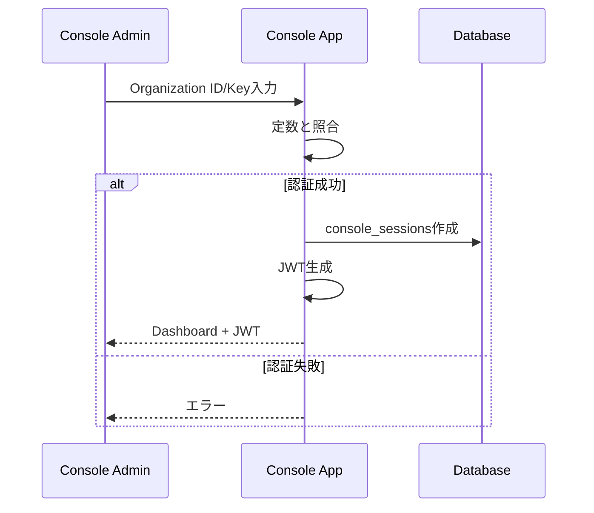

# Console API仕様

Console App（管理者向け）のAPI仕様です。ConnectRPCを使用しています。

## サービス一覧

- `ConsoleAuthService`: Console認証管理
- `ConsoleManagementService`: Tenant・メンバー管理

---

## ConsoleAuthService - Console認証サービス

```proto
service ConsoleAuthService {
    // Organization IDで認証
    rpc LoginWithOrgId(LoginWithOrgIdRequest) returns (LoginResponse);

    // ログアウト
    rpc Logout(LogoutRequest) returns (LogoutResponse);
}
```

### LoginWithOrgId
Organization IDとKeyを使用してConsoleにログインします。

**リクエスト**:
```proto
message LoginWithOrgIdRequest {
    string organization_id = 1 [(buf.validate.field).string.uuid = true];
    string organization_key = 2 [(buf.validate.field).string = {min_len: 1, max_len: 200}];
}
```

**レスポンス**:
```proto
message LoginResponse {
    string session_token = 1;  // JWT形式
    int64 expires_in = 2;      // 有効期限（秒）
}
```

### Logout
Console管理者をログアウトさせます。

**リクエスト**: なし

**レスポンス**:
```proto
message LogoutResponse {
    bool success = 1;
}
```

---

## ConsoleManagementService - Console管理サービス

```proto
service ConsoleManagementService {
    // Tenant作成
    rpc CreateTenant(CreateTenantRequest) returns (Tenant);

    // Tenant一覧
    rpc ListTenants(ListTenantsRequest) returns (ListTenantsResponse);

    // Tenantメンバー一覧
    rpc ListTenantMembers(ListTenantMembersRequest) returns (ListTenantMembersResponse);

    // 参加コード発行
    rpc GenerateJoinCode(GenerateJoinCodeRequest) returns (JoinCode);
}
```

### CreateTenant
新しいテナントを作成します。

**リクエスト**:
```proto
message CreateTenantRequest {
    string name = 1 [(buf.validate.field).string = {min_len: 1, max_len: 100}];
    string description = 2 [(buf.validate.field).string.max_len = 500];
    TenantType tenant_type = 3 [(buf.validate.field).enum = {defined_only: true, not_in: [0]}];
}
```

**レスポンス**:
```proto
message Tenant {
    string id = 1;  // UUID形式
    string organization_id = 2;  // UUID形式
    string name = 3;
    string description = 4;
    TenantType tenant_type = 5;
    google.protobuf.Timestamp created_at = 6;
    google.protobuf.Timestamp updated_at = 7;
}
```

### ListTenants
全テナント一覧を取得します。

**リクエスト**:
```proto
message ListTenantsRequest {
    int32 page_size = 1 [(buf.validate.field).int32 = {gte: 1, lte: 100}];
    string page_token = 2;
    string filter = 3;  // オプション: name, type等でフィルタ
}
```

**レスポンス**:
```proto
message ListTenantsResponse {
    repeated TenantWithStats tenants = 1;
    string next_page_token = 2;
    int32 total_count = 3;
}

message TenantWithStats {
    Tenant tenant = 1;
    int32 member_count = 2;
    int32 active_member_count = 3;
}
```

### ListTenantMembers
指定したテナントのメンバー一覧を取得します。

**リクエスト**:
```proto
message ListTenantMembersRequest {
    string tenant_id = 1 [(buf.validate.field).string.uuid = true];
    int32 page_size = 2 [(buf.validate.field).int32 = {gte: 1, lte: 100}];
    string page_token = 3;
}
```

**レスポンス**:
```proto
message ListTenantMembersResponse {
    repeated ConsoleTenantMember members = 1;
    string next_page_token = 2;
    int32 total_count = 3;
}

message ConsoleTenantMember {
    string user_id = 1 [(buf.validate.field).string.uuid = true];
    string email = 2 [(buf.validate.field).string.email = true];
    string name = 3;
    string icon = 4;
    Role role = 5;
    MembershipStatus status = 6;
    google.protobuf.Timestamp joined_at = 7;
    google.protobuf.Timestamp last_active_at = 8;
}
```

### GenerateJoinCode
テナントへの参加コードを発行します。

**リクエスト**:
```proto
message GenerateJoinCodeRequest {
    string tenant_id = 1 [(buf.validate.field).string.uuid = true];
    google.protobuf.Timestamp expires_at = 2;  // オプション
    int32 max_uses = 3 [(buf.validate.field).int32.gte = 0];  // オプション: 0は無制限
    Role assigned_role = 4 [(buf.validate.field).enum = {defined_only: true, not_in: [0]}];  // 参加時に付与されるロール
}
```

**レスポンス**:
```proto
message JoinCode {
    string id = 1 [(buf.validate.field).string.uuid = true];
    string code = 2;  // KH-XXXXX-XX形式
    string tenant_id = 3 [(buf.validate.field).string.uuid = true];
    google.protobuf.Timestamp expires_at = 4;
    int32 max_uses = 5;
    int32 used_count = 6;
    Role assigned_role = 7;
    google.protobuf.Timestamp created_at = 8;
}
```

---

## データ型定義

### Enum定義

```proto
// Tenantタイプ
enum TenantType {
    TENANT_TYPE_UNSPECIFIED = 0;
    TENANT_TYPE_TEAM = 1;        // チーム
    TENANT_TYPE_DEPARTMENT = 2;  // 部署
    TENANT_TYPE_PROJECT = 3;     // プロジェクト
    TENANT_TYPE_LABORATORY = 4;  // 研究室
}

// ユーザーロール
enum Role {
    ROLE_UNSPECIFIED = 0;
    ROLE_VIEWER = 1;      // 閲覧のみ
    ROLE_MEMBER = 2;      // 通常メンバー
    ROLE_ADMIN = 3;       // 管理者
    ROLE_OWNER = 4;       // オーナー
}

// メンバーシップステータス
enum MembershipStatus {
    MEMBERSHIP_STATUS_UNSPECIFIED = 0;
    MEMBERSHIP_STATUS_ACTIVE = 1;      // アクティブ
    MEMBERSHIP_STATUS_INACTIVE = 2;    // 非アクティブ
    MEMBERSHIP_STATUS_SUSPENDED = 3;   // 停止中
    MEMBERSHIP_STATUS_INVITED = 4;     // 招待中
}
```

---

## 認証フロー

### 初回ログイン



---

## セキュリティ

### Organization ID/Key管理

現在の実装（定数）:
```javascript
const ORGANIZATION_ID = "550e8400-e29b-41d4-a716-446655440000" // UUID形式
const ORGANIZATION_KEY = "org_key_example_12345"
```

環境変数での管理:
```bash
ORGANIZATION_ID=550e8400-e29b-41d4-a716-446655440000  # UUID形式
ORGANIZATION_KEY=secure_random_key_here
```

**注意**: Organization IDはUUID形式で管理します。DB内の`tenants.organization_id`と一致させる必要があります。

### JWT構成

```json
{
  "sub": "550e8400-e29b-41d4-a716-446655440000",
  "iat": 1704067200,
  "exp": 1704153600,  // 24時間後
  "type": "console_session"
}
```

---

## エラーコード

| コード | 説明 |
|--------|------|
| `UNAUTHENTICATED` | Organization ID/Keyが無効 |
| `PERMISSION_DENIED` | 操作権限なし |
| `ALREADY_EXISTS` | 既存のテナント名 |
| `NOT_FOUND` | テナントが見つからない |
| `INVALID_ARGUMENT` | 無効なパラメータ |
| `FAILED_PRECONDITION` | 前提条件を満たしていない |

---

## 完全なProtobufスキーマ

```proto
syntax = "proto3";

package keyhub.console.v1;

import "google/protobuf/timestamp.proto";
import "buf/validate/validate.proto";

option go_package = "github.com/yourusername/keyhub/gen/go/keyhub/console/v1;consolev1";

// ========== Enums ==========

// Tenantタイプ
enum TenantType {
    TENANT_TYPE_UNSPECIFIED = 0;
    TENANT_TYPE_TEAM = 1;        // チーム
    TENANT_TYPE_DEPARTMENT = 2;  // 部署
    TENANT_TYPE_PROJECT = 3;     // プロジェクト
    TENANT_TYPE_LABORATORY = 4;  // 研究室
}

// ユーザーロール
enum Role {
    ROLE_UNSPECIFIED = 0;
    ROLE_VIEWER = 1;      // 閲覧のみ
    ROLE_MEMBER = 2;      // 通常メンバー
    ROLE_ADMIN = 3;       // 管理者
    ROLE_OWNER = 4;       // オーナー
}

// メンバーシップステータス
enum MembershipStatus {
    MEMBERSHIP_STATUS_UNSPECIFIED = 0;
    MEMBERSHIP_STATUS_ACTIVE = 1;      // アクティブ
    MEMBERSHIP_STATUS_INACTIVE = 2;    // 非アクティブ
    MEMBERSHIP_STATUS_SUSPENDED = 3;   // 停止中
    MEMBERSHIP_STATUS_INVITED = 4;     // 招待中
}

// ========== Common Messages ==========

message Tenant {
    string id = 1 [(buf.validate.field).string.uuid = true];
    string organization_id = 2 [(buf.validate.field).string.uuid = true];
    string name = 3 [(buf.validate.field).string = {min_len: 1, max_len: 100}];
    string description = 4 [(buf.validate.field).string.max_len = 500];
    TenantType tenant_type = 5;
    google.protobuf.Timestamp created_at = 6;
    google.protobuf.Timestamp updated_at = 7;
}

message TenantWithStats {
    Tenant tenant = 1;
    int32 member_count = 2 [(buf.validate.field).int32.gte = 0];
    int32 active_member_count = 3 [(buf.validate.field).int32.gte = 0];
}

message ConsoleTenantMember {
    string user_id = 1 [(buf.validate.field).string.uuid = true];
    string email = 2 [(buf.validate.field).string.email = true];
    string name = 3 [(buf.validate.field).string = {min_len: 1, max_len: 100}];
    string icon = 4 [(buf.validate.field).string.uri = true];
    Role role = 5;
    MembershipStatus status = 6;
    google.protobuf.Timestamp joined_at = 7;
    google.protobuf.Timestamp last_active_at = 8;
}

message JoinCode {
    string id = 1 [(buf.validate.field).string.uuid = true];
    string code = 2 [(buf.validate.field).string = {pattern: "^KH-[A-Z0-9]{5}-[A-Z0-9]{2}$"}];
    string tenant_id = 3 [(buf.validate.field).string.uuid = true];
    google.protobuf.Timestamp expires_at = 4;
    int32 max_uses = 5 [(buf.validate.field).int32.gte = 0];
    int32 used_count = 6 [(buf.validate.field).int32.gte = 0];
    Role assigned_role = 7;
    google.protobuf.Timestamp created_at = 8;
}

// ========== ConsoleAuthService ==========

service ConsoleAuthService {
    // Organization IDで認証
    rpc LoginWithOrgId(LoginWithOrgIdRequest) returns (LoginResponse);

    // ログアウト
    rpc Logout(LogoutRequest) returns (LogoutResponse);
}

message LoginWithOrgIdRequest {
    string organization_id = 1 [(buf.validate.field).string.uuid = true];
    string organization_key = 2 [(buf.validate.field).string = {min_len: 1, max_len: 200}];
}

message LoginResponse {
    string session_token = 1;  // JWT形式
    int64 expires_in = 2;      // 有効期限（秒）
}

message LogoutRequest {}

message LogoutResponse {
    bool success = 1;
}

// ========== ConsoleManagementService ==========

service ConsoleManagementService {
    // Tenant作成
    rpc CreateTenant(CreateTenantRequest) returns (Tenant);

    // Tenant一覧
    rpc ListTenants(ListTenantsRequest) returns (ListTenantsResponse);

    // Tenantメンバー一覧
    rpc ListTenantMembers(ListTenantMembersRequest) returns (ListTenantMembersResponse);

    // 参加コード発行
    rpc GenerateJoinCode(GenerateJoinCodeRequest) returns (JoinCode);
}

message CreateTenantRequest {
    string name = 1 [(buf.validate.field).string = {min_len: 1, max_len: 100}];
    string description = 2 [(buf.validate.field).string.max_len = 500];
    TenantType tenant_type = 3 [(buf.validate.field).enum = {defined_only: true, not_in: [0]}];
}

message ListTenantsRequest {
    int32 page_size = 1 [(buf.validate.field).int32 = {gte: 1, lte: 100}];
    string page_token = 2;
    string filter = 3;  // オプション: name, type等でフィルタ
}

message ListTenantsResponse {
    repeated TenantWithStats tenants = 1;
    string next_page_token = 2;
    int32 total_count = 3 [(buf.validate.field).int32.gte = 0];
}

message ListTenantMembersRequest {
    string tenant_id = 1 [(buf.validate.field).string.uuid = true];
    int32 page_size = 2 [(buf.validate.field).int32 = {gte: 1, lte: 100}];
    string page_token = 3;
}

message ListTenantMembersResponse {
    repeated ConsoleTenantMember members = 1;
    string next_page_token = 2;
    int32 total_count = 3 [(buf.validate.field).int32.gte = 0];
}

message GenerateJoinCodeRequest {
    string tenant_id = 1 [(buf.validate.field).string.uuid = true];
    google.protobuf.Timestamp expires_at = 2;  // オプション
    int32 max_uses = 3 [(buf.validate.field).int32.gte = 0];  // オプション: 0は無制限
    Role assigned_role = 4 [(buf.validate.field).enum = {defined_only: true, not_in: [0]}];  // 参加時に付与されるロール
}
```

---

## バリデーションルール

### 共通ルール

- **UUID**: すべてのIDフィールドは有効なUUID形式
- **Email**: RFC 5322準拠のメールアドレス形式
- **URI**: 有効なURL形式（プロフィール画像など）
- **ページサイズ**: 1〜100の範囲

### フィールド別ルール

| フィールド | ルール |
|-----------|--------|
| `name` | 1〜100文字 |
| `description` | 最大500文字 |
| `organization_id` | UUID形式 |
| `organization_key` | 1〜200文字 |
| `code` | `KH-[A-Z0-9]{5}-[A-Z0-9]{2}` パターン |
| `tenant_type` | UNSPECIFIED以外の定義済みenum値 |
| `role` | UNSPECIFIED以外の定義済みenum値 |
| `max_uses` | 0以上（0は無制限） |

### Enum値の制約

- すべてのenum型フィールドは `UNSPECIFIED` (0) を除く定義済み値のみ許可
- リクエストで `UNSPECIFIED` を指定した場合は `INVALID_ARGUMENT` エラー

---

## HTTP エンドポイント

認証関連のHTTPエンドポイント：

| エンドポイント | メソッド | 説明 |
|---------------|---------|------|
| `/console/auth/login` | POST | Organization ID/Keyでログイン |

ConnectRPCエンドポイント：
- ベースURL: `/connect`
- Content-Type: `application/connect+proto`
