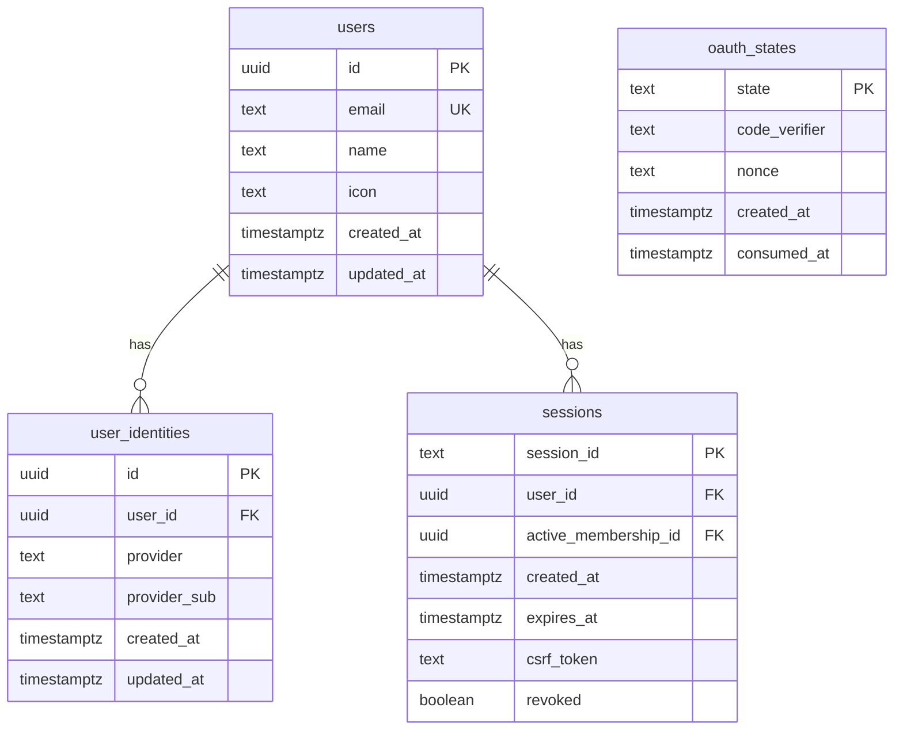

## ER図（コア）

```mermaid
erDiagram
  users {
    uuid id PK
    text email UK
    text name
    text icon
    timestamptz created_at
    timestamptz updated_at
  }

  user_identities {
    uuid id PK
    uuid user_id FK
    text provider
    text provider_sub
    timestamptz created_at
    timestamptz updated_at
  }

  sessions {
    text session_id PK
    uuid user_id FK
    uuid active_membership_id FK
    timestamptz created_at
    timestamptz expires_at
    text csrf_token
    boolean revoked
  }

  oauth_states {
    text state PK
    text code_verifier
    text nonce
    timestamptz created_at
    timestamptz consumed_at
  }

  users ||--o{ user_identities : has
  users ||--o{ sessions : has
```

