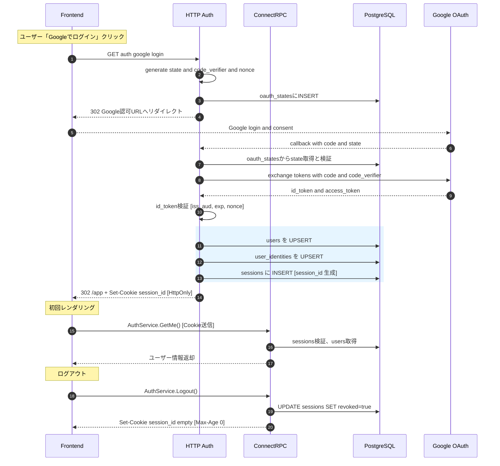

## 全体ワークフロー（DB操作込み）

```mermaid
sequenceDiagram
  autonumber
  participant FE as Frontend
  participant HTTP as HTTP Auth
  participant RPC as ConnectRPC
  participant DB as PostgreSQL
  participant G as Google OAuth

  Note over FE: ユーザー「Googleでログイン」クリック
  FE->>HTTP: GET auth google login
  HTTP->>HTTP: generate state and code_verifier and nonce
  HTTP->>DB: oauth_statesにINSERT
  HTTP-->>FE: 302 Google認可URLへリダイレクト

  FE-->>G: Google login and consent
  G-->>HTTP: callback with code and state
  HTTP->>DB: oauth_statesからstate取得と検証
  HTTP->>G: exchange tokens with code and code_verifier
  G-->>HTTP: id_token and access_token
  HTTP->>HTTP: id_token検証 [iss, aud, exp, nonce]
  %% refresh_token は取得/保存しない（Google APIは呼ばない前提）

  rect rgb(230, 245, 255)
    HTTP->>DB: users を UPSERT
    HTTP->>DB: user_identities を UPSERT
    HTTP->>DB: sessions に INSERT [session_id 生成]
  end

  HTTP-->>FE: 302 /app + Set-Cookie session_id [HttpOnly]

  Note over FE: 初回レンダリング
  FE->>RPC: AuthService.GetMe() [Cookie送信]
  RPC->>DB: sessions検証、users取得
  RPC-->>FE: ユーザー情報返却

  Note over FE: ログアウト
  FE->>RPC: AuthService.Logout()
  RPC->>DB: UPDATE sessions SET revoked=true
  RPC-->>FE: Set-Cookie session_id empty [Max-Age 0]

```

関連資料: authflow.md

