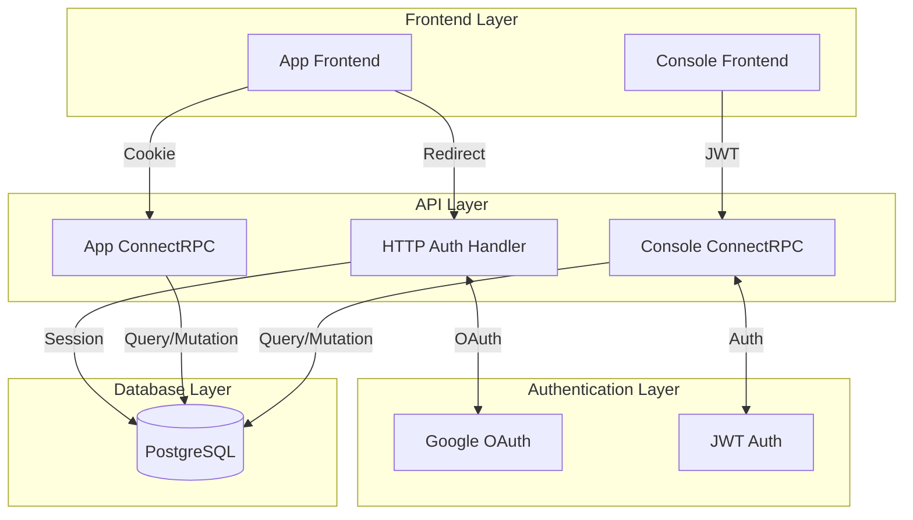
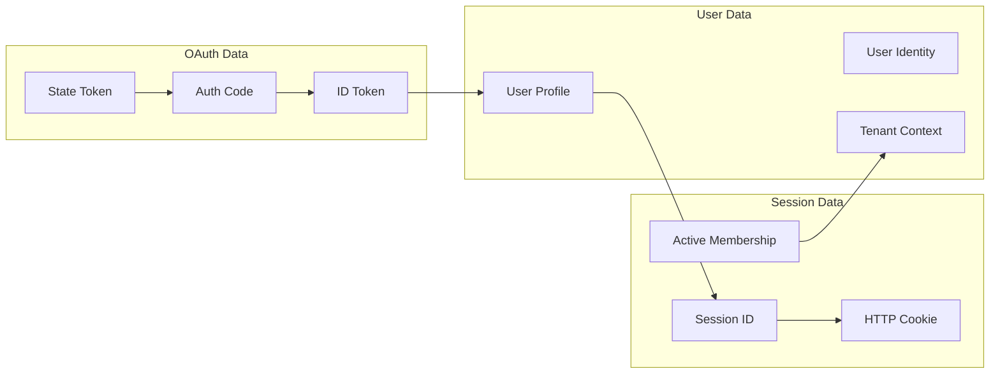
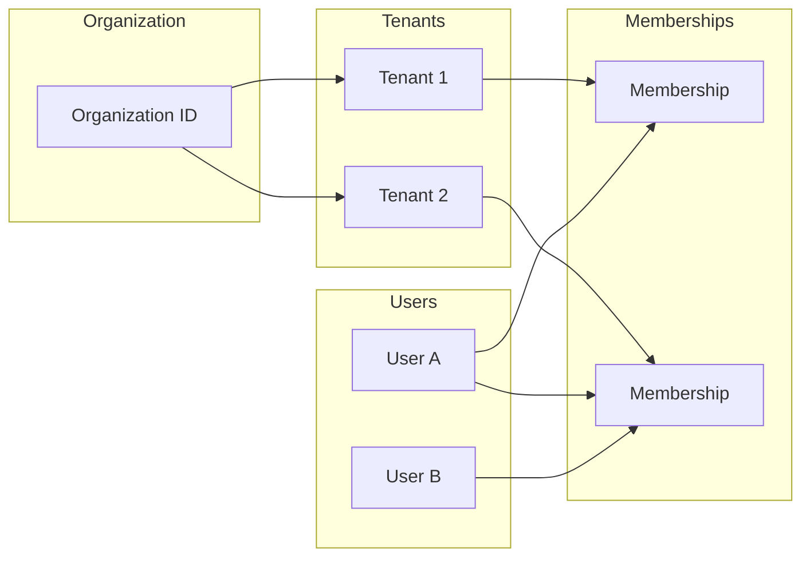
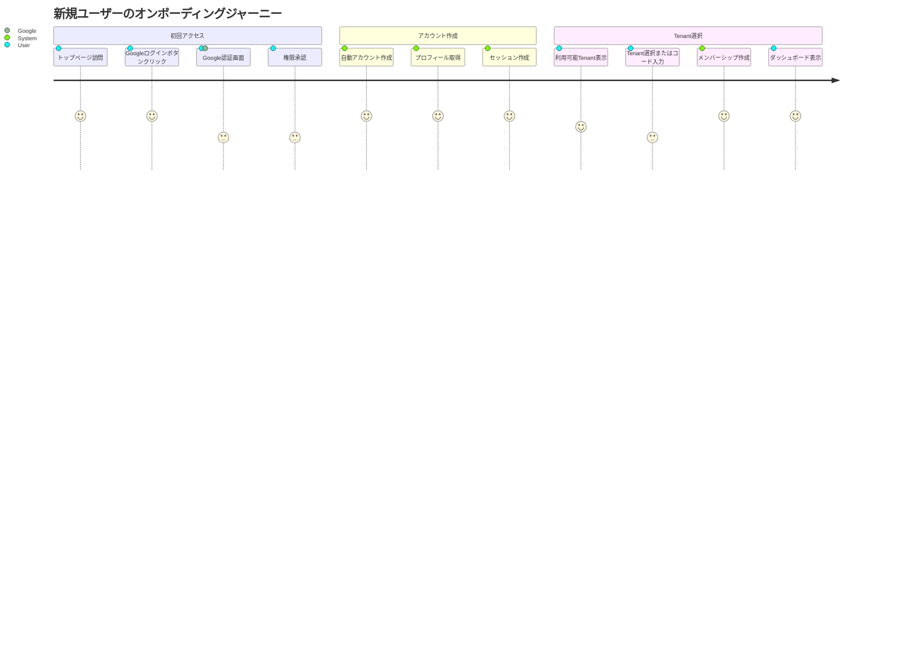
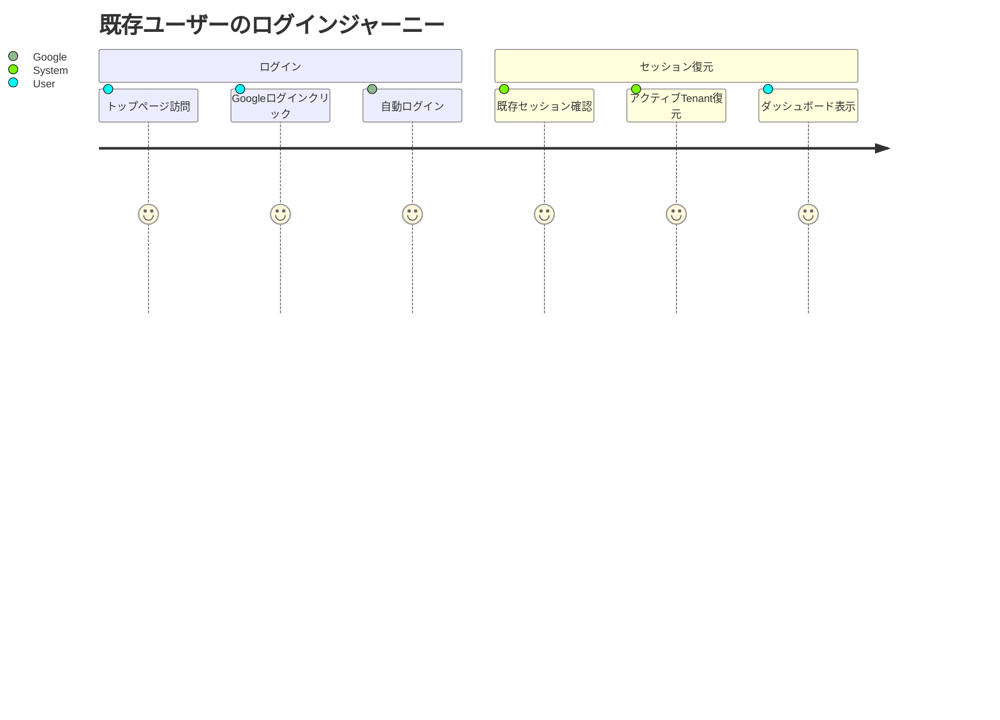
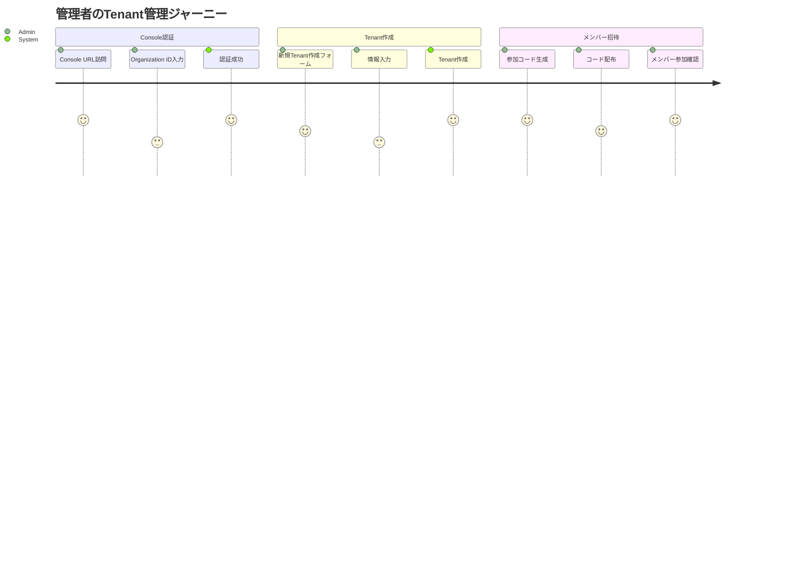

# データフローとユースケースシナリオ

KeyHubシステムにおけるデータフローと主要なユースケースシナリオの詳細です。

## 目次

1. [データフロー図](#1-データフロー図)
2. [ユーザージャーニー](#2-ユーザージャーニー)
3. [詳細シナリオ](#3-詳細シナリオ)
4. [エラーハンドリング](#4-エラーハンドリング)

---

## 1. データフロー図

### 1.1 全体データフロー



### 1.2 認証フローデータ



### 1.3 Tenantデータフロー



---

## 2. ユーザージャーニー

### 2.1 新規ユーザーのオンボーディング



### 2.2 既存ユーザーのログイン



### 2.3 管理者のTenant管理



---

## 3. 詳細シナリオ

### 3.1 シナリオ: 大学研究室での利用

**背景**
- 組織: 〇〇大学
- Tenant: 情報工学科、機械工学科、電気工学科
- ユーザー: 教員、学生、研究員

**フロー**

1. **初期セットアップ**
   ```sql
   -- Organization作成（将来）
   INSERT INTO organizations (id, name, slug)
   VALUES ('ORG-UNIV-001', '〇〇大学', 'univ-example');

   -- 学科Tenant作成
   INSERT INTO tenants (organization_id, name, slug, tenant_type)
   VALUES
   ('ORG-UNIV-001', '情報工学科', 'cs-dept', 'department'),
   ('ORG-UNIV-001', '機械工学科', 'mech-dept', 'department'),
   ('ORG-UNIV-001', '電気工学科', 'ee-dept', 'department');
   ```

2. **教員の参加**
   - Console経由で教員用参加コード生成（role='admin'）
   - 教員がコードで参加
   - 教員権限でグループ管理

3. **学生の参加**
   - 教員が学生用参加コード生成（role='member'）
   - 学生がコードで参加
   - 研究室リソースへのアクセス

### 3.2 シナリオ: 企業での部門管理

**背景**
- 組織: 株式会社Example
- Tenant: 営業部、開発部、人事部
- ユーザー: 社員、マネージャー、役員

**フロー**

1. **部門Tenant作成**
   ```typescript
   // Console APIで作成
   const tenants = [
     { name: '営業部', slug: 'sales', type: 'department' },
     { name: '開発部', slug: 'dev', type: 'department' },
     { name: '人事部', slug: 'hr', type: 'department' }
   ];
   ```

2. **社員オンボーディング**
   - 入社時に部門参加コード発行
   - Googleアカウントでログイン
   - 自動的に所属部門へ配置

3. **プロジェクト作成**
   ```sql
   -- プロジェクトTenant作成
   INSERT INTO tenants (organization_id, name, slug, tenant_type)
   VALUES ('ORG-CORP-001', 'プロジェクトA', 'project-a', 'project');

   -- メンバーアサイン
   INSERT INTO tenant_memberships (tenant_id, user_id, role)
   SELECT 'project-tenant-id', user_id, 'member'
   FROM tenant_memberships
   WHERE tenant_id IN ('sales-id', 'dev-id')
   AND role IN ('member', 'admin');
   ```

### 3.3 シナリオ: マルチテナント切り替え

**状況**
- ユーザーが複数Tenantに所属
- アクティブTenantの切り替えが必要

**実装**

```typescript
// Frontend: Tenant切り替えUI
async function switchTenant(tenantId: string) {
  const response = await rpc.switchTenant({
    tenant_id: tenantId
  });

  if (response.success) {
    // UIをリロード
    window.location.reload();
  }
}

// Backend: セッション更新
async function handleSwitchTenant(ctx: Context, req: SwitchTenantRequest) {
  // 権限確認
  const membership = await db.getMembership(ctx.userId, req.tenantId);
  if (!membership || membership.status !== 'active') {
    throw new Error('No active membership');
  }

  // セッション更新
  await db.updateSession(ctx.sessionId, {
    active_membership_id: membership.id
  });

  return { success: true };
}
```

### 3.4 シナリオ: 参加コード配布

**パターン1: メール配布**
```text
Subject: KeyHubへの招待

〇〇チームへの招待が届いています。
以下のコードを使用して参加してください。

参加コード: KH-A3B5C-7D
有効期限: 2024年12月31日

参加手順:
1. https://app.keyhub.example にアクセス
2. Googleアカウントでログイン
3. 参加コード入力画面でコードを入力
```

**パターン2: QRコード配布**
```typescript
// QRコード生成
const joinUrl = `https://app.keyhub.example/join?code=KH-A3B5C-7D`;
const qrCode = generateQR(joinUrl);

// 直接参加リンク処理
app.get('/join', async (req, res) => {
  const { code } = req.query;
  // セッションに保存
  req.session.pendingJoinCode = code;
  // ログイン画面へリダイレクト
  res.redirect('/auth/google/login');
});
```

---

## 4. エラーハンドリング

### 4.1 認証エラー

**シナリオ別エラー処理**

| エラー | 原因 | 対処 |
|------|------|------|
| Invalid state | CSRF攻撃の可能性 | 再度ログイン要求 |
| Token expired | IDトークン期限切れ | 再認証 |
| Session not found | セッション無効 | 新規ログイン |
| No active tenant | Tenant未選択 | Tenant選択画面表示 |

**エラーレスポンス例**
```typescript
interface ErrorResponse {
  error: {
    code: string;
    message: string;
    details?: any;
  };
  timestamp: string;
  request_id: string;
}

// 例
{
  "error": {
    "code": "AUTH_SESSION_EXPIRED",
    "message": "セッションが期限切れです。再度ログインしてください。",
    "details": {
      "expired_at": "2024-01-01T00:00:00Z"
    }
  },
  "timestamp": "2024-01-01T12:00:00Z",
  "request_id": "req_abc123"
}
```

### 4.2 Tenantエラー

**参加コードエラー**
```typescript
enum JoinCodeError {
  INVALID_CODE = "参加コードが無効です",
  EXPIRED_CODE = "参加コードの有効期限が切れています",
  MAX_USES_REACHED = "参加コードの使用上限に達しています",
  ALREADY_MEMBER = "既にメンバーとして登録されています"
}
```

**メンバーシップエラー**
```typescript
enum MembershipError {
  NOT_FOUND = "メンバーシップが見つかりません",
  INACTIVE = "メンバーシップが無効化されています",
  INSUFFICIENT_PERMISSION = "権限が不足しています",
  LAST_OWNER = "最後のオーナーは削除できません"
}
```

### 4.3 リトライ戦略

**自動リトライ**
```typescript
async function withRetry<T>(
  fn: () => Promise<T>,
  options: {
    maxAttempts: number;
    delay: number;
    backoff: number;
  }
): Promise<T> {
  let lastError: Error;

  for (let i = 0; i < options.maxAttempts; i++) {
    try {
      return await fn();
    } catch (error) {
      lastError = error;

      if (i < options.maxAttempts - 1) {
        const delay = options.delay * Math.pow(options.backoff, i);
        await sleep(delay);
      }
    }
  }

  throw lastError!;
}

// 使用例
const result = await withRetry(
  () => fetchUserData(),
  {
    maxAttempts: 3,
    delay: 1000,
    backoff: 2
  }
);
```

### 4.4 フォールバック処理

**Tenant取得失敗時**
```typescript
async function getTenantWithFallback(userId: string): Promise<Tenant> {
  try {
    // アクティブTenant取得
    const activeTenant = await getActiveTenant(userId);
    if (activeTenant) return activeTenant;
  } catch (error) {
    console.error('Failed to get active tenant:', error);
  }

  try {
    // デフォルトTenant取得
    const defaultTenant = await getDefaultTenant();
    if (defaultTenant) return defaultTenant;
  } catch (error) {
    console.error('Failed to get default tenant:', error);
  }

  // 最初のTenant取得
  const firstTenant = await getFirstAvailableTenant(userId);
  if (!firstTenant) {
    throw new Error('No tenant available');
  }

  return firstTenant;
}
```

## データ整合性保証

### トランザクション管理

```sql
-- 参加処理のトランザクション
BEGIN;

-- 排他ロック取得
SELECT * FROM tenant_join_codes
WHERE code = 'KH-ABC123'
FOR UPDATE;

-- 使用回数チェック
-- メンバーシップ作成
-- 使用回数更新

COMMIT;
```

### 同時実行制御

```typescript
// 楽観的ロック
interface OptimisticLock {
  version: number;
  updated_at: Date;
}

async function updateWithOptimisticLock(
  id: string,
  updates: any,
  expectedVersion: number
) {
  const result = await db.query(
    `UPDATE tenants
     SET ..., version = version + 1
     WHERE id = $1 AND version = $2`,
    [id, expectedVersion]
  );

  if (result.rowCount === 0) {
    throw new Error('Concurrent modification detected');
  }
}
```