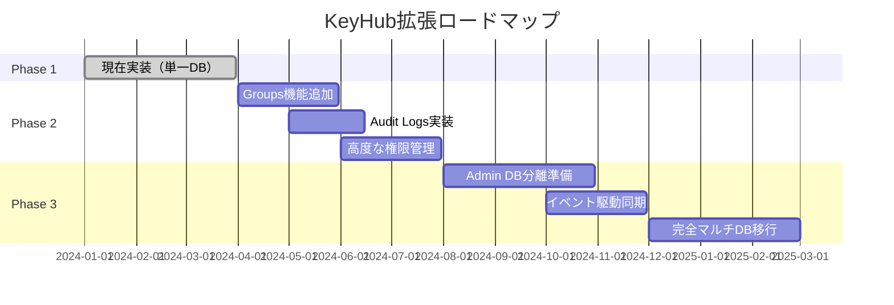
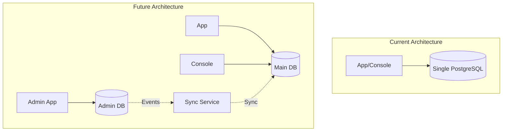
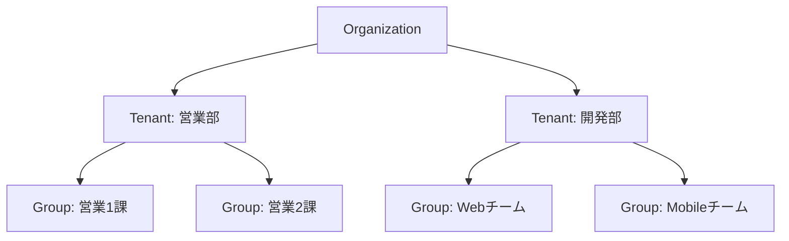

# 将来の拡張計画

KeyHubシステムの将来的な拡張計画と移行戦略の詳細です。

## 目次

1. [拡張ロードマップ](#1-拡張ロードマップ)
2. [マルチデータベース移行](#2-マルチデータベース移行)
3. [機能拡張詳細](#3-機能拡張詳細)
4. [技術的検討事項](#4-技術的検討事項)

---

## 1. 拡張ロードマップ

### 1.1 フェーズ概要



### 1.2 各フェーズの目標

**Phase 1: 基盤構築（現在）**
- ✅ 基本的な認証・認可
- ✅ Tenant管理
- ✅ 単一Organization対応
- ✅ Console管理画面

**Phase 2: 機能拡張**
- Groups機能によるサブ組織管理
- 監査ログによるコンプライアンス対応
- RBAC（Role-Based Access Control）
- API Rate Limiting

**Phase 3: スケーラビリティ**
- マルチデータベースアーキテクチャ
- Organization独立性の確立
- 水平スケーリング対応
- マルチリージョン展開

---

## 2. マルチデータベース移行

### 2.1 アーキテクチャ変更



### 2.2 データ分離戦略

**Admin DB（組織管理）**
```sql
-- Organizations
CREATE TABLE organizations (
    id TEXT PRIMARY KEY,
    name TEXT NOT NULL,
    slug TEXT UNIQUE NOT NULL,
    plan TEXT NOT NULL,
    settings JSONB,
    created_at TIMESTAMPTZ NOT NULL DEFAULT CURRENT_TIMESTAMP
);

-- Organization Domains
CREATE TABLE organization_domains (
    id UUID PRIMARY KEY DEFAULT uuid_generate_v4(),
    organization_id TEXT NOT NULL REFERENCES organizations(id),
    domain TEXT UNIQUE NOT NULL,
    is_verified BOOLEAN DEFAULT FALSE,
    verification_token TEXT,
    verified_at TIMESTAMPTZ
);

-- Organization API Keys
CREATE TABLE organization_api_keys (
    id UUID PRIMARY KEY DEFAULT uuid_generate_v4(),
    organization_id TEXT NOT NULL REFERENCES organizations(id),
    key_hash TEXT NOT NULL,
    name TEXT,
    permissions JSONB,
    expires_at TIMESTAMPTZ,
    created_at TIMESTAMPTZ NOT NULL DEFAULT CURRENT_TIMESTAMP
);

-- Billing Information
CREATE TABLE billing_accounts (
    id UUID PRIMARY KEY DEFAULT uuid_generate_v4(),
    organization_id TEXT NOT NULL REFERENCES organizations(id),
    stripe_customer_id TEXT,
    plan TEXT NOT NULL,
    status TEXT NOT NULL,
    current_period_end TIMESTAMPTZ
);
```

**Main DB（アプリケーション）**
```sql
-- 既存のテーブル構造を維持
-- organizations テーブルを参照テーブルに変更
CREATE TABLE organization_cache (
    id TEXT PRIMARY KEY,
    name TEXT NOT NULL,
    settings JSONB,
    synced_at TIMESTAMPTZ NOT NULL,
    version BIGINT NOT NULL
);
```

### 2.3 同期メカニズム

**イベント駆動同期**
```go
// Event定義
type OrganizationEvent struct {
    EventID      string    `json:"event_id"`
    EventType    string    `json:"event_type"`  // created, updated, deleted
    Organization Organization `json:"organization"`
    Timestamp    time.Time `json:"timestamp"`
    Version      int64     `json:"version"`
}

// Admin DBからのイベント発行
func PublishOrganizationEvent(org Organization, eventType string) error {
    event := OrganizationEvent{
        EventID:      uuid.New().String(),
        EventType:    eventType,
        Organization: org,
        Timestamp:    time.Now(),
        Version:      org.Version,
    }

    return messageQueue.Publish("organization.events", event)
}

// Main DBでのイベント処理
func HandleOrganizationEvent(event OrganizationEvent) error {
    switch event.EventType {
    case "created", "updated":
        return upsertOrganizationCache(event.Organization)
    case "deleted":
        return deleteOrganizationCache(event.Organization.ID)
    }
    return nil
}
```

**冪等性の保証**
```sql
-- Version管理による重複処理防止
UPDATE organization_cache
SET
    name = $2,
    settings = $3,
    synced_at = NOW(),
    version = $4
WHERE id = $1
AND version < $4;  -- より新しいバージョンのみ更新
```

---

## 3. 機能拡張詳細

### 3.1 Groups機能

**階層構造**


**実装テーブル**
```sql
CREATE TABLE groups (
    id UUID PRIMARY KEY DEFAULT uuid_generate_v4(),
    tenant_id UUID NOT NULL REFERENCES tenants(id),
    parent_group_id UUID REFERENCES groups(id),
    name TEXT NOT NULL,
    description TEXT,
    path TEXT NOT NULL,  -- 階層パス: /tenant-id/parent-id/group-id
    depth INTEGER NOT NULL DEFAULT 0,
    settings JSONB,
    created_at TIMESTAMPTZ NOT NULL DEFAULT CURRENT_TIMESTAMP,
    updated_at TIMESTAMPTZ NOT NULL DEFAULT CURRENT_TIMESTAMP
);

-- マテリアライズドパス用インデックス
CREATE INDEX idx_groups_path ON groups USING GIST (path gist_trgm_ops);

-- 階層クエリ用
CREATE INDEX idx_groups_parent ON groups(parent_group_id);
CREATE INDEX idx_groups_depth ON groups(depth);
```

**権限継承**
```typescript
// グループ権限の継承
interface GroupPermission {
  group_id: string;
  permission: string;
  inheritable: boolean;  // 子グループに継承
}

// 有効な権限の計算
async function getEffectivePermissions(userId: string, groupId: string) {
  // 1. 直接権限
  const directPerms = await getDirectPermissions(userId, groupId);

  // 2. 親グループからの継承権限
  const inheritedPerms = await getInheritedPermissions(groupId);

  // 3. Tenantレベル権限
  const tenantPerms = await getTenantPermissions(userId);

  return mergePermissions(directPerms, inheritedPerms, tenantPerms);
}
```

### 3.2 高度な権限管理（RBAC）

**権限テーブル設計**
```sql
-- 権限定義
CREATE TABLE permissions (
    id UUID PRIMARY KEY DEFAULT uuid_generate_v4(),
    name TEXT UNIQUE NOT NULL,
    resource TEXT NOT NULL,
    action TEXT NOT NULL,
    description TEXT
);

-- ロール定義
CREATE TABLE roles (
    id UUID PRIMARY KEY DEFAULT uuid_generate_v4(),
    tenant_id UUID REFERENCES tenants(id),
    name TEXT NOT NULL,
    description TEXT,
    is_system BOOLEAN DEFAULT FALSE,
    UNIQUE(tenant_id, name)
);

-- ロール権限マッピング
CREATE TABLE role_permissions (
    role_id UUID REFERENCES roles(id),
    permission_id UUID REFERENCES permissions(id),
    PRIMARY KEY (role_id, permission_id)
);

-- ユーザーロール割り当て
CREATE TABLE user_roles (
    user_id UUID REFERENCES users(id),
    role_id UUID REFERENCES roles(id),
    scope_type TEXT NOT NULL, -- 'tenant', 'group'
    scope_id UUID NOT NULL,
    granted_at TIMESTAMPTZ NOT NULL DEFAULT CURRENT_TIMESTAMP,
    granted_by UUID REFERENCES users(id),
    PRIMARY KEY (user_id, role_id, scope_type, scope_id)
);
```

**動的権限評価**
```go
// 権限チェックミドルウェア
func RequirePermission(resource string, action string) gin.HandlerFunc {
    return func(c *gin.Context) {
        user := GetUser(c)
        tenant := GetTenant(c)

        hasPermission := evaluatePermission(user.ID, tenant.ID, resource, action)

        if !hasPermission {
            c.JSON(403, gin.H{"error": "Insufficient permissions"})
            c.Abort()
            return
        }

        c.Next()
    }
}

// 権限評価エンジン
func evaluatePermission(userID, tenantID, resource, action string) bool {
    // キャッシュチェック
    cacheKey := fmt.Sprintf("perm:%s:%s:%s:%s", userID, tenantID, resource, action)
    if cached, exists := cache.Get(cacheKey); exists {
        return cached.(bool)
    }

    // データベースから評価
    query := `
        SELECT EXISTS(
            SELECT 1
            FROM user_roles ur
            JOIN role_permissions rp ON ur.role_id = rp.role_id
            JOIN permissions p ON rp.permission_id = p.id
            WHERE ur.user_id = $1
            AND ur.scope_id = $2
            AND p.resource = $3
            AND p.action = $4
        )
    `

    var hasPermission bool
    db.QueryRow(query, userID, tenantID, resource, action).Scan(&hasPermission)

    // キャッシュ保存（5分）
    cache.Set(cacheKey, hasPermission, 5*time.Minute)

    return hasPermission
}
```

### 3.3 監査ログ

**包括的ログ記録**
```go
type AuditLog struct {
    ID             string          `json:"id"`
    OrganizationID string          `json:"organization_id"`
    TenantID       *string         `json:"tenant_id,omitempty"`
    UserID         *string         `json:"user_id,omitempty"`
    Action         string          `json:"action"`
    ResourceType   string          `json:"resource_type"`
    ResourceID     string          `json:"resource_id"`
    Changes        json.RawMessage `json:"changes,omitempty"`
    Metadata       map[string]interface{} `json:"metadata"`
    IPAddress      string          `json:"ip_address"`
    UserAgent      string          `json:"user_agent"`
    CreatedAt      time.Time       `json:"created_at"`
}

// 自動ログ記録デコレータ
func WithAuditLog(action string, resourceType string) gin.HandlerFunc {
    return func(c *gin.Context) {
        // リクエスト前の状態を記録
        var before interface{}
        if c.Request.Method == "PUT" || c.Request.Method == "PATCH" {
            before = captureResourceState(c)
        }

        // ハンドラ実行
        c.Next()

        // 成功時のみログ記録
        if c.Writer.Status() < 400 {
            log := AuditLog{
                ID:             uuid.New().String(),
                OrganizationID: GetOrganizationID(c),
                TenantID:       GetTenantID(c),
                UserID:         GetUserID(c),
                Action:         action,
                ResourceType:   resourceType,
                ResourceID:     c.Param("id"),
                IPAddress:      c.ClientIP(),
                UserAgent:      c.Request.UserAgent(),
                CreatedAt:      time.Now(),
            }

            // 変更内容の記録
            if before != nil {
                after := captureResourceState(c)
                log.Changes = computeChanges(before, after)
            }

            // 非同期でログ保存
            go saveAuditLog(log)
        }
    }
}
```

---

## 4. 技術的検討事項

### 4.1 パフォーマンス最適化

**Connection Pooling**
```go
// データベース接続プール設定
type DBConfig struct {
    MaxOpenConns    int           // 最大接続数
    MaxIdleConns    int           // アイドル接続数
    ConnMaxLifetime time.Duration // 接続の最大生存時間
    ConnMaxIdleTime time.Duration // アイドル接続の最大時間
}

func NewDBPool(config DBConfig) *sql.DB {
    db, _ := sql.Open("postgres", dsn)

    db.SetMaxOpenConns(config.MaxOpenConns)
    db.SetMaxIdleConns(config.MaxIdleConns)
    db.SetConnMaxLifetime(config.ConnMaxLifetime)
    db.SetConnMaxIdleTime(config.ConnMaxIdleTime)

    return db
}

// 推奨設定
var productionConfig = DBConfig{
    MaxOpenConns:    25,
    MaxIdleConns:    10,
    ConnMaxLifetime: 1 * time.Hour,
    ConnMaxIdleTime: 10 * time.Minute,
}
```

**クエリ最適化**
```sql
-- 複合インデックスの活用
CREATE INDEX idx_tenant_memberships_lookup
ON tenant_memberships(user_id, tenant_id, status)
WHERE status = 'active';

-- パーティショニング（大規模データ）
CREATE TABLE sessions_2024_01 PARTITION OF sessions
FOR VALUES FROM ('2024-01-01') TO ('2024-02-01');

-- マテリアライズドビュー（集計高速化）
CREATE MATERIALIZED VIEW mv_tenant_stats AS
SELECT
    t.id as tenant_id,
    t.name as tenant_name,
    COUNT(DISTINCT tm.user_id) as member_count,
    COUNT(DISTINCT CASE WHEN tm.role = 'admin' THEN tm.user_id END) as admin_count,
    MAX(tm.joined_at) as last_joined_at
FROM tenants t
LEFT JOIN tenant_memberships tm ON t.id = tm.tenant_id AND tm.status = 'active'
GROUP BY t.id, t.name;

-- 定期リフレッシュ
CREATE OR REPLACE FUNCTION refresh_tenant_stats()
RETURNS void AS $$
BEGIN
    REFRESH MATERIALIZED VIEW CONCURRENTLY mv_tenant_stats;
END;
$$ LANGUAGE plpgsql;
```

### 4.2 セキュリティ強化

**Row Level Security (RLS)**
```sql
-- RLS有効化
ALTER TABLE tenants ENABLE ROW LEVEL SECURITY;

-- ポリシー定義
CREATE POLICY tenant_isolation ON tenants
    FOR ALL
    TO application_user
    USING (organization_id = current_setting('app.current_org_id')::text);

-- アプリケーションでの設定
BEGIN;
SET LOCAL app.current_org_id = 'ORG-001';
-- クエリ実行（自動的にORG-001のデータのみアクセス可能）
COMMIT;
```

**暗号化**
```go
// フィールドレベル暗号化
type EncryptedField struct {
    CipherText []byte
    Nonce      []byte
}

func EncryptSensitiveData(plaintext string, key []byte) (*EncryptedField, error) {
    block, _ := aes.NewCipher(key)
    gcm, _ := cipher.NewGCM(block)

    nonce := make([]byte, gcm.NonceSize())
    io.ReadFull(rand.Reader, nonce)

    ciphertext := gcm.Seal(nil, nonce, []byte(plaintext), nil)

    return &EncryptedField{
        CipherText: ciphertext,
        Nonce:      nonce,
    }, nil
}
```

### 4.3 可観測性

**メトリクス収集**
```go
// Prometheusメトリクス
var (
    apiRequestDuration = prometheus.NewHistogramVec(
        prometheus.HistogramOpts{
            Name: "keyhub_api_request_duration_seconds",
            Help: "API request duration in seconds",
        },
        []string{"method", "endpoint", "status"},
    )

    activeUsers = prometheus.NewGaugeVec(
        prometheus.GaugeOpts{
            Name: "keyhub_active_users",
            Help: "Number of active users",
        },
        []string{"tenant_id"},
    )
)

// トレーシング
func TraceMiddleware() gin.HandlerFunc {
    return func(c *gin.Context) {
        ctx, span := tracer.Start(c.Request.Context(), c.Request.URL.Path)
        defer span.End()

        span.SetAttributes(
            attribute.String("http.method", c.Request.Method),
            attribute.String("http.url", c.Request.URL.String()),
            attribute.String("user.id", GetUserID(c)),
        )

        c.Request = c.Request.WithContext(ctx)
        c.Next()

        span.SetAttributes(
            attribute.Int("http.status_code", c.Writer.Status()),
        )
    }
}
```

## 移行チェックリスト

### Phase 2移行前
- [ ] Groups機能の要件定義完了
- [ ] 権限モデルの設計レビュー
- [ ] データベーススキーマの承認
- [ ] 既存データの移行計画
- [ ] ロールバック手順の文書化

### Phase 3移行前
- [ ] マルチDB同期の性能テスト
- [ ] 組織分離の完全性検証
- [ ] 災害復旧計画の策定
- [ ] 監視・アラートの設定
- [ ] 負荷テストの実施