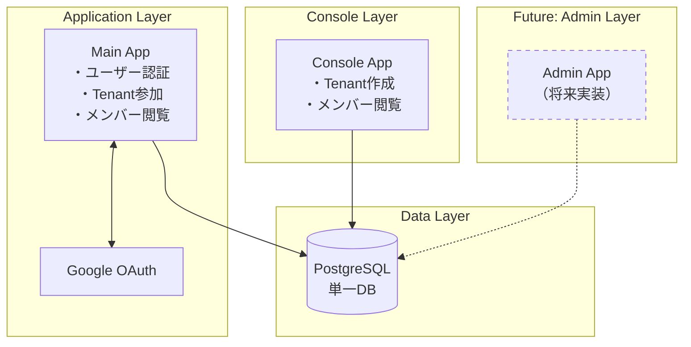

# システム概要

KeyHubは、Google OAuth 2.0/OIDCを使用した認証システムと、組織管理機能を備えたWebアプリケーションです。

## アーキテクチャ構成

## 現在の実装範囲

### App側
- **認証**: Google OAuth 2.0 + OIDC
- **機能**:
  - Tenant参加機能
  - メンバー一覧表示
  - セッション管理（HttpOnly Cookie）

### Console側
- **認証**: Organization ID認証（定数）
- **機能**:
  - Tenant作成・管理
  - メンバー一覧閲覧
  - 参加コード発行

### データ層
- **データベース**: PostgreSQL（単一DB）
- **将来**: Admin DBとMain DBに分離可能な設計

## 用語定義

| 用語 | 説明 | 現在の実装 | 将来の拡張 |
|------|------|------------|------------|
| **Organization** | 最上位組織（会社・大学） | 定数として1つ | Admin DBで管理 |
| **Tenant** | 部門・研究室 | Console作成 | Organization配下 |
| **User** | エンドユーザー | Google認証 | 複数Organization対応 |
| **Group** | Tenant内の小グループ | 未実装 | オプション機能 |

## 設計原則

1. **段階的拡張**: 小さく始めて段階的に機能追加
2. **後方互換性**: 既存機能を壊さない拡張
3. **設定駆動**: Feature Flagsによる機能切り替え
4. **将来への準備**: Admin Layer、Integration Layer、Group機能への拡張ポイント