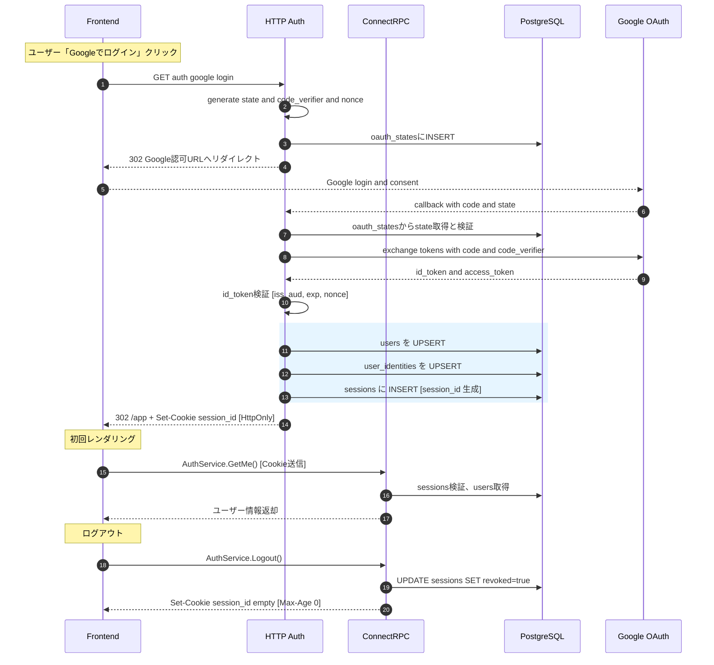
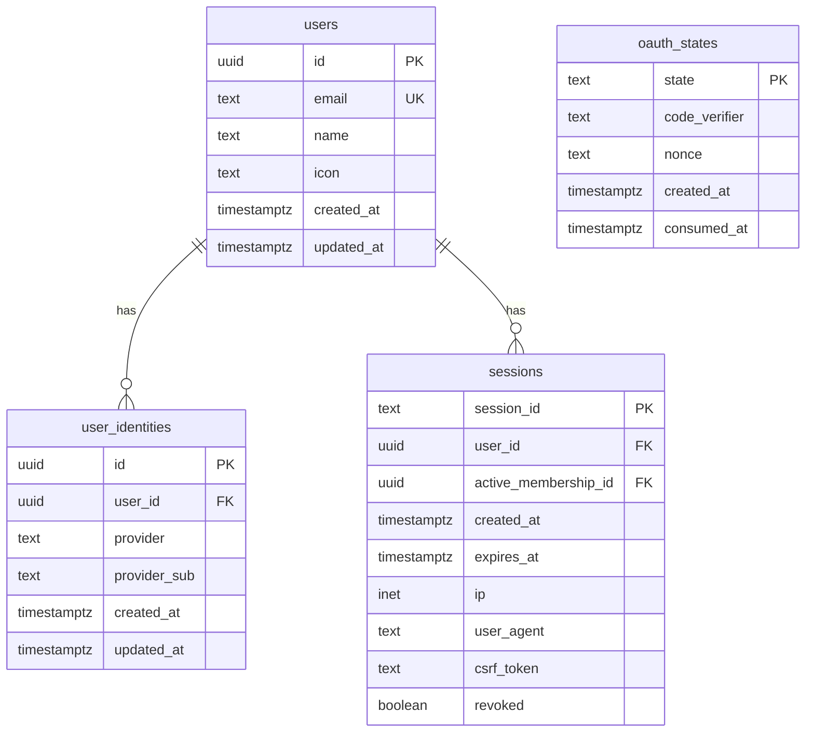

# 認証フロー

## 1️⃣ 方針と用語

- OAuth 2.0 と OIDC（OpenID Connect）で Google ログインを実装。
- フローは Authorization Code + PKCE。リダイレクト処理は HTTP、業務APIは ConnectRPC。
- IDトークンはサーバーで必ず検証（iss/aud/exp/nonce）。
- Accessトークンは自サービスの認証には使わない。
- Refreshトークンは取得・保存しない（Google API は呼ばない前提）。

## 2️⃣ アーキテクチャ概要

- HTTPハンドラ: `/auth/google/login`, `/auth/google/callback`
- セッション: `HttpOnly+Secure` クッキーで配布（`session_id`）。
- ConnectRPC: `AuthService.GetMe`, `AuthService.Logout` ほか業務API。認証はサーバ/クライアント両インターセプタで一元化。

## 3️⃣ 全体フロー（DB操作込み）

## 4️⃣ ER 図（認証関連）

## 5️⃣ テーブル詳細

### users

| カラム | 型 | 説明 |
| --- | --- | --- |
| id | uuid | 主キー。`uuid_generate_v4()` |
| email | text | Google のメールアドレス（lower unique） |
| name | text | 表示名（Googleプロフィール） |
| icon | text | 画像URL（Googleプロフィール） |
| created_at / updated_at | timestamptz | 監査用 |

### user_identities

| カラム | 型 | 説明 |
| --- | --- | --- |
| id | uuid | 主キー |
| user_id | uuid | 外部キー（users.id） |
| provider | text | 例: `google` |
| provider_sub | text | Google の `sub` |
| created_at / updated_at | timestamptz | 監査用 |

備考: 現状は Google API を呼ばないため refresh_token は保存しない。

### sessions

| カラム | 型 | 説明 |
| --- | --- | --- |
| session_id | text | ランダムID（Cookieに保存） |
| user_id | uuid | 外部キー（users.id） |
| active_membership_id | uuid | `tenant_memberships.id` 外部キー。NULL許容 |
| created_at / expires_at | timestamptz | 作成・期限 |
| ip / user_agent | inet / text | 監査用 |
| csrf_token | text | CSRF対策 |
| revoked | boolean | ログアウト等で無効化 |

### oauth_states

| カラム | 型 | 説明 |
| --- | --- | --- |
| state | text | ランダム値（CSRF対策） |
| code_verifier | text | PKCE 用 |
| nonce | text | IDトークン検証用 |
| created_at / consumed_at | timestamptz | 期限・消費済み |

## 6️⃣ API と DB 対応

| エンドポイント/メソッド | 操作 | 対応テーブル |
| --- | --- | --- |
| GET /auth/google/login | INSERT | oauth_states |
| GET /auth/google/callback | UPSERT/INSERT | users, user_identities, sessions, oauth_states |
| AuthService.GetMe | SELECT | sessions, users |
| AuthService.Logout | UPDATE (revoked=true) | sessions |

## 7️⃣ 運用・セキュリティ

- TTL/GC: `oauth_states` は10〜15分、`sessions` は `expires_at` と `revoked=true` を定期清掃。
- クッキー: `HttpOnly + Secure + SameSite=Lax(または None)`。
- CSRF: `csrf_token` 発行・検証（必要なエンドポイントに限定）。
- 端末管理: `ip/user_agent` を保持。必要なら device 情報付与。
- IDトークン検証: JWK で署名、`iss/aud/exp/nonce` を厳格に確認。
- CORS: 必要最小限（Origin固定、credentials有効時のヘッダ制御）。

## 8️⃣ RLS（概略）

- セッションの `active_membership_id` を DB セッション変数で伝播し、RLS でテナント境界を強制。
- 例: `current_setting('app.membership_id', true)` から `tenant_id` を導出し、各テーブルを `tenant_id = current_tenant_id()` で制限。
- 詳細なDDL例は `docs/all.md` の「RLS（概略）」を参照。

## 9️⃣ 実装メモ

- Google OAuth スコープ: `openid email profile`（Google API を呼ばない運用）
- ConnectRPC の未認証応答は `CodeUnauthenticated` を統一使用。
- エラー（`invalid_grant` 等）は HTTP 側でユーザ向けに 302 で整流。

## まとめ

- リダイレクトは HTTP、業務APIは ConnectRPC。セッションは HttpOnly クッキー。
- Logout は session を削除せず `revoked=true`（監査性・多端末管理のため）。
- マルチテナントは `active_membership_id` で文脈化し、RLS と併用して境界を強制。

