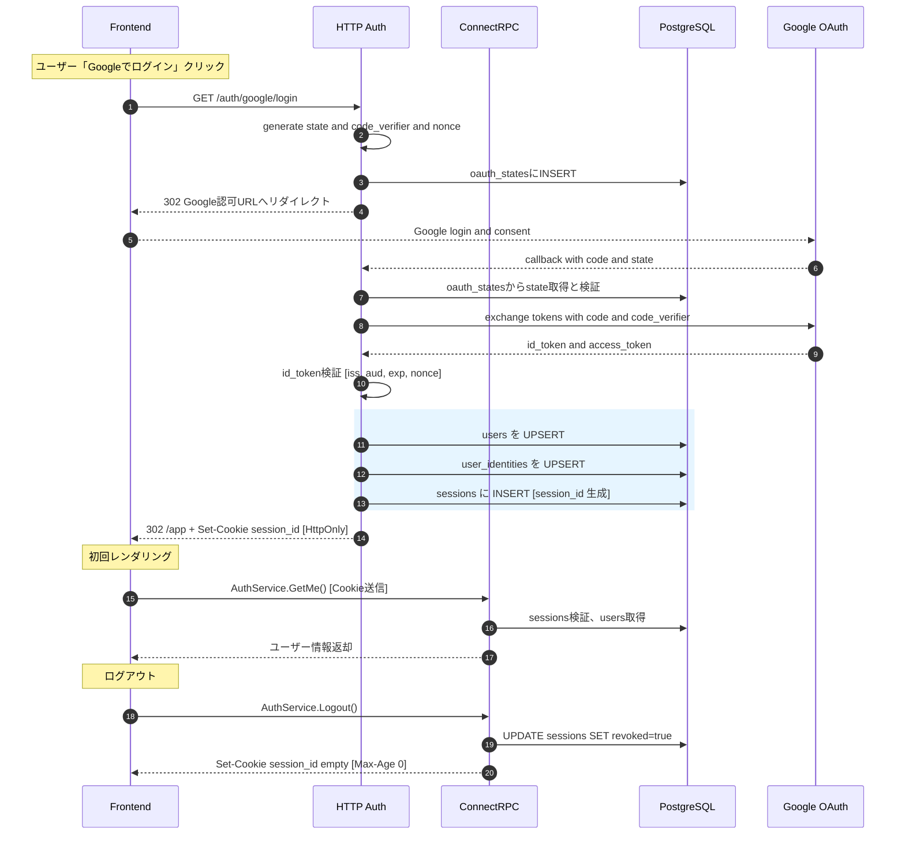
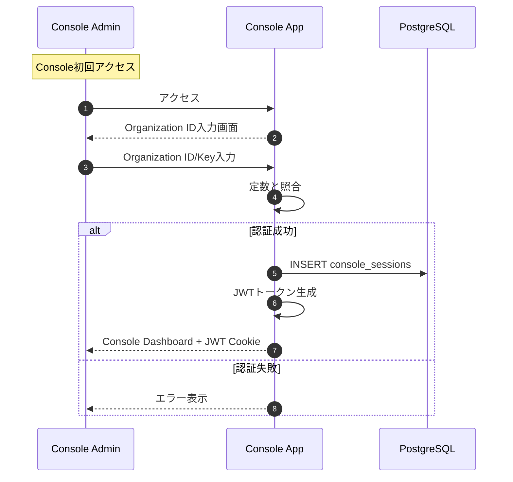
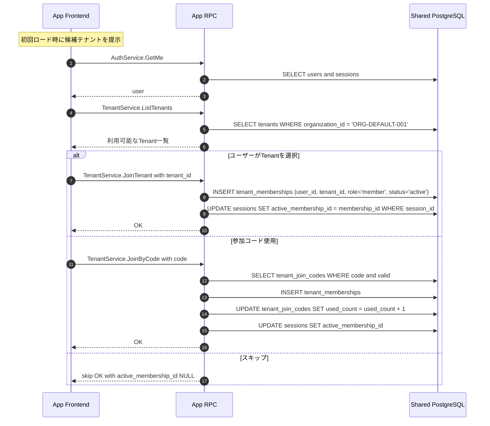

# 認証フロー詳細

KeyHubの認証フローの完全な仕様書です。

## 目次

1. [App側認証フロー](#1-app側認証フロー)
2. [Console側認証フロー](#2-console側認証フロー)
3. [Tenant参加フロー](#3-tenant参加フロー)

---

## 1. App側認証フロー

### 1.1 Google OAuth認証フロー全体



### 1.2 認証開始処理詳細

#### エンドポイント: `GET /auth/google/login`

**処理フロー**:

1. **セキュリティパラメータ生成**
   ```go
   state := generateRandomString(32)        // CSRF対策
   codeVerifier := generateCodeVerifier()   // PKCE用（43-128文字）
   codeChallenge := sha256(codeVerifier)    // S256方式
   nonce := generateRandomString(32)        // リプレイ攻撃対策
   ```

2. **一時保存**
   ```sql
   INSERT INTO oauth_states (state, code_verifier, nonce, created_at)
   VALUES ($1, $2, $3, NOW())
   ```

3. **Google認証URLパラメータ**
   ```
   https://accounts.google.com/o/oauth2/v2/auth?
     client_id={CLIENT_ID}
     &redirect_uri={REDIRECT_URI}
     &response_type=code
     &scope=openid+email+profile
     &state={state}
     &nonce={nonce}
     &code_challenge={codeChallenge}
     &code_challenge_method=S256
   ```

### 1.3 コールバック処理詳細

#### エンドポイント: `GET /auth/google/callback`

**処理フロー**:

1. **State検証**
   ```sql
   SELECT * FROM oauth_states
   WHERE state = $1
   AND consumed_at IS NULL
   AND created_at > NOW() - INTERVAL '15 minutes'
   ```

2. **トークン交換**
   ```
   POST https://oauth2.googleapis.com/token
   {
     "code": "{authorization_code}",
     "client_id": "{CLIENT_ID}",
     "client_secret": "{CLIENT_SECRET}",
     "redirect_uri": "{REDIRECT_URI}",
     "grant_type": "authorization_code",
     "code_verifier": "{code_verifier}"
   }
   ```

3. **IDトークン検証**
   - **署名検証**: Google JWKSを使用
   - **Issuer確認**: `https://accounts.google.com`
   - **Audience確認**: CLIENT_IDと一致
   - **有効期限確認**: 現在時刻より未来
   - **Nonce確認**: 保存されたnonceと一致

4. **ユーザー処理**
   ```sql
   -- users UPSERT
   INSERT INTO users (email, name, icon, created_at, updated_at)
   VALUES ($1, $2, $3, NOW(), NOW())
   ON CONFLICT (email)
   DO UPDATE SET
     name = EXCLUDED.name,
     icon = EXCLUDED.icon,
     updated_at = NOW()
   RETURNING id;

   -- user_identities UPSERT
   INSERT INTO user_identities (user_id, provider, provider_sub, created_at, updated_at)
   VALUES ($1, 'google', $2, NOW(), NOW())
   ON CONFLICT (user_id, provider, provider_sub)
   DO UPDATE SET updated_at = NOW();
   ```

5. **セッション作成**
   ```sql
   INSERT INTO sessions (session_id, user_id, expires_at, created_at)
   VALUES ($1, $2, NOW() + INTERVAL '7 days', NOW())
   ```

6. **Cookie設定**
   ```
   Set-Cookie: session_id={session_id};
     HttpOnly;
     Secure;
     SameSite=Lax;
     Max-Age=604800;
     Path=/
   ```

### 1.4 セッション管理

#### セッション検証（全APIリクエスト）

```go
func validateSession(sessionID string) (*User, error) {
    session, err := db.Query(`
        SELECT s.*, u.*
        FROM sessions s
        JOIN users u ON s.user_id = u.id
        WHERE s.session_id = $1
        AND s.revoked = false
        AND s.expires_at > NOW()
    `, sessionID)

    if err != nil {
        return nil, ErrInvalidSession
    }

    return session.User, nil
}
```

#### セッション更新（アクティビティ延長）

```sql
UPDATE sessions
SET expires_at = NOW() + INTERVAL '7 days'
WHERE session_id = $1
AND revoked = false
```

---

## 2. Console側認証フロー

### 2.1 Organization ID認証フロー



### 2.2 認証処理詳細

#### 定数管理（現在実装）

```go
const (
    ORGANIZATION_ID  = "ORG-DEFAULT-001"
    ORGANIZATION_KEY = "org_key_example_12345"
)

// 本番環境では環境変数から取得
func getOrganizationCredentials() (string, string) {
    if env == "production" {
        return os.Getenv("ORGANIZATION_ID"), os.Getenv("ORGANIZATION_KEY")
    }
    return ORGANIZATION_ID, ORGANIZATION_KEY
}
```

#### JWT生成

```go
type ConsoleClaims struct {
    OrganizationID string `json:"org_id"`
    SessionID      string `json:"session_id"`
    jwt.RegisteredClaims
}

func generateConsoleJWT(orgID, sessionID string) (string, error) {
    claims := ConsoleClaims{
        OrganizationID: orgID,
        SessionID:      sessionID,
        RegisteredClaims: jwt.RegisteredClaims{
            ExpiresAt: jwt.NewNumericDate(time.Now().Add(24 * time.Hour)),
            IssuedAt:  jwt.NewNumericDate(time.Now()),
            Subject:   orgID,
        },
    }

    token := jwt.NewWithClaims(jwt.SigningMethodHS256, claims)
    return token.SignedString(jwtSecret)
}
```

#### セッション管理

```sql
-- セッション作成
INSERT INTO console_sessions (session_id, organization_id, expires_at, created_at)
VALUES ($1, $2, NOW() + INTERVAL '24 hours', NOW());

-- セッション検証
SELECT * FROM console_sessions
WHERE session_id = $1
AND organization_id = $2
AND expires_at > NOW();
```

---

## 3. Tenant参加フロー

### 3.1 Tenant参加完全フロー



### 3.2 Tenant選択処理

#### 利用可能Tenant取得

```sql
SELECT
    t.id,
    t.name,
    t.slug,
    t.description,
    t.tenant_type,
    COUNT(tm.id) as member_count
FROM tenants t
LEFT JOIN tenant_memberships tm ON t.id = tm.tenant_id AND tm.status = 'active'
WHERE t.organization_id = $1
GROUP BY t.id
ORDER BY t.name;
```

#### Tenant参加処理

```sql
-- メンバーシップ作成
INSERT INTO tenant_memberships (
    tenant_id,
    user_id,
    role,
    status,
    joined_at
) VALUES (
    $1,  -- tenant_id
    $2,  -- user_id
    'member',
    'active',
    NOW()
) ON CONFLICT (tenant_id, user_id) DO NOTHING
RETURNING id;

-- アクティブメンバーシップ設定
UPDATE sessions
SET active_membership_id = $1
WHERE session_id = $2
AND user_id = $3;
```

### 3.3 参加コード処理

#### コード検証

```sql
SELECT
    tjc.*,
    t.name as tenant_name
FROM tenant_join_codes tjc
JOIN tenants t ON tjc.tenant_id = t.id
WHERE tjc.code = $1
AND (tjc.expires_at IS NULL OR tjc.expires_at > NOW())
AND (tjc.max_uses = 0 OR tjc.used_count < tjc.max_uses);
```

#### 使用回数更新

```sql
-- トランザクション内で実行
BEGIN;

-- 参加コードの使用回数チェック
SELECT * FROM tenant_join_codes
WHERE code = $1
FOR UPDATE;

-- メンバーシップ作成
INSERT INTO tenant_memberships (...);

-- 使用回数インクリメント
UPDATE tenant_join_codes
SET used_count = used_count + 1
WHERE code = $1;

COMMIT;
```

### 3.4 Tenant切り替え

#### アクティブTenant変更

```sql
-- 権限確認
SELECT id FROM tenant_memberships
WHERE user_id = $1
AND tenant_id = $2
AND status = 'active';

-- 切り替え
UPDATE sessions
SET active_membership_id = $1
WHERE session_id = $2
AND user_id = $3;
```

#### コンテキスト取得（API処理）

```go
func GetTenantContext(ctx context.Context) (*TenantContext, error) {
    session := GetSessionFromContext(ctx)

    if session.ActiveMembershipID == nil {
        return nil, ErrNoActiveTenant
    }

    membership, err := db.GetMembership(session.ActiveMembershipID)
    if err != nil {
        return nil, err
    }

    return &TenantContext{
        TenantID: membership.TenantID,
        UserID:   membership.UserID,
        Role:     membership.Role,
    }, nil
}
```

## セキュリティ考慮事項

### CSRF対策
- OAuth: stateパラメータ（32文字のランダム文字列）
- フォーム: csrf_tokenをセッションに保存

### セッション固定攻撃対策
- ログイン成功時に新しいセッションIDを発行
- 古いセッションは無効化

### タイミング攻撃対策
- パスワード検証（将来）: constant-time comparison
- エラーレスポンスの統一化

### レート制限
- ログイン試行: 5回/分
- 参加コード試行: 10回/時
- API全般: 1000回/時