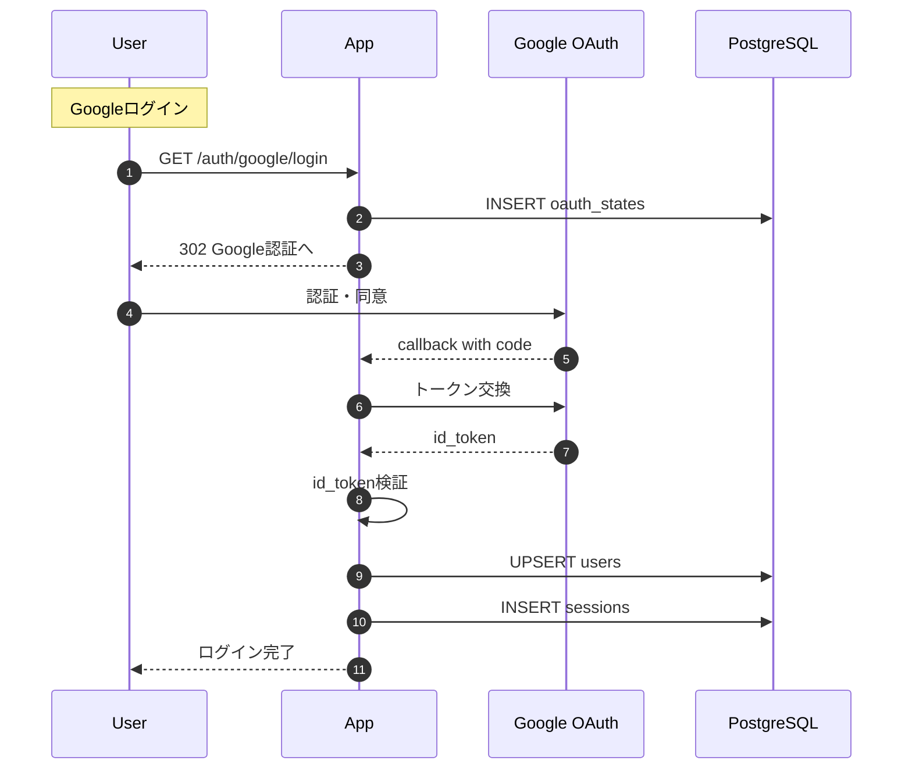

# Google OAuth 認証

KeyHubのGoogle OAuth 2.0 + OpenID Connect実装の詳細です。

## 認証フロー概要

### 基本方針

- **プロトコル**: OAuth 2.0 + OIDC (OpenID Connect)
- **フロー**: Authorization Code + PKCE
- **リダイレクト処理**: HTTP
- **業務API**: ConnectRPC
- **IDトークン検証**: iss/aud/exp/nonce を厳格に確認
- **セッション**: HttpOnly + Secure Cookie

### 全体フロー



## 実装詳細

### 1. 認証開始 (`/auth/google/login`)

```go
func GoogleLogin(w http.ResponseWriter, r *http.Request) {
    // PKCE用のcode_verifier生成
    codeVerifier := generateCodeVerifier()
    codeChallenge := generateCodeChallenge(codeVerifier)

    // CSRF対策のstate生成
    state := generateRandomString(32)

    // リプレイ攻撃対策のnonce生成
    nonce := generateRandomString(32)

    // DBに保存
    db.SaveOAuthState(state, codeVerifier, nonce)

    // Google認証URLへリダイレクト
    authURL := buildGoogleAuthURL(
        clientID,
        redirectURI,
        state,
        nonce,
        codeChallenge,
    )

    http.Redirect(w, r, authURL, http.StatusFound)
}
```

### 2. コールバック処理 (`/auth/google/callback`)

```go
func GoogleCallback(w http.ResponseWriter, r *http.Request) {
    // state検証
    state := r.URL.Query().Get("state")
    oauthState := db.GetOAuthState(state)
    if oauthState == nil {
        return errorInvalidState()
    }

    // トークン交換
    code := r.URL.Query().Get("code")
    tokens := exchangeTokens(code, oauthState.CodeVerifier)

    // IDトークン検証
    claims := verifyIDToken(tokens.IDToken, oauthState.Nonce)

    // ユーザー作成/更新
    user := db.UpsertUser(
        claims.Email,
        claims.Name,
        claims.Picture,
    )

    // セッション作成
    sessionID := generateSessionID()
    db.CreateSession(sessionID, user.ID, 7*24*time.Hour)

    // Cookie設定
    http.SetCookie(w, &http.Cookie{
        Name:     "session_id",
        Value:    sessionID,
        HttpOnly: true,
        Secure:   true,
        SameSite: http.SameSiteLaxMode,
        MaxAge:   7 * 24 * 60 * 60,
    })

    // アプリへリダイレクト
    http.Redirect(w, r, "/app", http.StatusFound)
}
```

### 3. IDトークン検証

```go
func verifyIDToken(idToken string, expectedNonce string) (*Claims, error) {
    // JWKSで署名検証
    keys := getGoogleJWKS()
    token, err := jwt.Parse(idToken, keys)

    // クレーム検証
    claims := token.Claims

    // Issuer検証
    if claims.Issuer != "https://accounts.google.com" {
        return nil, ErrInvalidIssuer
    }

    // Audience検証
    if claims.Audience != clientID {
        return nil, ErrInvalidAudience
    }

    // 有効期限検証
    if time.Now().After(claims.ExpiresAt) {
        return nil, ErrTokenExpired
    }

    // Nonce検証
    if claims.Nonce != expectedNonce {
        return nil, ErrInvalidNonce
    }

    return claims, nil
}
```

## セキュリティ設定

### Cookie設定

```go
cookie := &http.Cookie{
    Name:     "session_id",
    Value:    sessionID,
    HttpOnly: true,              // XSS対策
    Secure:   true,              // HTTPS必須
    SameSite: http.SameSiteLax, // CSRF対策
    MaxAge:   604800,            // 7日間
    Path:     "/",
}
```

### CORS設定

```go
cors := handlers.CORS(
    handlers.AllowedOrigins([]string{frontendURL}),
    handlers.AllowedMethods([]string{"GET", "POST", "OPTIONS"}),
    handlers.AllowedHeaders([]string{"Content-Type", "Authorization"}),
    handlers.AllowCredentials(),
)
```

### セッション管理

- **有効期限**: 7日間（デフォルト）
- **更新**: アクティビティに応じて延長
- **無効化**: ログアウト時に`revoked=true`
- **クリーンアップ**: 定期的に期限切れセッション削除

## 環境変数

```bash
# Google OAuth設定
GOOGLE_CLIENT_ID=your-client-id.apps.googleusercontent.com
GOOGLE_CLIENT_SECRET=your-client-secret
GOOGLE_REDIRECT_URI=http://localhost:8080/auth/google/callback

# セッション設定
SESSION_SECRET=random-32-byte-secret
SESSION_DURATION=168h  # 7日間

# Cookie設定
COOKIE_DOMAIN=localhost
COOKIE_SECURE=true  # 本番環境
COOKIE_HTTPONLY=true
COOKIE_SAMESITE=lax
```

## エラーハンドリング

| エラー | 対処 |
|--------|------|
| Invalid state | 認証フローを最初からやり直し |
| Token expired | 再ログイン要求 |
| Invalid nonce | セキュリティエラーとして記録 |
| Network error | リトライまたはエラー画面 |

## 将来の拡張

1. **Refresh Token対応**
   - Google APIアクセスが必要な場合に実装
   - 安全な保存方法の検討必要

2. **複数プロバイダ対応**
   - user_identitiesテーブルで準備済み
   - プロバイダ選択画面の追加

3. **MFA (多要素認証)**
   - Google認証後の追加認証
   - TOTP/SMS/バックアップコード