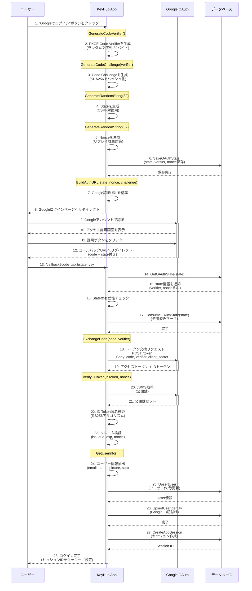

# Google OAuth認証フロー - 完全ガイド

## 📋 目次
1. [全体フロー](#全体フロー)
2. [シーケンス図](#シーケンス図)
3. [各関数の詳細](#各関数の詳細)
4. [セキュリティ機能](#セキュリティ機能)

---

## 全体フロー

```
ユーザー → アプリ → Google → アプリ → ユーザー
   ↓         ↓        ↓        ↓        ↓
 ログイン  認証URL  認証画面  トークン  ログイン
 ボタン   生成     承認      取得     完了
```

---

## シーケンス図



---

## 各関数の詳細

### 📍 フェーズ1: ログイン開始（ユーザー → Google）

#### 1️⃣ `GenerateCodeVerifier()` - PKCE Verifier生成

**タイミング**: ログインボタンがクリックされた直後

**場所**: `usecase/app/auth.go` の `StartGoogleLogin` から呼ばれる

```go
// 使用例
codeVerifier, err := google.GenerateCodeVerifier()
// 結果: "a1b2c3d4e5f6g7h8i9j0k1l2m3n4o5p6q7r8s9t0u1v2w3x4"
```

**処理内容**:
```go
func GenerateCodeVerifier() (string, error) {
    b := make([]byte, 32)              // 32バイトのランダムデータ
    rand.Read(b)                       // 暗号学的に安全な乱数生成
    return base64.RawURLEncoding.EncodeToString(b), nil
    // Base64URLエンコード（パディングなし）
}
```

**目的**: PKCE (Proof Key for Code Exchange) の秘密鍵
- 認可コード横取り攻撃を防ぐ
- クライアントサイドで生成、サーバーサイドで保存

---

#### 2️⃣ `GenerateCodeChallenge(verifier)` - PKCE Challenge生成

**タイミング**: Code Verifier生成の直後

**場所**: `usecase/app/auth.go` の `StartGoogleLogin` から呼ばれる

```go
// 使用例
codeChallenge := google.GenerateCodeChallenge(codeVerifier)
// 結果: "E9Melhoa2OwvFrEMTJguCHaoeK1t8URWbuGJSstw-cM"
```

**処理内容**:
```go
func GenerateCodeChallenge(verifier string) string {
    h := sha256.Sum256([]byte(verifier))  // SHA256ハッシュ化
    return base64.RawURLEncoding.EncodeToString(h[:])
    // Base64URLエンコード
}
```

**目的**: Verifierのハッシュ値をGoogleに送信
- Googleは後でVerifierとChallengeが一致するか検証
- ハッシュなので元のVerifierは推測不可能

**PKCE のフロー**:
```
1. Code Verifier (秘密)  → サーバーに保存
2. Code Challenge (公開) → Googleに送信
3. Google認証後、Code Verifier → Googleに送信
4. Google検証: SHA256(Verifier) == Challenge ?
```

---

#### 3️⃣ `GenerateRandomString(32)` - State/Nonce生成

**タイミング**: ログイン開始時に2回呼ばれる（State用とNonce用）

**場所**: `usecase/app/auth.go` の `StartGoogleLogin` から呼ばれる

```go
// 使用例1: State生成
state, err := google.GenerateRandomString(32)
// 結果: "x9y8z7w6v5u4t3s2r1q0p9o8n7m6l5k4"

// 使用例2: Nonce生成
nonce, err := google.GenerateRandomString(32)
// 結果: "m5n4o3p2q1r0s9t8u7v6w5x4y3z2a1b0"
```

**処理内容**:
```go
func GenerateRandomString(length int) (string, error) {
    b := make([]byte, length)
    rand.Read(b)
    return base64.RawURLEncoding.EncodeToString(b)[:length], nil
    // 指定した長さで切り取り
}
```

**目的**:
- **State**: CSRF攻撃を防ぐ（リクエストとレスポンスの紐付け）
- **Nonce**: リプレイ攻撃を防ぐ（ID Tokenの一意性保証）

---

#### 4️⃣ `BuildAuthURL(state, nonce, codeChallenge)` - Google認証URL構築

**タイミング**: State、Nonce、Code Challengeを生成した後

**場所**: `usecase/app/auth.go` の `StartGoogleLogin` から呼ばれる

```go
// 使用例
authURL := oauthService.BuildAuthURL(state, nonce, codeChallenge)
// 結果:
// "https://accounts.google.com/o/oauth2/v2/auth?
//   client_id=xxx.apps.googleusercontent.com&
//   redirect_uri=http://localhost:8080/callback&
//   response_type=code&
//   scope=openid+email+profile&
//   state=x9y8z7w6...&
//   nonce=m5n4o3p2...&
//   code_challenge=E9Melhoa2OwvFrEMTJguCHaoeK1t8URWbuGJSstw-cM&
//   code_challenge_method=S256"
```

**処理内容**:
```go
func (s *OAuthService) BuildAuthURL(state, nonce, codeChallenge string) string {
    params := url.Values{}
    params.Set("client_id", s.clientID)
    params.Set("redirect_uri", s.redirectURI)
    params.Set("response_type", "code")           // 認可コードフロー
    params.Set("scope", "openid email profile")   // 要求する権限
    params.Set("state", state)                    // CSRF対策
    params.Set("nonce", nonce)                    // リプレイ攻撃対策
    params.Set("code_challenge", codeChallenge)   // PKCE Challenge
    params.Set("code_challenge_method", "S256")   // SHA256ハッシュ

    return GoogleAuthURL + "?" + params.Encode()
}
```

**パラメータ詳細**:

| パラメータ | 値 | 説明 |
|-----------|-----|------|
| `client_id` | `xxx.apps.googleusercontent.com` | アプリ識別子 |
| `redirect_uri` | `http://localhost:8080/callback` | 認証後の戻り先 |
| `response_type` | `code` | 認可コードフローを使用 |
| `scope` | `openid email profile` | ユーザー情報の権限 |
| `state` | ランダム文字列 | CSRF対策トークン |
| `nonce` | ランダム文字列 | リプレイ攻撃対策 |
| `code_challenge` | SHA256ハッシュ | PKCE Challenge |
| `code_challenge_method` | `S256` | SHA256使用 |

---

### 📍 フェーズ2: Google認証（Google側の処理）

この段階ではKeyHubのコードは実行されません。Googleが以下を行います:

1. ユーザーにログイン画面を表示
2. ユーザーが認証
3. 権限許可画面を表示
4. ユーザーが許可
5. **認可コード（code）を生成**
6. `redirect_uri`にリダイレクト
   ```
   http://localhost:8080/callback?code=4/0AY0e-g7...&state=x9y8z7w6...
   ```

---

### 📍 フェーズ3: コールバック処理（Google → アプリ）

#### 5️⃣ `ExchangeCode(code, codeVerifier)` - トークン交換

**タイミング**: コールバックURLにアクセスされた時

**場所**: `usecase/app/auth.go` の `GoogleCallback` から呼ばれる

```go
// 使用例
tokens, err := oauthService.ExchangeCode(ctx, code, oauthState.CodeVerifier)
// 結果:
// &TokenResponse{
//     AccessToken:  "ya29.a0AfH6SMB...",
//     ExpiresIn:    3599,
//     IDToken:      "eyJhbGciOiJSUzI1NiIsImtpZCI6...",
//     RefreshToken: "1//0gGXz...",
//     Scope:        "openid https://www.googleapis.com/auth/userinfo.email ...",
//     TokenType:    "Bearer",
// }
```

**処理内容**:
```go
func (s *OAuthService) ExchangeCode(ctx context.Context, code, codeVerifier string) (*TokenResponse, error) {
    // 1. リクエストボディを構築
    data := url.Values{}
    data.Set("code", code)                           // 認可コード
    data.Set("client_id", s.clientID)                // クライアントID
    data.Set("client_secret", s.clientSecret)        // クライアントシークレット
    data.Set("redirect_uri", s.redirectURI)          // リダイレクトURI
    data.Set("grant_type", "authorization_code")     // フロータイプ
    data.Set("code_verifier", codeVerifier)          // PKCE Verifier

    // 2. HTTPリクエスト作成
    req, err := http.NewRequestWithContext(
        ctx,
        "POST",
        GoogleTokenURL,
        strings.NewReader(data.Encode()),  // ボディに入れる（重要！）
    )
    req.Header.Set("Content-Type", "application/x-www-form-urlencoded")

    // 3. リクエスト送信
    resp, err := s.httpClient.Do(req)
    defer resp.Body.Close()

    // 4. エラーチェック
    if resp.StatusCode != http.StatusOK {
        body, _ := io.ReadAll(resp.Body)
        return nil, errors.Newf("token exchange failed: %s", string(body))
    }

    // 5. レスポンスパース
    var tokenResp TokenResponse
    json.NewDecoder(resp.Body).Decode(&tokenResp)

    return &tokenResp, nil
}
```

**リクエスト例**:
```http
POST /token HTTP/1.1
Host: oauth2.googleapis.com
Content-Type: application/x-www-form-urlencoded

code=4/0AY0e-g7...&
client_id=xxx.apps.googleusercontent.com&
client_secret=GOCSPX-xxx&
redirect_uri=http://localhost:8080/callback&
grant_type=authorization_code&
code_verifier=a1b2c3d4e5f6g7h8i9j0k1l2m3n4o5p6q7r8s9t0u1v2w3x4
```

**レスポンス例**:
```json
{
  "access_token": "ya29.a0AfH6SMB...",
  "expires_in": 3599,
  "id_token": "eyJhbGciOiJSUzI1NiIsImtpZCI6IjFiZjk...",
  "refresh_token": "1//0gGXz...",
  "scope": "openid https://www.googleapis.com/auth/userinfo.email ...",
  "token_type": "Bearer"
}
```

**セキュリティポイント**:
- ✅ **ボディにデータを入れる**（修正済み）
  - 以前はクエリストリング（URL）に入れていた → URLログに残る危険
  - 現在はボディに入れている → ログに残りにくい
- ✅ **client_secretの保護**
  - HTTPSで通信
  - サーバーサイドでのみ使用
- ✅ **code_verifierの検証**
  - Googleが`code_challenge`と照合
  - 認可コード横取り攻撃を防ぐ

---

#### 6️⃣ `VerifyIDToken(idToken, expectedNonce)` - ID Token検証

**タイミング**: トークン交換の直後

**場所**: `usecase/app/auth.go` の `GoogleCallback` から呼ばれる

```go
// 使用例
claims, err := oauthService.VerifyIDToken(ctx, tokens.IDToken, oauthState.Nonce)
// 結果:
// &IDTokenClaims{
//     Iss:           "https://accounts.google.com",
//     Aud:           "xxx.apps.googleusercontent.com",
//     Sub:           "1234567890",
//     Email:         "user@example.com",
//     EmailVerified: true,
//     Name:          "山田太郎",
//     Picture:       "https://lh3.googleusercontent.com/a/...",
//     Exp:           1640995200,
//     Iat:           1640991600,
//     Nonce:         "m5n4o3p2...",
// }
```

**処理内容**:
```go
func (s *OAuthService) VerifyIDToken(ctx context.Context, idTokenString, expectedNonce string) (*IDTokenClaims, error) {
    // 1. Google公式パッケージで署名検証
    payload, err := idtoken.Validate(ctx, idTokenString, s.clientID)
    if err != nil {
        return nil, errors.Wrap(err, "failed to validate ID token")
    }
    // ↑ この中で以下が行われる:
    // - JWKSから公開鍵を取得（https://www.googleapis.com/oauth2/v3/certs）
    // - kid（Key ID）で適切な鍵を選択
    // - RS256署名検証
    // - iss, aud, exp の自動検証

    // 2. クレーム情報を構築
    claims := IDTokenClaims{
        Iss:           payload.Issuer,
        Aud:           payload.Audience,
        Sub:           payload.Subject,
        Exp:           payload.Expires,
        Iat:           payload.IssuedAt,
        Email:         getStringClaim(payload.Claims, "email"),
        EmailVerified: getBoolClaim(payload.Claims, "email_verified"),
        Name:          getStringClaim(payload.Claims, "name"),
        Picture:       getStringClaim(payload.Claims, "picture"),
        GivenName:     getStringClaim(payload.Claims, "given_name"),
        FamilyName:    getStringClaim(payload.Claims, "family_name"),
        Locale:        getStringClaim(payload.Claims, "locale"),
        Nonce:         getStringClaim(payload.Claims, "nonce"),
        Azp:           getStringClaim(payload.Claims, "azp"),
    }

    // 3. Nonce検証（リプレイ攻撃対策）
    if claims.Nonce != expectedNonce {
        return nil, errors.New("invalid nonce")
    }

    // 4. メール検証済みチェック
    if !claims.EmailVerified {
        return nil, errors.New("email not verified")
    }

    return &claims, nil
}
```

**ID Tokenの構造**:
```
ID Token = Header.Payload.Signature

Header (Base64URL):
{
  "alg": "RS256",              // 署名アルゴリズム
  "kid": "1bf9..."             // 鍵ID
}

Payload (Base64URL):
{
  "iss": "https://accounts.google.com",
  "azp": "xxx.apps.googleusercontent.com",
  "aud": "xxx.apps.googleusercontent.com",
  "sub": "1234567890",         // GoogleユーザーID
  "email": "user@example.com",
  "email_verified": true,
  "name": "山田太郎",
  "picture": "https://...",
  "iat": 1640991600,
  "exp": 1640995200,
  "nonce": "m5n4o3p2..."
}

Signature (Base64URL):
RS256(Header + "." + Payload, GooglePrivateKey)
```

**検証の流れ**:
```
1. idtoken.Validate() が以下を実行:
   ├─ JWKSエンドポイントから公開鍵を取得
   │  GET https://www.googleapis.com/oauth2/v3/certs
   │  {
   │    "keys": [
   │      {
   │        "kid": "1bf9...",
   │        "kty": "RSA",
   │        "n": "...",  // 公開鍵のモジュラス
   │        "e": "AQAB"  // 公開鍵の指数
   │      }
   │    ]
   │  }
   │
   ├─ Header.kid で適切な公開鍵を選択
   │
   ├─ RS256署名検証
   │  RS256_Verify(Header + "." + Payload, Signature, PublicKey)
   │  → 成功 = Googleが発行したトークン
   │  → 失敗 = 偽造されたトークン
   │
   ├─ Issuer検証
   │  payload.iss == "https://accounts.google.com"
   │
   ├─ Audience検証
   │  payload.aud == s.clientID
   │
   └─ Expiration検証
      payload.exp > time.Now()

2. アプリ側で追加検証:
   ├─ Nonce検証（リプレイ攻撃対策）
   │  claims.nonce == expectedNonce
   │
   └─ Email検証済みチェック
      claims.email_verified == true
```

**セキュリティレベル**:

| 検証項目 | 修正前 | 修正後 |
|---------|--------|--------|
| **署名検証** | ❌ なし | ✅ RS256検証 |
| **Issuer検証** | ✅ 手動 | ✅ 自動 |
| **Audience検証** | ✅ 手動 | ✅ 自動 |
| **Expiration検証** | ✅ 手動 | ✅ 自動 |
| **Nonce検証** | ✅ 手動 | ✅ 手動 |
| **Email検証** | ✅ 手動 | ✅ 手動 |

---

#### 7️⃣ `GetUserInfo()` - ユーザー情報取得

**タイミング**: ID Token検証の直後

**場所**: `usecase/app/auth.go` の `GoogleCallback` から呼ばれる

```go
// 使用例
email, name, picture, providerSub := claims.GetUserInfo()
// 結果:
// email = "user@example.com"
// name = "山田太郎"
// picture = "https://lh3.googleusercontent.com/a/..."
// providerSub = "1234567890"  // GoogleユーザーID
```

**処理内容**:
```go
func (c *IDTokenClaims) GetUserInfo() (email, name, picture, sub string) {
    return c.Email, c.Name, c.Picture, c.Sub
}
```

**シンプルですが重要**:
- `Sub`: Googleユーザーの一意ID（変わらない）
- `Email`: メールアドレス（変更される可能性あり）
- `Name`: 表示名（変更される可能性あり）
- `Picture`: プロフィール画像URL（変更される可能性あり）

**データベース設計との関係**:
```sql
-- users テーブル
id (UUID)  -- KeyHub内部のユーザーID
email      -- 変更される可能性あり
name       -- 変更される可能性あり
icon       -- 変更される可能性あり

-- user_identities テーブル
user_id        -- users.id への外部キー
provider       -- "google"
provider_sub   -- Sub（Googleユーザーの一意ID、不変）
```

**なぜSubで管理？**:
- ✅ **不変**: Googleアカウントが存在する限り変わらない
- ✅ **一意**: 他のユーザーと重複しない
- ❌ **Email**: ユーザーが変更できる

---

## セキュリティ機能

### 🛡️ PKCE (Proof Key for Code Exchange)

**目的**: 認可コード横取り攻撃を防ぐ

**シナリオ（PKCE なしの場合）**:
```
1. 攻撃者がユーザーのブラウザを監視
2. ユーザーがGoogle認証
3. Google → ユーザー: リダイレクト (code=xxx)
4. 攻撃者がcodeを横取り
5. 攻撃者 → App: code=xxx でトークン取得 ← 成功してしまう
```

**対策（PKCE あり）**:
```
1. App: Code Verifier生成（秘密）
2. App: Code Challenge生成（公開） = SHA256(Verifier)
3. App → Google: Challenge付きで認証
4. Google → User: リダイレクト (code=xxx)
5. 攻撃者がcodeを横取り
6. 攻撃者 → App: code=xxx でトークン取得を試みる
7. App → Google: code + Verifierを送信
8. 攻撃者はVerifierを知らない
9. Google: SHA256(Verifier) != 保存されたChallenge
10. トークン発行拒否 ← 攻撃失敗
```

**フロー図**:
```
[ログイン開始]
   ↓
GenerateCodeVerifier()     → Verifier = "abc123..."（秘密）
   ↓
GenerateCodeChallenge()    → Challenge = SHA256("abc123...")（公開）
   ↓
SaveOAuthState()           → DBに保存: Verifier = "abc123..."
   ↓
BuildAuthURL()             → Google: Challenge送信
   ↓
[Google認証]
   ↓
[コールバック]
   ↓
GetOAuthState()            → DBから取得: Verifier = "abc123..."
   ↓
ExchangeCode(code, Verifier) → Google: code + Verifier送信
   ↓
[Google検証]
SHA256(Verifier) == Challenge ? → OK: トークン発行
```

---

### 🛡️ State (CSRF対策)

**目的**: クロスサイトリクエストフォージェリ攻撃を防ぐ

**シナリオ（State なしの場合）**:
```
1. 攻撃者が事前にGoogle認証を行い、codeを取得
2. 攻撃者がユーザーに罠のリンクを送信
   <a href="https://keyhub.com/callback?code=攻撃者のcode">クリック</a>
3. ユーザーがクリック
4. App: 攻撃者のcodeでトークン取得
5. ユーザーが攻撃者のGoogleアカウントでログイン ← 成功してしまう
```

**対策（State あり）**:
```
1. App: State生成（ランダム文字列）
2. App → DB: State保存
3. App → User: Google認証URLにState付加
4. Google → User: リダイレクト (code + state)
5. User → App: callback?code=xxx&state=yyy
6. App: DBのStateと比較
7. 一致 → OK、不一致 → エラー
```

**攻撃が失敗する理由**:
```
攻撃者のcode には 攻撃者のstate が付いている
  ↓
ユーザーのセッションには ユーザーのstate が保存されている
  ↓
state が一致しない
  ↓
認証拒否
```

---

### 🛡️ Nonce (リプレイ攻撃対策)

**目的**: ID Tokenの使い回しを防ぐ

**シナリオ（Nonce なしの場合）**:
```
1. 攻撃者が通信を傍受してID Tokenを取得
2. 攻撃者が後日、同じID Tokenを使用
3. App: ID Token検証 → 有効期限内なら成功 ← 成功してしまう
```

**対策（Nonce あり）**:
```
1. App: Nonce生成（ランダム文字列）
2. App → DB: Nonce保存
3. App → Google: Nonce付きで認証
4. Google → App: ID Token内にNonceを含める
5. App: ID Token内のNonceとDBのNonceを比較
6. 一致 → OK、不一致 → エラー
7. App → DB: Nonceを使用済みマーク（ConsumeOAuthState）
```

**攻撃が失敗する理由**:
```
1回目のログイン:
  Nonce = "abc123"
  ID Token.nonce = "abc123"
  → 一致、ログイン成功
  → Nonceを使用済みマーク

2回目（リプレイ攻撃）:
  ID Token.nonce = "abc123"（盗聴したトークン）
  DB Nonce = 使用済み
  → エラー、ログイン失敗
```

---

### 🛡️ 署名検証 (改ざん検知)

**目的**: ID Tokenの改ざんを検知

**シナリオ（署名検証なしの場合）**:
```
1. 攻撃者がID Tokenを取得
2. 攻撃者がPayloadを改ざん
   "sub": "1234567890" → "sub": "攻撃者のID"
   "email": "user@example.com" → "email": "attacker@example.com"
3. App: ParseUnverified → 改ざんされたクレームを受け入れ ← 成功してしまう
```

**対策（署名検証あり）**:
```
1. Google: 秘密鍵でトークンに署名
   Signature = RS256(Header + Payload, GooglePrivateKey)

2. 攻撃者がPayloadを改ざん
   → Signatureが一致しなくなる

3. App: 公開鍵で署名検証
   RS256_Verify(Header + Payload, Signature, GooglePublicKey)
   → 失敗

4. App: エラーを返す
```

**RS256アルゴリズム**:
```
署名生成（Google側）:
  Signature = RSA_Sign(SHA256(Header + Payload), PrivateKey)

署名検証（App側）:
  Valid = RSA_Verify(SHA256(Header + Payload), Signature, PublicKey)

攻撃者の問題:
  - PrivateKeyは持っていない
  - Payloadを改ざんすると、SHA256が変わる
  - 正しいSignatureを生成できない
  → 検証失敗
```

---

## 全体フロー図（関数の呼び出し順）

```
[ユーザー: ログインボタンクリック]
          ↓
┌─────────────────────────────────────────────────────┐
│ StartGoogleLogin (usecase/app/auth.go)             │
│                                                     │
│  1. GenerateCodeVerifier()                         │
│     → "abc123..."                                  │
│                                                     │
│  2. GenerateCodeChallenge("abc123...")             │
│     → "E9Melhoa2..."                               │
│                                                     │
│  3. GenerateRandomString(32)  [State]              │
│     → "xyz789..."                                  │
│                                                     │
│  4. GenerateRandomString(32)  [Nonce]              │
│     → "mno456..."                                  │
│                                                     │
│  5. SaveOAuthState(state, verifier, nonce)         │
│     → DB保存                                        │
│                                                     │
│  6. BuildAuthURL(state, nonce, challenge)          │
│     → "https://accounts.google.com/..."           │
│                                                     │
│  7. リダイレクト                                    │
└─────────────────────────────────────────────────────┘
          ↓
[ユーザー: Google認証・許可]
          ↓
[Google: コールバック /callback?code=xxx&state=xyz789]
          ↓
┌─────────────────────────────────────────────────────┐
│ GoogleCallback (usecase/app/auth.go)               │
│                                                     │
│  1. GetOAuthState(state)                           │
│     → {state, verifier, nonce}                     │
│                                                     │
│  2. State検証                                       │
│     → OK                                           │
│                                                     │
│  3. ConsumeOAuthState(state)                       │
│     → 使用済みマーク                                │
│                                                     │
│  4. ExchangeCode(code, verifier)                   │
│     → {access_token, id_token, ...}                │
│                                                     │
│  5. VerifyIDToken(id_token, nonce)                 │
│     ├─ idtoken.Validate() [署名検証]              │
│     ├─ Nonce検証                                   │
│     └─ EmailVerified検証                           │
│     → Claims                                       │
│                                                     │
│  6. GetUserInfo()                                  │
│     → email, name, picture, sub                    │
│                                                     │
│  7. UpsertUser(email, name, icon)                  │
│     → User                                         │
│                                                     │
│  8. UpsertUserIdentity(userId, "google", sub)      │
│     → OK                                           │
│                                                     │
│  9. CreateAppSession(userId)                       │
│     → sessionID                                    │
│                                                     │
│ 10. ログイン完了                                    │
└─────────────────────────────────────────────────────┘
```

---

## まとめ

### 各関数の役割

| 関数 | フェーズ | 目的 | セキュリティ |
|------|---------|------|-------------|
| `GenerateCodeVerifier` | 開始 | PKCE Verifier生成 | 認可コード横取り防止 |
| `GenerateCodeChallenge` | 開始 | PKCE Challenge生成 | 認可コード横取り防止 |
| `GenerateRandomString` | 開始 | State/Nonce生成 | CSRF/リプレイ攻撃防止 |
| `BuildAuthURL` | 開始 | Google認証URL構築 | パラメータ送信 |
| `ExchangeCode` | コールバック | トークン取得 | PKCE検証、シークレット保護 |
| `VerifyIDToken` | コールバック | ID Token検証 | 署名検証、改ざん検知 |
| `GetUserInfo` | コールバック | ユーザー情報抽出 | - |

### セキュリティの多層防御

```
┌─────────────────────────────────────────────┐
│ PKCE (認可コード横取り防止)                  │
│   GenerateCodeVerifier + GenerateCodeChallenge │
└─────────────────────────────────────────────┘
              ↓
┌─────────────────────────────────────────────┐
│ State (CSRF攻撃防止)                        │
│   GenerateRandomString → State検証          │
└─────────────────────────────────────────────┘
              ↓
┌─────────────────────────────────────────────┐
│ Nonce (リプレイ攻撃防止)                    │
│   GenerateRandomString → Nonce検証          │
└─────────────────────────────────────────────┘
              ↓
┌─────────────────────────────────────────────┐
│ 署名検証 (改ざん検知)                       │
│   VerifyIDToken → RS256署名検証             │
└─────────────────────────────────────────────┘
              ↓
┌─────────────────────────────────────────────┐
│ セキュアな通信                              │
│   HTTPS, ボディにシークレット               │
└─────────────────────────────────────────────┘
```

**すべての防御が連携して、安全な認証フローを実現しています！**
