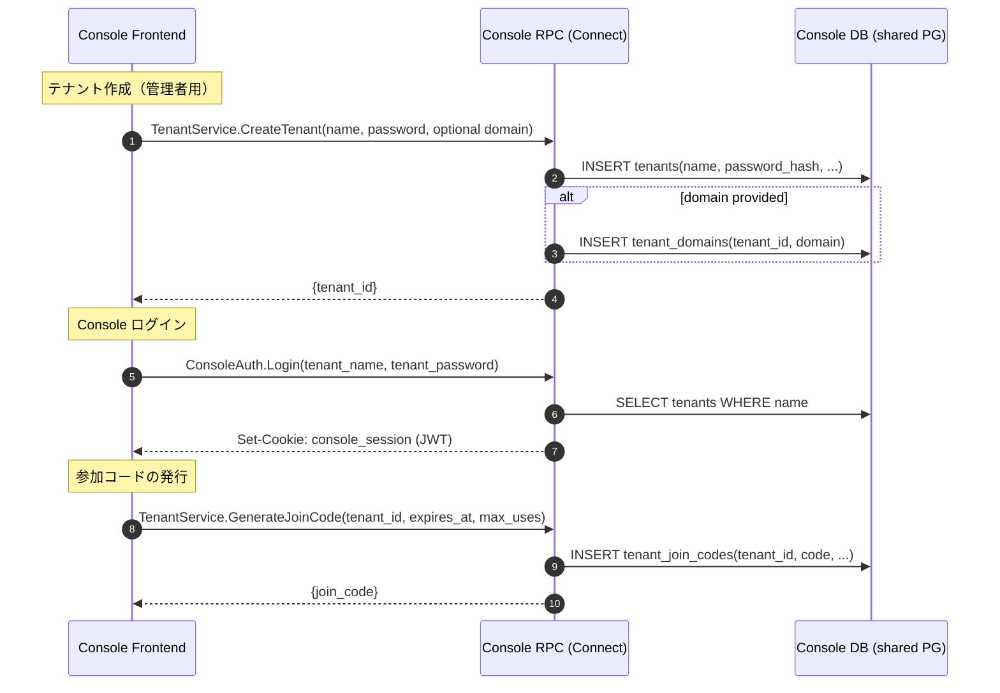
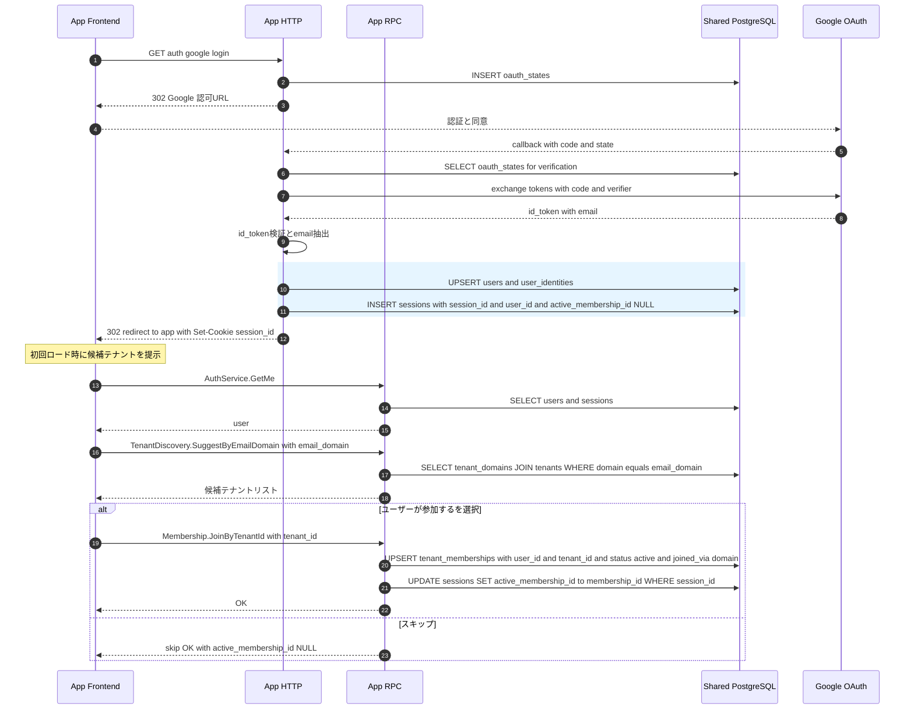
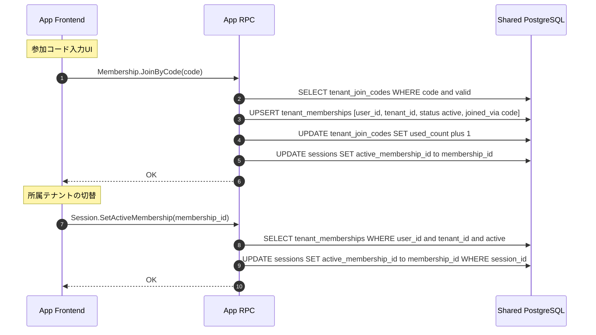

### シーケンス図（Console: テナント作成・ログイン・ドメイン/コード管理）

```mermaid
sequenceDiagram
  autonumber
  participant COFE as Console Frontend
  participant CORPC as Console RPC (Connect)
  participant CODB as Console DB (shared PG)

  Note over COFE: テナント作成（管理者用）
  COFE->>CORPC: TenantService.CreateTenant(name, password, optional domain)
  CORPC->>CODB: INSERT tenants(name, password_hash, ...)
  alt domain provided
    CORPC->>CODB: INSERT tenant_domains(tenant_id, domain)
  end
  CORPC-->>COFE: {tenant_id}

  Note over COFE: Console ログイン
  COFE->>CORPC: ConsoleAuth.Login(tenant_name, tenant_password)
  CORPC->>CODB: SELECT tenants WHERE name
  CORPC-->>COFE: Set-Cookie: console_session (JWT)

  Note over COFE: 参加コードの発行
  COFE->>CORPC: TenantService.GenerateJoinCode(tenant_id, expires_at, max_uses)
  CORPC->>CODB: INSERT tenant_join_codes(tenant_id, code, ...)
  CORPC-->>COFE: {join_code}

```

---

### シーケンス図（App: Googleログイン→テナント候補提示→任意参加）

```mermaid
sequenceDiagram
  autonumber
  participant AFE as App Frontend
  participant AHTTP as App HTTP
  participant ARPC as App RPC
  participant DB as Shared PostgreSQL
  participant G as Google OAuth

  AFE->>AHTTP: GET auth google login
  AHTTP->>DB: INSERT oauth_states
  AHTTP-->>AFE: 302 Google 認可URL
  AFE-->>G: 認証と同意
  G-->>AHTTP: callback with code and state
  AHTTP->>DB: SELECT oauth_states for verification
  AHTTP->>G: exchange tokens with code and verifier
  G-->>AHTTP: id_token with email
  AHTTP->>AHTTP: id_token検証とemail抽出

  rect rgb(230, 245, 255)
    AHTTP->>DB: UPSERT users and user_identities
    AHTTP->>DB: INSERT sessions with session_id and user_id and active_membership_id NULL
  end
  AHTTP-->>AFE: 302 redirect to app with Set-Cookie session_id

  Note over AFE: 初回ロード時に候補テナントを提示
  AFE->>ARPC: AuthService.GetMe
  ARPC->>DB: SELECT users and sessions
  ARPC-->>AFE: user
  AFE->>ARPC: TenantDiscovery.SuggestByEmailDomain with email_domain
  ARPC->>DB: SELECT tenant_domains JOIN tenants WHERE domain equals email_domain
  ARPC-->>AFE: 候補テナントリスト

  alt ユーザーが参加するを選択
    AFE->>ARPC: Membership.JoinByTenantId with tenant_id
    ARPC->>DB: UPSERT tenant_memberships with user_id and tenant_id and status active and joined_via domain
    ARPC->>DB: UPDATE sessions SET active_membership_id to membership_id WHERE session_id
    ARPC-->>AFE: OK
  else スキップ
    ARPC-->>AFE: skip OK with active_membership_id NULL
  end

```

---

### シーケンス図（App: 参加コードで参加 / テナント切替）

```mermaid
sequenceDiagram
  autonumber
  participant AFE as App Frontend
  participant ARPC as App RPC
  participant DB as Shared PostgreSQL

  Note over AFE: 参加コード入力UI
  AFE->>ARPC: Membership.JoinByCode(code)
  ARPC->>DB: SELECT tenant_join_codes WHERE code and valid
  ARPC->>DB: UPSERT tenant_memberships [user_id, tenant_id, status active, joined_via code]
  ARPC->>DB: UPDATE tenant_join_codes SET used_count plus 1
  ARPC->>DB: UPDATE sessions SET active_membership_id to membership_id
  ARPC-->>AFE: OK

  Note over AFE: 所属テナントの切替
  AFE->>ARPC: Session.SetActiveMembership(membership_id)
  ARPC->>DB: SELECT tenant_memberships WHERE user_id and tenant_id and active
  ARPC->>DB: UPDATE sessions SET active_membership_id to membership_id WHERE session_id
  ARPC-->>AFE: OK

```

