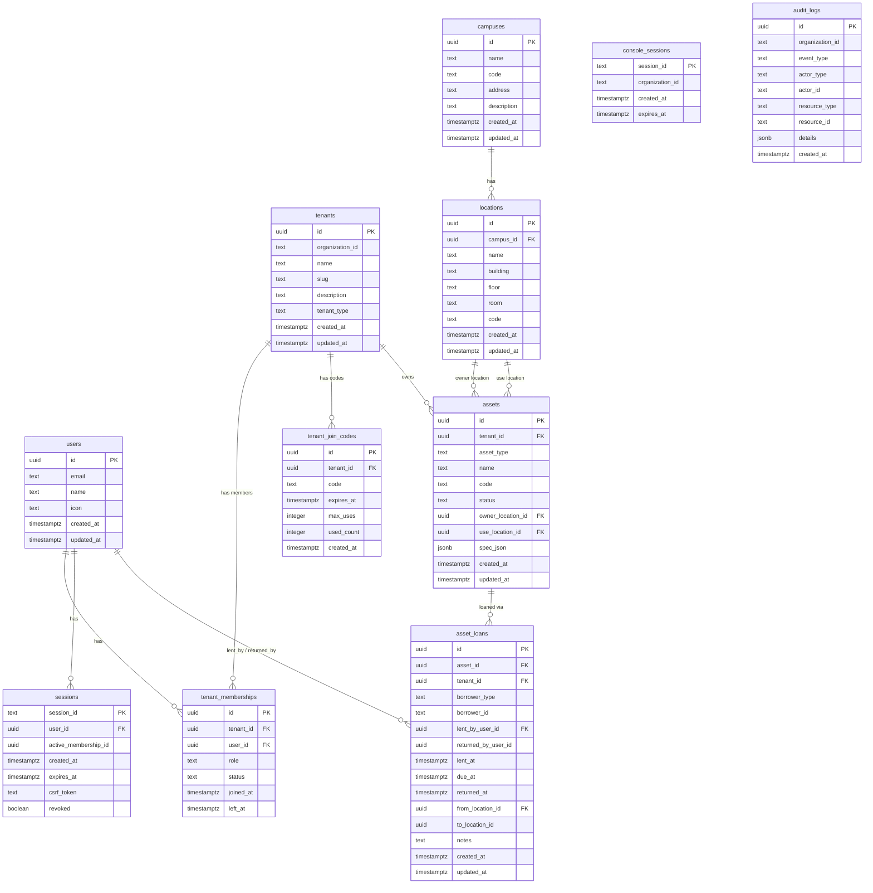

# Console 管理機能

KeyHub Console（管理者向けダッシュボード）の機能仕様です。

## 目次

1. 概要・スコープ
2. Console 認証
3. Tenant 管理
4. 参加コード管理
5. メンバー管理
6. 監査ログ
7. データモデル（Console 領域）
8. Console 画面構成
9. API について
10. 他ドキュメントとの整合性
11. ER 図

## 1. 概要・スコープ

### 1.1 目的・スコープ

- 研究室や部門（テナント）単位で、物理鍵の所在と貸出状況を可視化・追跡する。
- 将来は「鍵」以外の資産（機材・備品）にも拡張できるよう、資産(Asset) + 貸出(Loan) の汎用モデルを採用。
- 監査・トラブル対応のため、履歴・ログを保持。

### 1.2 想定ユーザーと権限

- 一般ユーザー（User）
  - 自分の貸出履歴の閲覧
  - 鍵の在庫/利用可否の閲覧
  - 予約（任意／導入時期は後述）
- 管理者（Asset Admin / 受付・警備室）
  - 資産（鍵）の登録/更新/無効化
  - 貸出・返却処理、延長、強制回収フラグ
  - 監査ログ・統計の閲覧
- テナント管理者（Tenant Admin）
  - テナント配下のユーザー/ロール管理
  - テナント配下の資産・貸出の全権限

### 1.3 コア概念（データの考え方）

- Tenant：部門・研究室単位のオーナー概念
- Asset（鍵）: 初期実装は鍵のみ（`assetType = "key"` 固定）。将来、他資産へ拡張可能。
  - 管理場所（保管場所）＝ `ownerLocation`
  - 使用場所（主に利用される場所）＝ `useLocation`
  - 任意コード（バーコード/RFID 等）、状態（`available`/`in_use`/`lost`/`maintenance`）
  - 種別依存の拡張情報は `spec`（JSON）に保持（例：鍵の複製可否、関連ドア ID）
- AssetLoan（貸出）：貸し借りのイベント
  - 借り手（ユーザー/外部者/チーム）・貸出者（受付者）
  - 貸出時刻・返却期限・返却時刻
  - 貸出/返却場所、メモ
  - `returnedAt IS NULL` を未返却判定の基本に

### 1.4 主要機能（画面イメージに対応）

1. ダッシュボード
   - 未返却一覧、期限超過一覧
   - 今日の貸出・返却数、資産別の利用状況
2. 鍵一覧
   - 絞り込み：テナント/キャンパス/ロケーション/状態/タグ/キーワード
   - 一覧：名称、コード、状態、管理場所、使用場所、現在の貸出状況
   - 詳細：基本情報、履歴、関連ファイル（写真・取説）
   - 登録/編集/無効化（アーカイブ）
3. 貸出管理
   - 検索：借り手・資産・状態（未返却/期限超過/返却済）
   - 貸出作成：資産選択 → 借り手選択 → 貸出場所 → 期限設定 → 発行
   - 返却処理：資産スキャン → 返却場所 → 返却処理 → メモ
   - 延長・強制回収フラグ（管理者のみ）
4. ロケーション管理
   - キャンパス/建物/フロア/部屋の階層管理
   - 管理場所・使用場所の定義
5. 予約（将来導入可）
   - 借用枠の予約・承認ワークフロー
   - 予約 → 貸出の自動連携
6. 監査・ログ
   - 操作ログ（作成/更新/貸出/返却/延長/強制回収）
   - エクスポート（CSV/JSON、必要に応じて PDF）
7. 権限・テナント管理
   - テナント配下のユーザー/ロール
   - 招待コード/入退室履歴（必要に応じて）

### 1.5 データ入力・バリデーション（例）

- 鍵（Asset）
  - `name`: 必須（1〜100 文字程度）
  - `code`: 任意（ユニーク推奨／バーコード/RFID 連携も想定）
  - `ownerLocation`: 必須、`useLocation`: 任意
  - `status`: 列挙（`available`/`in_use`/`lost`/`maintenance`）＋アプリ側で整合性確保
  - `assetType`: 必須（今回は `"key"` 固定で運用開始）
- 貸出（AssetLoan）
  - `assetId`: 必須、未返却がある資産に重複貸出は不可
  - `borrower`: 必須（ユーザー ID or 外部者名）
  - `lentAt`: 必須、`dueAt`: 任意（設定があると期限超過アラート可）
  - 返却処理は `returnedAt` を必ず記録
- ロケーション/キャンパス
  - `name`/`code`: 必須（重複可否は運用次第）
  - 施設体系と紐づき方は固定ではなく柔軟（`building`/`floor`/`room` は任意）

### 1.6 ルール（業務ロジック）

- 未返却判定：`returnedAt IS NULL`（インデックスで高速化）
- 資産状態同期：貸出時 → `in_use`、返却時 → `available` へ更新（トランザクション）
- 重複貸出防止：貸出作成時に未返却が存在しないかチェック
- 強制回収：期限超過・所在不明時のフラグと通知（後述の通知連携を想定）
- 監査証跡：重要操作は必ず履歴化（誰が/いつ/何を/どこに）

### 1.7 通知・連携（拡張）

- 期限の前日/当日/超過時にメール or Slack 通知
- 受付端末でバーコード/RFID 読み取りによる貸出・返却高速化
- SSO / 大学アカウント連携（学生/教職員 ID）

### 1.8 レポート/統計（MVP→ 拡張）

- MVP：未返却一覧、期限超過一覧、月間の貸出/返却数
- 拡張：資産別稼働率、人別利用傾向、ロケーション別混雑時間帯

### 1.9 非機能要件（運用観点）

- 可用性：貸出・返却が止まらない設計（DB はトランザクション整合性重視）
- 監査：操作ログの保持期間とエクスポート
- パフォーマンス：`asset_loans(returned_at)`・`assets(status, tenant_id)`・`assets(code)` 等に適切なインデックス
- セキュリティ：CSRF/CORS/認証（JWT+Cookie など現状の方針に合わせる）
- 拡張性：AssetType 追加と`spec`の拡張で DDL 変更を最小化

### 1.10 段階的リリース（MVP → 次フェーズ）

MVP（まず入れる）

- テナント/ロケーション管理
- 鍵（`AssetType=key`）の登録・一覧・詳細・編集
- 貸出/返却処理（重複貸出防止、未返却・期限超過表示）
- 監査ログの記録・基本的な検索
- ダッシュボード（未返却/期限超過/本日件数）

次フェーズ

- 予約機能、延長・承認フロー
- 通知（メール/Slack）
- タグ/ファイル添付、QR/RFID
- 統計レポートの拡充
- 備品カテゴリ（`device`, `tool` 等）を順次導入

## 2. Console 認証

### 2.1 認証方式

- Organization ID/Key によるログイン。
- 現在は固定の Organization ID/Key（例: ORG-DEFAULT-001）で照合。
- 将来は Admin レイヤ（Organizations）での発行・無効化に移行。

### 2.2 セッション管理とセキュリティ

- Console セッションは短期（例: 24 時間）で有効期限を設定。
- Cookie ベースのセッションに加え、必要に応じて JWT を併用（`org_id`/`session_id`/`exp`を含む）。
- ログイン成功時に監査ログへ記録。ログアウトでセッション失効。

---

## 3. Tenant 管理

### 3.1 Tenant 一覧

- 表示項目: 名前、説明、種別（tenant_type）、作成日/更新日、アクティブメンバー数、参加コード数。
- 絞り込み/ソート: 名前、種別、作成日、メンバー数等。
- スコープ: 現在の Organization 配下（固定 ID）に限定。

### 3.2 Tenant 作成

フォーム項目とバリデーション

- name: 必須（1〜100 文字）
- description: 任意（最大 500 文字）
- tenant_type: 定義済みの値（department / laboratory / division）
- 同一 Organization 内で name の重複不可（`docs/database/tables.md:tenants` に準拠）

### 3.3 Tenant 編集

更新可能: name, description, tenant_type
更新不可: id, organization_id, created_at

### 3.4 Tenant 削除

削除前チェック（ガード）

- アクティブメンバーが存在しないこと
- 有効な参加コードが残っていないこと

削除方針

- 監査性のためソフトデリート（削除日時と状態を保持）を推奨

---

## 4. 参加コード管理

### 4.1 参加コード生成

生成時の指定項目

- 対象テナント
- 有効期限（任意）
- 最大使用回数（0=無制限）

コードフォーマット（例）

- `KH-XXXXX-XX` 形式など、読み上げ/手入力に強い形式を採用（設計案）

### 4.2 参加コード一覧

- 表示項目: コード、期限、最大/使用回数、作成日時、テナント名、作成者名、状態（active/expired/exhausted）。
- 並び順: 作成日時の新しい順。

### 4.3 使用履歴

- 将来実装: 参加コードの使用ログ（使用者、時刻、クライアント情報）。

### 4.4 参加コード無効化

- 即時無効化（期限を現在時刻に更新）または削除。

---

## 5. メンバー管理

### 5.1 メンバー一覧

- 表示項目: メンバーシップ ID、ユーザー、ロール、状態、参加/退出日時、メール、表示名、アイコン、テナント名、現在アクティブかどうか。
- 並び順: 参加日時の新しい順。フィルタ: テナント/ロール/状態。

### 5.2 ロール管理

- ロール: owner / admin / member（`docs/database/tables.md:tenant_memberships` に準拠）。viewer は将来導入可。
- 状態: active / invited / suspended（同ドキュメントに準拠）。
- 権限例
  - owner: すべての操作
  - admin: 読み取り + 管理（招待/メンバー管理/資産管理）
  - member: 読み取り + 自分に関わる操作

### 5.3 メンバー削除（退会処理）

- 退出時は `left_at` を記録（物理削除は行わない）。
- アクティブメンバーシップを参照するセッションはクリア。

### 5.4 一括操作

- 一括招待: メールリスト投入、ロール付与、通知送信（任意）。
- CSV エクスポート: メンバー一覧を CSV で出力。

---

## 6. 監査ログ

### 6.1 ログ記録対象

#### 記録するイベント

- Tenant 作成/編集/削除
- 参加コード生成/使用/無効化
- メンバー追加/ロール変更/削除
- Console 管理者ログイン

### 6.2 ログの保持・検索（方針）

- 検索軸: 期間、アクション、リソース種別、ユーザー/テナント。
- 保持期間: 通常ログ 90 日、セキュリティイベント 1 年、ログイン履歴 30 日（運用で調整）。
- エクスポート: CSV/JSON。必要に応じて PDF 生成。

## 7. データモデル（Console 領域）

本セクションは Console で扱う主要テーブルの概念スキーマ（現行方針）です。実装の DDL は後続の DB 設計ドキュメントにて定義します。

### tenants（テナント：部門や研究室など）

| カラム名        | 型          | 制約                                | 説明                                       |
| --------------- | ----------- | ----------------------------------- | ------------------------------------------ |
| id              | UUID        | PK                                  | 一意識別子                                 |
| organization_id | TEXT        | DEFAULT 'ORG-DEFAULT-001'           | 所属 Organization（現状は固定文字列）      |
| name            | TEXT        | NOT NULL                            | テナント名                                 |
| slug            | TEXT        | UNIQUE, NULL 可                     | URL 等で利用するスラッグ（未設定可）       |
| description     | TEXT        | NULL 可                             | 説明                                       |
| tenant_type     | TEXT        | DEFAULT 'department'                | 種別（例: department/laboratory/division） |
| created_at      | TIMESTAMPTZ | NOT NULL, DEFAULT CURRENT_TIMESTAMP | 作成日時                                   |
| updated_at      | TIMESTAMPTZ | NOT NULL, DEFAULT CURRENT_TIMESTAMP | 更新日時                                   |

### assets（鍵：初期実装）

| カラム名          | 型          | 制約                        | 説明                                         |
| ----------------- | ----------- | --------------------------- | -------------------------------------------- |
| id                | UUID        | PK                          | 一意識別子                                   |
| tenant_id         | UUID        | FK → tenants.id             | 所属テナント                                 |
| asset_type        | TEXT        | NOT NULL                    | 種別（初期は 'key' 固定）                    |
| name              | TEXT        | NOT NULL                    | 資産名                                       |
| code              | TEXT        | UNIQUE, NULL 可             | 管理コード/バーコード                        |
| status            | TEXT        | NOT NULL                    | 状態（available, in_use, lost, maintenance） |
| owner_location_id | UUID        | FK → locations.id, NOT NULL | 管理（保管）場所                             |
| use_location_id   | UUID        | FK → locations.id, NULL 可  | 使用（利用）場所                             |
| spec_json         | JSONB       | NULL 可                     | 拡張属性（例: 鍵=合鍵可否/関連ドア ID）      |
| created_at        | TIMESTAMPTZ | NOT NULL                    | 作成日時                                     |
| updated_at        | TIMESTAMPTZ | NOT NULL                    | 更新日時                                     |

### asset_loans（貸出情報）

| カラム名            | 型          | 制約                        | 説明                                                     |
| ------------------- | ----------- | --------------------------- | -------------------------------------------------------- |
| id                  | UUID        | PK                          | 一意識別子                                               |
| asset_id            | UUID        | FK → assets.id, NOT NULL    | 対象資産                                                 |
| tenant_id           | UUID        | FK → tenants.id, NOT NULL   | 所属テナント                                             |
| borrower_type       | TEXT        | NOT NULL                    | 借り手種別（'user', 'external', 'team'）                 |
| borrower_id         | TEXT        | NOT NULL                    | 借り手の識別子（user の場合は `users.id`（UUID）を格納） |
| lent_by_user_id     | UUID        | FK → users.id, NOT NULL     | 貸出処理担当者（ユーザー ID）                            |
| returned_by_user_id | UUID        | FK → users.id, NULL 可      | 返却処理担当者（ユーザー ID）                            |
| lent_at             | TIMESTAMPTZ | NOT NULL                    | 貸出日時                                                 |
| due_at              | TIMESTAMPTZ | NULL 可                     | 返却予定日                                               |
| returned_at         | TIMESTAMPTZ | NULL 可                     | 返却日時（未返却は NULL）                                |
| from_location_id    | UUID        | FK → locations.id, NOT NULL | 貸出場所                                                 |
| to_location_id      | UUID        | FK → locations.id, NULL 可  | 返却場所                                                 |
| notes               | TEXT        | NULL 可                     | 備考                                                     |
| created_at          | TIMESTAMPTZ | NOT NULL                    | 作成日時                                                 |
| updated_at          | TIMESTAMPTZ | NOT NULL                    | 更新日時                                                 |

### locations（建物・部屋）

| カラム名   | 型          | 制約             | 説明                         |
| ---------- | ----------- | ---------------- | ---------------------------- |
| id         | UUID        | PK               | 一意識別子                   |
| campus_id  | UUID        | FK → campuses.id | キャンパス                   |
| name       | TEXT        | NOT NULL         | 名称（例: 研究棟 A, 警備室） |
| building   | TEXT        | NULL 可          | 建物名                       |
| floor      | TEXT        | NULL 可          | 階（例: 3F）                 |
| room       | TEXT        | NULL 可          | 部屋番号                     |
| code       | TEXT        | UNIQUE, NULL 可  | 管理コード                   |
| created_at | TIMESTAMPTZ | NOT NULL         | 作成日時                     |
| updated_at | TIMESTAMPTZ | NOT NULL         | 更新日時                     |

### campuses（キャンパス）

| カラム名    | 型          | 制約     | 説明       |
| ----------- | ----------- | -------- | ---------- |
| id          | UUID        | PK       | 一意識別子 |
| name        | TEXT        | NOT NULL | 名称       |
| code        | TEXT        | UNIQUE   | コード     |
| address     | TEXT        | NULL 可  | 住所       |
| description | TEXT        | NULL 可  | 説明       |
| created_at  | TIMESTAMPTZ | NOT NULL | 作成日時   |
| updated_at  | TIMESTAMPTZ | NOT NULL | 更新日時   |

### audit_logs（操作ログ：将来）

| カラム名        | 型          | 制約                      | 説明                              |
| --------------- | ----------- | ------------------------- | --------------------------------- |
| id              | UUID        | PK                        | 一意識別子                        |
| organization_id | TEXT        | DEFAULT 'ORG-DEFAULT-001' | 組織 ID                           |
| event_type      | TEXT        | NOT NULL                  | イベント種別                      |
| actor_type      | TEXT        | NOT NULL                  | 実行者種別（user/console/system） |
| actor_id        | TEXT        | NULL 可                   | 実行者 ID                         |
| resource_type   | TEXT        | NULL 可                   | 対象リソース種別                  |
| resource_id     | TEXT        | NULL 可                   | 対象リソース ID                   |
| details         | JSONB       | NULL 可                   | 詳細情報（JSON）                  |
| created_at      | TIMESTAMPTZ | NOT NULL                  | 記録日時                          |

#### assets 拡張候補（将来拡張）

- asset_tags（資産のタグ: 例「高額」「持出禁止」）
- asset_files（添付ファイル: 写真/取説/保証書）
- asset_reservations（貸出予約情報）
- asset_maintenances（点検・修理履歴）

## 8. Console 画面構成

### ダッシュボード

- Organization 情報表示
- Tenant 数、総メンバー数
- 最近のアクティビティ

### Tenant 管理画面

- Tenant 一覧テーブル
- 作成/編集モーダル
- メンバー数表示

### 鍵管理画面

- 鍵一覧テーブル
- フィルタ（ロケーション/状態/キーワード）
- 詳細（基本情報/履歴/関連ファイル）
- 登録/編集/無効化（アーカイブ）

### 参加コード管理画面

- コード一覧テーブル
- 生成フォーム
- 使用状況グラフ

### メンバー管理画面

- メンバー一覧テーブル
- フィルタ（Tenant、ロール、状態）
- 一括操作メニュー

### 監査ログ画面

- ログ一覧テーブル
- 検索フィルタ
- エクスポート機能

## 9. API について

- API 詳細は `docs/api/console_api.md:1` を参照（ConnectRPC 仕様）。
- 本ドキュメントは画面/業務要件の概要に留め、具体的なスキーマや IDL は API 仕様に集約。

---

## 10. 他ドキュメントとの整合性

- マスターソース: `docs/all_docs.md:1`（統合ドキュメント）。
- Organization ID: 現在は固定の文字列 ID（例: `ORG-DEFAULT-001`）。本書もこの前提に合わせた。将来は Organizations テーブル（UUID）へ移行予定。
- ロール: 現行は `owner/admin/member`（`all_docs.md`の定義に準拠）。`viewer`は拡張候補として明記。
- テナントドメイン: 現状は使用しない（`tenant_domains` は廃止方針）。
- データベース: 現在は単一 PostgreSQL を前提に記述（将来のマルチ DB は別章参照）。
- Asset/Loan/Location: Console 領域の新規拡張コンセプトであり、`all_docs.md`の現行スコープ外。実装スキーマは後続の DB 設計ドキュメントにて定義する。
- 初期実装は「鍵」に限定。`assets.asset_type` は 'key' を前提とし、他資産は将来拡張として扱う。

## 11. ER 図

以下は Console 領域を中心とした概念 ER 図（Mermaid）です。

