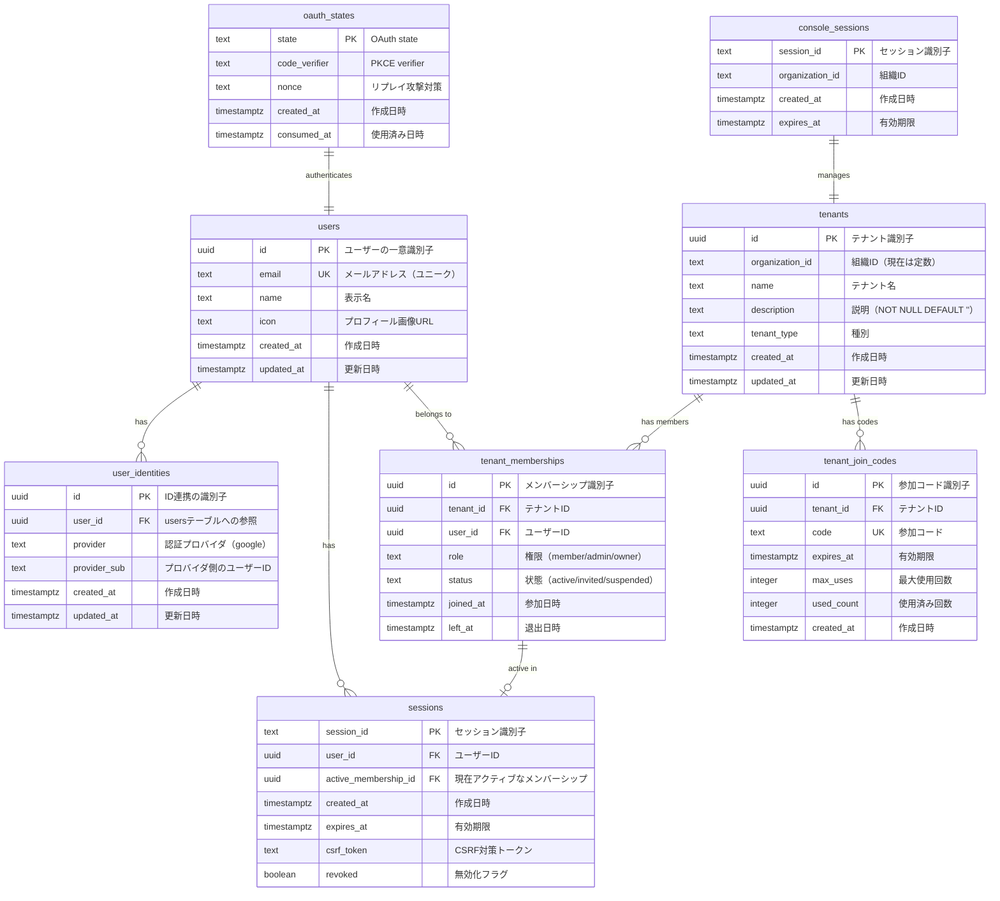

# ER図

## 現在実装予定のER図

## 将来拡張時の完全ER図

将来的にAdmin LayerとIntegration Layerを追加した場合の完全な構成については、[multi_db_architecture.md](../multi_db_architecture.md)を参照してください。

### 主な追加要素

- **organizations テーブル**: 組織の最上位管理
- **organization_domains テーブル**: 組織レベルのドメイン管理
- **groups テーブル**: Tenant内の小グループ
- **audit_logs テーブル**: 監査ログ

## テーブル関係の説明

### 認証フロー
1. `oauth_states` → 一時的な認証状態
2. `users` → ユーザー作成
3. `user_identities` → Google連携
4. `sessions` → ログインセッション

### テナント管理フロー
1. `tenants` → Console経由で作成
2. `tenant_join_codes` → 参加コード発行
3. `tenant_memberships` → ユーザー参加
4. `sessions.active_membership_id` → アクティブなテナント選択