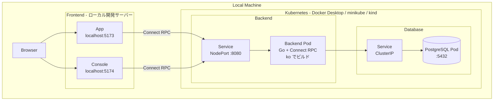

# KeyHub Kubernetes ローカル環境構築ガイド

このドキュメントでは、KeyHubをローカルKubernetes環境にデプロイするための手順を説明します。

---

## アーキテクチャ概要



---

## 前提条件

### 必要なツール

| ツール | 用途 |
|-------|------|
| `ko` | Go コンテナイメージビルド |
| `kubectl` | Kubernetes CLI |
| Docker Desktop / minikube / kind | ローカル Kubernetes |

### ko のインストール

```bash
# aqua (このプロジェクトで使用)
aqua install

# または Homebrew
brew install ko

# または go install
go install github.com/ko-build/ko@latest
```

---

## デプロイ手順

### 1. ローカル Kubernetes の起動

```bash
# Docker Desktop: 設定 > Kubernetes > Enable Kubernetes

# minikube の場合
minikube start

# kind の場合
kind create cluster --name keyhub
```

### 2. バックエンドイメージのビルド

```bash
cd backend

# ローカル Docker にビルド
ko build ./cmd --local --bare
```

### 3. マニフェストの適用

```bash
# Namespace 作成
kubectl apply -f - <<EOF
apiVersion: v1
kind: Namespace
metadata:
  name: keyhub
EOF

# PostgreSQL のデプロイ
kubectl apply -f - <<EOF
apiVersion: v1
kind: Secret
metadata:
  name: postgres-secret
  namespace: keyhub
type: Opaque
stringData:
  username: keyhub
  password: keyhub
---
apiVersion: apps/v1
kind: Deployment
metadata:
  name: postgres
  namespace: keyhub
spec:
  replicas: 1
  selector:
    matchLabels:
      app: postgres
  template:
    metadata:
      labels:
        app: postgres
    spec:
      containers:
        - name: postgres
          image: postgres:16-alpine
          ports:
            - containerPort: 5432
          env:
            - name: POSTGRES_DB
              value: keyhub
            - name: POSTGRES_USER
              valueFrom:
                secretKeyRef:
                  name: postgres-secret
                  key: username
            - name: POSTGRES_PASSWORD
              valueFrom:
                secretKeyRef:
                  name: postgres-secret
                  key: password
---
apiVersion: v1
kind: Service
metadata:
  name: postgres
  namespace: keyhub
spec:
  selector:
    app: postgres
  ports:
    - port: 5432
      targetPort: 5432
EOF

# Backend のデプロイ
kubectl apply -f - <<EOF
apiVersion: v1
kind: ConfigMap
metadata:
  name: keyhub-config
  namespace: keyhub
data:
  config.yaml: |
    postgres:
      host: postgres.keyhub.svc.cluster.local
      port: 5432
      user: keyhub
      password: keyhub
      database: keyhub
    env: "local"
    frontend_url:
      app: "http://localhost:5173"
      console: "http://localhost:5174"
    sentry:
      dsn: ""
    auth:
      google:
        client_id: "YOUR_CLIENT_ID"
        client_secret: "YOUR_CLIENT_SECRET"
        redirect_uri: "http://localhost:8080/auth/google/callback"
    console:
      organization_id: "550e8400-e29b-41d4-a716-446655440000"
      organization_key: "org_key_example_12345"
      jwt_secret: "your-secret-jwt-key-change-in-production"
---
apiVersion: apps/v1
kind: Deployment
metadata:
  name: keyhub-backend
  namespace: keyhub
spec:
  replicas: 1
  selector:
    matchLabels:
      app: keyhub-backend
  template:
    metadata:
      labels:
        app: keyhub-backend
    spec:
      containers:
        - name: keyhub
          image: ko.local/keyhub:latest
          ports:
            - containerPort: 8080
          volumeMounts:
            - name: config
              mountPath: /app/config.yaml
              subPath: config.yaml
      volumes:
        - name: config
          configMap:
            name: keyhub-config
---
apiVersion: v1
kind: Service
metadata:
  name: keyhub-backend
  namespace: keyhub
spec:
  type: NodePort
  selector:
    app: keyhub-backend
  ports:
    - port: 8080
      targetPort: 8080
      nodePort: 30080
EOF
```

### 4. フロントエンドの起動

フロントエンドはコンテナ化せず、ローカル開発サーバーで起動します。

```bash
cd frontend

# App の起動
pnpm dev:app
# http://localhost:5173

# Console の起動 (別ターミナル)
pnpm dev:console
# http://localhost:5174
```

---

## 動作確認

```bash
# Pod の状態確認
kubectl get pods -n keyhub

# ログの確認
kubectl logs -n keyhub -l app=keyhub-backend -f

# Backend API へのアクセス確認
curl http://localhost:30080/health
```

---

## クリーンアップ

```bash
# リソースの削除
kubectl delete namespace keyhub

# minikube の場合
minikube delete

# kind の場合
kind delete cluster --name keyhub
```

---

## トラブルシューティング

### Pod が起動しない

```bash
kubectl describe pod -n keyhub <pod-name>
kubectl get events -n keyhub --sort-by='.lastTimestamp'
```

### データベース接続エラー

```bash
# PostgreSQL Pod のログ確認
kubectl logs -n keyhub -l app=postgres

# Backend から PostgreSQL への接続確認
kubectl exec -it -n keyhub deployment/keyhub-backend -- nc -zv postgres 5432
```

### ポートフォワードで直接アクセス

```bash
# NodePort が使えない場合
kubectl port-forward -n keyhub svc/keyhub-backend 8080:8080
```
