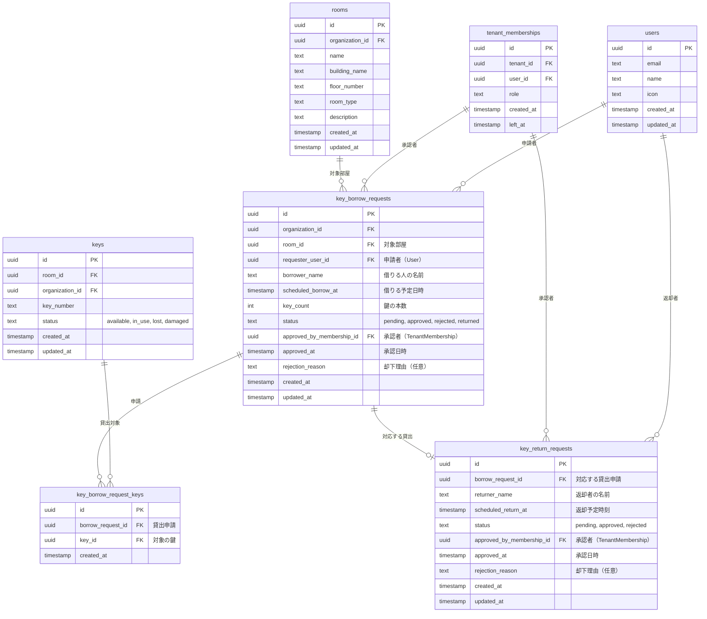
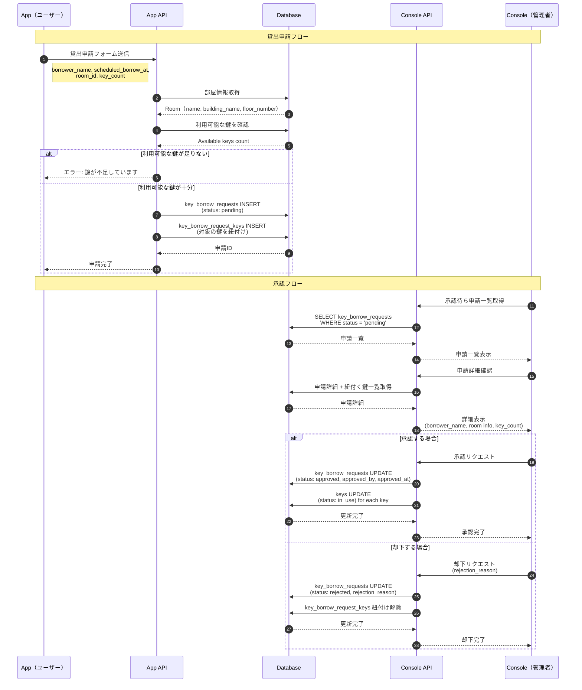
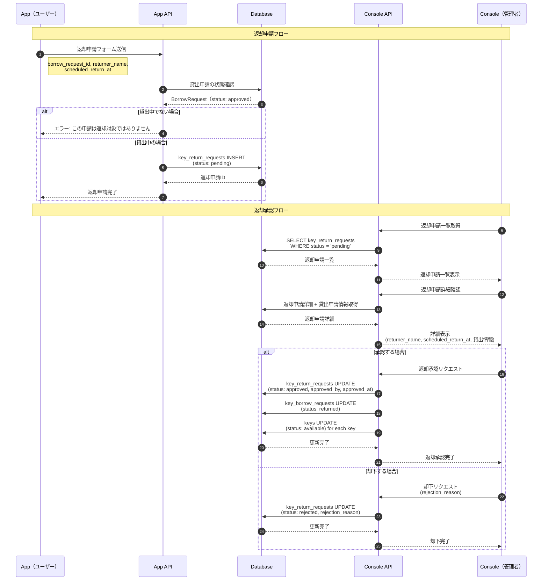

# 鍵貸出・返却機能 設計ドキュメント

## 概要

本機能は、app側からの鍵貸出申請と返却申請を、console側で承認するワークフローを実現する。

### 機能要件

#### 貸出フロー
1. **App側**: ユーザーがフォームに以下の情報を入力
   - 借りる予定日時
   - 部屋名
   - 階
   - 借りる人の名前
   - 鍵の本数
2. **Console側**: 申請内容を確認し、不備がなければ承認
3. **システム**: 鍵の状態を「貸出可能（available）」から「貸出中（in_use）」に変更

#### 返却フロー
1. **App側**: ユーザーがフォームに以下の情報を入力
   - 返した本人の名前
   - 返却予定時刻
2. **Console側**: 情報を確認し、承認
3. **システム**: 鍵の状態を「貸出中（in_use）」から「貸出可能（available）」に変更

---

## ER図



---

## 申請ステータス

### 貸出申請ステータス (BorrowRequestStatus)
| ステータス | 説明 |
|-----------|------|
| `pending` | 申請中（承認待ち） |
| `approved` | 承認済み（貸出中） |
| `rejected` | 却下済み |
| `returned` | 返却済み |

### 返却申請ステータス (ReturnRequestStatus)
| ステータス | 説明 |
|-----------|------|
| `pending` | 申請中（承認待ち） |
| `approved` | 承認済み（返却完了） |
| `rejected` | 却下済み |

---

## シーケンス図

### 貸出フロー



### 返却フロー



---

## Protobuf定義

### App API (keyhub/app/v1/borrow.proto)

```protobuf
syntax = "proto3";

package keyhub.app.v1;

import "buf/validate/validate.proto";
import "google/protobuf/timestamp.proto";

// ==================== 貸出申請関連 ====================

service BorrowService {
  // 貸出申請を作成
  rpc CreateBorrowRequest(CreateBorrowRequestRequest) returns (CreateBorrowRequestResponse);

  // 自分の貸出申請一覧を取得
  rpc ListMyBorrowRequests(ListMyBorrowRequestsRequest) returns (ListMyBorrowRequestsResponse);

  // 貸出申請の詳細を取得
  rpc GetBorrowRequest(GetBorrowRequestRequest) returns (GetBorrowRequestResponse);

  // 返却申請を作成
  rpc CreateReturnRequest(CreateReturnRequestRequest) returns (CreateReturnRequestResponse);

  // 自分の返却申請一覧を取得
  rpc ListMyReturnRequests(ListMyReturnRequestsRequest) returns (ListMyReturnRequestsResponse);
}

// ---------- 貸出申請作成 ----------

message CreateBorrowRequestRequest {
  // 対象の部屋ID
  string room_id = 1 [(buf.validate.field).string.uuid = true];

  // 借りる人の名前
  string borrower_name = 2 [(buf.validate.field).string.min_len = 1];

  // 借りる予定日時
  google.protobuf.Timestamp scheduled_borrow_at = 3 [(buf.validate.field).required = true];

  // 借りる鍵の本数
  int32 key_count = 4 [(buf.validate.field).int32.gte = 1];
}

message CreateBorrowRequestResponse {
  // 作成された貸出申請ID
  string id = 1 [(buf.validate.field).string.uuid = true];
}

// ---------- 貸出申請一覧取得 ----------

message ListMyBorrowRequestsRequest {
  // ステータスでフィルタ（任意）
  optional BorrowRequestStatus status_filter = 1;
}

message ListMyBorrowRequestsResponse {
  repeated BorrowRequest borrow_requests = 1;
}

// ---------- 貸出申請詳細取得 ----------

message GetBorrowRequestRequest {
  string id = 1 [(buf.validate.field).string.uuid = true];
}

message GetBorrowRequestResponse {
  BorrowRequest borrow_request = 1;
}

// ---------- 返却申請作成 ----------

message CreateReturnRequestRequest {
  // 対応する貸出申請ID
  string borrow_request_id = 1 [(buf.validate.field).string.uuid = true];

  // 返却者の名前
  string returner_name = 2 [(buf.validate.field).string.min_len = 1];

  // 返却予定時刻
  google.protobuf.Timestamp scheduled_return_at = 3 [(buf.validate.field).required = true];
}

message CreateReturnRequestResponse {
  // 作成された返却申請ID
  string id = 1 [(buf.validate.field).string.uuid = true];
}

// ---------- 返却申請一覧取得 ----------

message ListMyReturnRequestsRequest {
  // ステータスでフィルタ（任意）
  optional ReturnRequestStatus status_filter = 1;
}

message ListMyReturnRequestsResponse {
  repeated ReturnRequest return_requests = 1;
}

// ==================== メッセージ型 ====================

message BorrowRequest {
  string id = 1 [(buf.validate.field).string.uuid = true];
  string room_id = 2 [(buf.validate.field).string.uuid = true];
  RoomInfo room = 3;
  string borrower_name = 4;
  google.protobuf.Timestamp scheduled_borrow_at = 5;
  int32 key_count = 6;
  BorrowRequestStatus status = 7;
  repeated KeyInfo keys = 8;
  google.protobuf.Timestamp approved_at = 9;
  string rejection_reason = 10;
  google.protobuf.Timestamp created_at = 11;
  google.protobuf.Timestamp updated_at = 12;
}

message ReturnRequest {
  string id = 1 [(buf.validate.field).string.uuid = true];
  string borrow_request_id = 2 [(buf.validate.field).string.uuid = true];
  string returner_name = 3;
  google.protobuf.Timestamp scheduled_return_at = 4;
  ReturnRequestStatus status = 5;
  google.protobuf.Timestamp approved_at = 6;
  string rejection_reason = 7;
  google.protobuf.Timestamp created_at = 8;
  google.protobuf.Timestamp updated_at = 9;
}

message RoomInfo {
  string id = 1 [(buf.validate.field).string.uuid = true];
  string name = 2;
  string building_name = 3;
  string floor_number = 4;
}

message KeyInfo {
  string id = 1 [(buf.validate.field).string.uuid = true];
  string key_number = 2;
}

// ==================== Enum ====================

enum BorrowRequestStatus {
  BORROW_REQUEST_STATUS_UNSPECIFIED = 0;
  BORROW_REQUEST_STATUS_PENDING = 1;    // 申請中
  BORROW_REQUEST_STATUS_APPROVED = 2;   // 承認済み（貸出中）
  BORROW_REQUEST_STATUS_REJECTED = 3;   // 却下済み
  BORROW_REQUEST_STATUS_RETURNED = 4;   // 返却済み
}

enum ReturnRequestStatus {
  RETURN_REQUEST_STATUS_UNSPECIFIED = 0;
  RETURN_REQUEST_STATUS_PENDING = 1;    // 申請中
  RETURN_REQUEST_STATUS_APPROVED = 2;   // 承認済み（返却完了）
  RETURN_REQUEST_STATUS_REJECTED = 3;   // 却下済み
}
```

### Console API (keyhub/console/v1/borrow.proto)

```protobuf
syntax = "proto3";

package keyhub.console.v1;

import "buf/validate/validate.proto";
import "google/protobuf/timestamp.proto";

// ==================== 貸出・返却管理サービス ====================

service ConsoleBorrowService {
  // 貸出申請一覧を取得
  rpc ListBorrowRequests(ListBorrowRequestsRequest) returns (ListBorrowRequestsResponse);

  // 貸出申請の詳細を取得
  rpc GetBorrowRequest(GetBorrowRequestRequest) returns (GetBorrowRequestResponse);

  // 貸出申請を承認
  rpc ApproveBorrowRequest(ApproveBorrowRequestRequest) returns (ApproveBorrowRequestResponse);

  // 貸出申請を却下
  rpc RejectBorrowRequest(RejectBorrowRequestRequest) returns (RejectBorrowRequestResponse);

  // 返却申請一覧を取得
  rpc ListReturnRequests(ListReturnRequestsRequest) returns (ListReturnRequestsResponse);

  // 返却申請の詳細を取得
  rpc GetReturnRequest(GetReturnRequestRequest) returns (GetReturnRequestResponse);

  // 返却申請を承認
  rpc ApproveReturnRequest(ApproveReturnRequestRequest) returns (ApproveReturnRequestResponse);

  // 返却申請を却下
  rpc RejectReturnRequest(RejectReturnRequestRequest) returns (RejectReturnRequestResponse);
}

// ==================== 貸出申請管理 ====================

// ---------- 一覧取得 ----------

message ListBorrowRequestsRequest {
  // ステータスでフィルタ（任意）
  optional BorrowRequestStatus status_filter = 1;

  // 部屋IDでフィルタ（任意）
  optional string room_id = 2 [(buf.validate.field).string.uuid = true];
}

message ListBorrowRequestsResponse {
  repeated BorrowRequestDetail borrow_requests = 1;
}

// ---------- 詳細取得 ----------

message GetBorrowRequestRequest {
  string id = 1 [(buf.validate.field).string.uuid = true];
}

message GetBorrowRequestResponse {
  BorrowRequestDetail borrow_request = 1;
}

// ---------- 承認 ----------

message ApproveBorrowRequestRequest {
  string id = 1 [(buf.validate.field).string.uuid = true];
}

message ApproveBorrowRequestResponse {
  // 承認後のステータス
  BorrowRequestStatus status = 1;
}

// ---------- 却下 ----------

message RejectBorrowRequestRequest {
  string id = 1 [(buf.validate.field).string.uuid = true];

  // 却下理由（任意）
  string rejection_reason = 2;
}

message RejectBorrowRequestResponse {
  // 却下後のステータス
  BorrowRequestStatus status = 1;
}

// ==================== 返却申請管理 ====================

// ---------- 一覧取得 ----------

message ListReturnRequestsRequest {
  // ステータスでフィルタ（任意）
  optional ReturnRequestStatus status_filter = 1;
}

message ListReturnRequestsResponse {
  repeated ReturnRequestDetail return_requests = 1;
}

// ---------- 詳細取得 ----------

message GetReturnRequestRequest {
  string id = 1 [(buf.validate.field).string.uuid = true];
}

message GetReturnRequestResponse {
  ReturnRequestDetail return_request = 1;
}

// ---------- 承認 ----------

message ApproveReturnRequestRequest {
  string id = 1 [(buf.validate.field).string.uuid = true];
}

message ApproveReturnRequestResponse {
  // 承認後のステータス
  ReturnRequestStatus status = 1;
}

// ---------- 却下 ----------

message RejectReturnRequestRequest {
  string id = 1 [(buf.validate.field).string.uuid = true];

  // 却下理由（任意）
  string rejection_reason = 2;
}

message RejectReturnRequestResponse {
  // 却下後のステータス
  ReturnRequestStatus status = 1;
}

// ==================== メッセージ型 ====================

message BorrowRequestDetail {
  string id = 1 [(buf.validate.field).string.uuid = true];
  RoomInfo room = 2;
  RequesterInfo requester = 3;
  string borrower_name = 4;
  google.protobuf.Timestamp scheduled_borrow_at = 5;
  int32 key_count = 6;
  BorrowRequestStatus status = 7;
  repeated KeyInfo keys = 8;
  ApproverInfo approved_by = 9;
  google.protobuf.Timestamp approved_at = 10;
  string rejection_reason = 11;
  google.protobuf.Timestamp created_at = 12;
  google.protobuf.Timestamp updated_at = 13;
}

message ReturnRequestDetail {
  string id = 1 [(buf.validate.field).string.uuid = true];
  BorrowRequestSummary borrow_request = 2;
  string returner_name = 3;
  google.protobuf.Timestamp scheduled_return_at = 4;
  ReturnRequestStatus status = 5;
  ApproverInfo approved_by = 6;
  google.protobuf.Timestamp approved_at = 7;
  string rejection_reason = 8;
  google.protobuf.Timestamp created_at = 9;
  google.protobuf.Timestamp updated_at = 10;
}

message BorrowRequestSummary {
  string id = 1 [(buf.validate.field).string.uuid = true];
  RoomInfo room = 2;
  string borrower_name = 3;
  google.protobuf.Timestamp scheduled_borrow_at = 4;
  int32 key_count = 5;
  repeated KeyInfo keys = 6;
}

message RoomInfo {
  string id = 1 [(buf.validate.field).string.uuid = true];
  string name = 2;
  string building_name = 3;
  string floor_number = 4;
}

message KeyInfo {
  string id = 1 [(buf.validate.field).string.uuid = true];
  string key_number = 2;
}

message RequesterInfo {
  string user_id = 1 [(buf.validate.field).string.uuid = true];
  string name = 2;
  string email = 3;
}

message ApproverInfo {
  string membership_id = 1 [(buf.validate.field).string.uuid = true];
  string user_name = 2;
}

// ==================== Enum ====================

enum BorrowRequestStatus {
  BORROW_REQUEST_STATUS_UNSPECIFIED = 0;
  BORROW_REQUEST_STATUS_PENDING = 1;    // 申請中
  BORROW_REQUEST_STATUS_APPROVED = 2;   // 承認済み（貸出中）
  BORROW_REQUEST_STATUS_REJECTED = 3;   // 却下済み
  BORROW_REQUEST_STATUS_RETURNED = 4;   // 返却済み
}

enum ReturnRequestStatus {
  RETURN_REQUEST_STATUS_UNSPECIFIED = 0;
  RETURN_REQUEST_STATUS_PENDING = 1;    // 申請中
  RETURN_REQUEST_STATUS_APPROVED = 2;   // 承認済み（返却完了）
  RETURN_REQUEST_STATUS_REJECTED = 3;   // 却下済み
}
```

---

## データベースマイグレーション（参考）

以下は、新しいテーブルを追加するためのマイグレーションSQLの参考例です。

```sql
-- +goose Up

-- 鍵貸出申請テーブル
CREATE TABLE key_borrow_requests (
    id UUID PRIMARY KEY DEFAULT uuid_generate_v4(),
    organization_id UUID NOT NULL DEFAULT '550e8400-e29b-41d4-a716-446655440000',
    room_id UUID NOT NULL REFERENCES rooms(id) ON DELETE CASCADE,
    requester_user_id UUID NOT NULL REFERENCES users(id) ON DELETE CASCADE,
    borrower_name TEXT NOT NULL,
    scheduled_borrow_at TIMESTAMPTZ NOT NULL,
    key_count INTEGER NOT NULL CHECK (key_count > 0),
    status TEXT NOT NULL DEFAULT 'pending' CHECK (status IN ('pending', 'approved', 'rejected', 'returned')),
    approved_by_membership_id UUID REFERENCES tenant_memberships(id),
    approved_at TIMESTAMPTZ,
    rejection_reason TEXT,
    created_at TIMESTAMPTZ NOT NULL DEFAULT CURRENT_TIMESTAMP,
    updated_at TIMESTAMPTZ NOT NULL DEFAULT CURRENT_TIMESTAMP
);

-- 貸出申請と鍵の中間テーブル
CREATE TABLE key_borrow_request_keys (
    id UUID PRIMARY KEY DEFAULT uuid_generate_v4(),
    borrow_request_id UUID NOT NULL REFERENCES key_borrow_requests(id) ON DELETE CASCADE,
    key_id UUID NOT NULL REFERENCES keys(id) ON DELETE CASCADE,
    created_at TIMESTAMPTZ NOT NULL DEFAULT CURRENT_TIMESTAMP,
    UNIQUE (borrow_request_id, key_id)
);

-- 鍵返却申請テーブル
CREATE TABLE key_return_requests (
    id UUID PRIMARY KEY DEFAULT uuid_generate_v4(),
    borrow_request_id UUID NOT NULL REFERENCES key_borrow_requests(id) ON DELETE CASCADE,
    returner_name TEXT NOT NULL,
    scheduled_return_at TIMESTAMPTZ NOT NULL,
    status TEXT NOT NULL DEFAULT 'pending' CHECK (status IN ('pending', 'approved', 'rejected')),
    approved_by_membership_id UUID REFERENCES tenant_memberships(id),
    approved_at TIMESTAMPTZ,
    rejection_reason TEXT,
    created_at TIMESTAMPTZ NOT NULL DEFAULT CURRENT_TIMESTAMP,
    updated_at TIMESTAMPTZ NOT NULL DEFAULT CURRENT_TIMESTAMP
);

-- インデックス
CREATE INDEX idx_borrow_requests_org ON key_borrow_requests(organization_id);
CREATE INDEX idx_borrow_requests_room ON key_borrow_requests(room_id);
CREATE INDEX idx_borrow_requests_requester ON key_borrow_requests(requester_user_id);
CREATE INDEX idx_borrow_requests_status ON key_borrow_requests(status);
CREATE INDEX idx_return_requests_borrow ON key_return_requests(borrow_request_id);
CREATE INDEX idx_return_requests_status ON key_return_requests(status);

-- 更新日時トリガー
CREATE TRIGGER refresh_key_borrow_requests_updated_at
    BEFORE UPDATE ON key_borrow_requests
    FOR EACH ROW EXECUTE FUNCTION update_updated_at_column();

CREATE TRIGGER refresh_key_return_requests_updated_at
    BEFORE UPDATE ON key_return_requests
    FOR EACH ROW EXECUTE FUNCTION update_updated_at_column();

-- RLS有効化
ALTER TABLE key_borrow_requests ENABLE ROW LEVEL SECURITY;
ALTER TABLE key_borrow_request_keys ENABLE ROW LEVEL SECURITY;
ALTER TABLE key_return_requests ENABLE ROW LEVEL SECURITY;

-- RLSポリシー
CREATE POLICY key_borrow_requests_org_isolation ON key_borrow_requests TO keyhub
    USING ((current_organization_id() IS NULL) OR (organization_id = current_organization_id()));

CREATE POLICY key_borrow_request_keys_org_isolation ON key_borrow_request_keys TO keyhub
    USING ((current_organization_id() IS NULL) OR
           (borrow_request_id IN (SELECT id FROM key_borrow_requests WHERE organization_id = current_organization_id())));

CREATE POLICY key_return_requests_org_isolation ON key_return_requests TO keyhub
    USING ((current_organization_id() IS NULL) OR
           (borrow_request_id IN (SELECT id FROM key_borrow_requests WHERE organization_id = current_organization_id())));

-- +goose Down

DROP POLICY IF EXISTS key_return_requests_org_isolation ON key_return_requests;
DROP POLICY IF EXISTS key_borrow_request_keys_org_isolation ON key_borrow_request_keys;
DROP POLICY IF EXISTS key_borrow_requests_org_isolation ON key_borrow_requests;

DROP TABLE IF EXISTS key_return_requests;
DROP TABLE IF EXISTS key_borrow_request_keys;
DROP TABLE IF EXISTS key_borrow_requests;
```

---

## API エンドポイント一覧

### App API

| メソッド | エンドポイント | 説明 |
|---------|---------------|------|
| POST | `/keyhub.app.v1.BorrowService/CreateBorrowRequest` | 貸出申請作成 |
| POST | `/keyhub.app.v1.BorrowService/ListMyBorrowRequests` | 自分の貸出申請一覧取得 |
| POST | `/keyhub.app.v1.BorrowService/GetBorrowRequest` | 貸出申請詳細取得 |
| POST | `/keyhub.app.v1.BorrowService/CreateReturnRequest` | 返却申請作成 |
| POST | `/keyhub.app.v1.BorrowService/ListMyReturnRequests` | 自分の返却申請一覧取得 |

### Console API

| メソッド | エンドポイント | 説明 |
|---------|---------------|------|
| POST | `/keyhub.console.v1.ConsoleBorrowService/ListBorrowRequests` | 貸出申請一覧取得 |
| POST | `/keyhub.console.v1.ConsoleBorrowService/GetBorrowRequest` | 貸出申請詳細取得 |
| POST | `/keyhub.console.v1.ConsoleBorrowService/ApproveBorrowRequest` | 貸出申請承認 |
| POST | `/keyhub.console.v1.ConsoleBorrowService/RejectBorrowRequest` | 貸出申請却下 |
| POST | `/keyhub.console.v1.ConsoleBorrowService/ListReturnRequests` | 返却申請一覧取得 |
| POST | `/keyhub.console.v1.ConsoleBorrowService/GetReturnRequest` | 返却申請詳細取得 |
| POST | `/keyhub.console.v1.ConsoleBorrowService/ApproveReturnRequest` | 返却申請承認 |
| POST | `/keyhub.console.v1.ConsoleBorrowService/RejectReturnRequest` | 返却申請却下 |
