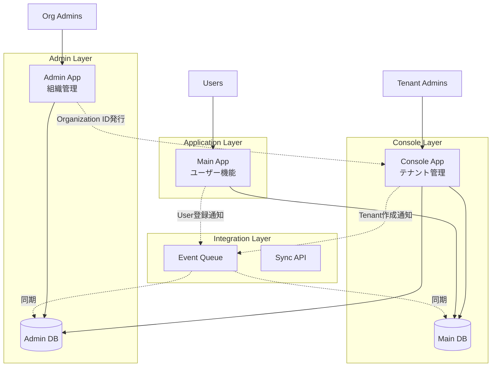
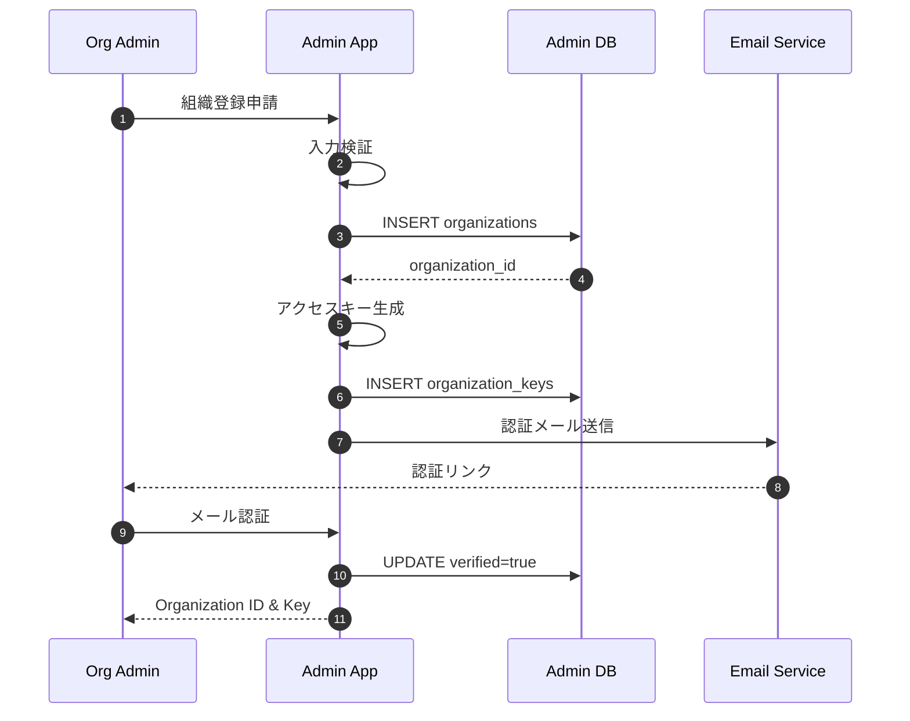
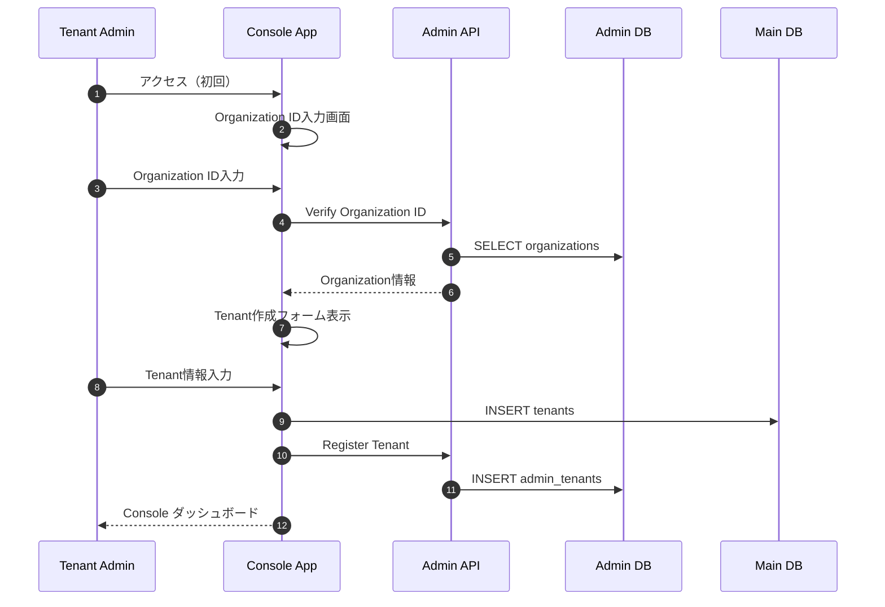
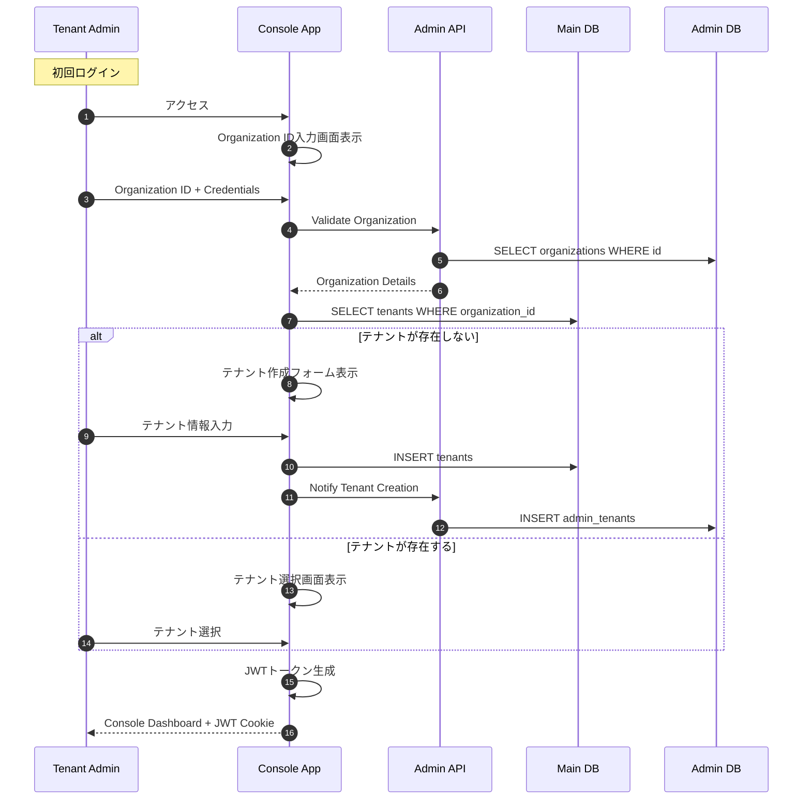
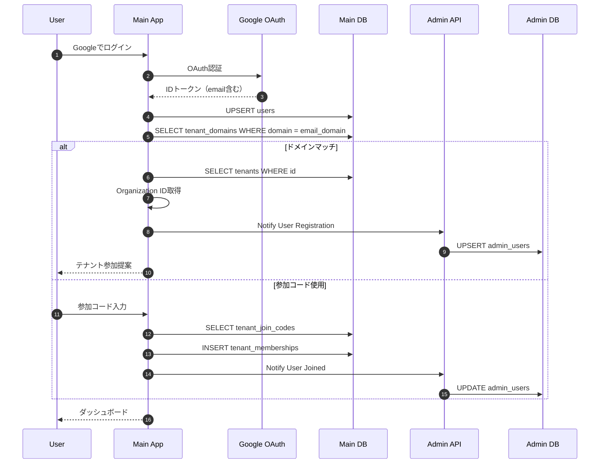
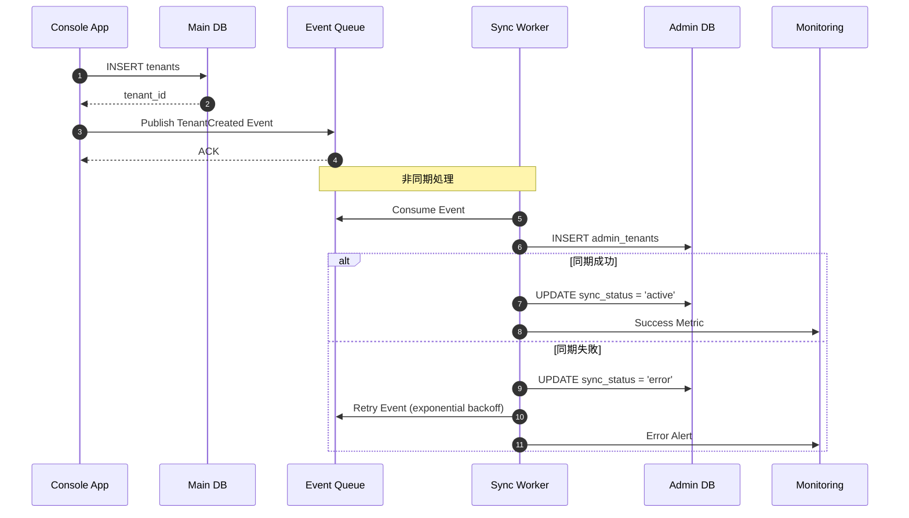

# KeyHub マルチデータベースアーキテクチャ設計書

このドキュメントは、KeyHubプロジェクトの新しいマルチデータベースアーキテクチャ（アプローチ3）の詳細設計を記述したものです。Organization（組織）レベルの管理を分離し、より堅牢でスケーラブルなシステムを実現します。

## 目次

1. [システム概要](#1-システム概要)
2. [アーキテクチャ構成](#2-アーキテクチャ構成)
3. [Admin システム](#3-admin-システム)
4. [データベース設計](#4-データベース設計)
5. [認証・認可フロー](#5-認証認可フロー)
6. [データ同期メカニズム](#6-データ同期メカニズム)
7. [API設計](#7-api設計)
8. [セキュリティ](#8-セキュリティ)
9. [運用・監視](#9-運用監視)
10. [移行計画](#10-移行計画)

---

## 1. システム概要

### 1.1 ビジョン

KeyHub マルチデータベースアーキテクチャは、エンタープライズレベルの組織管理とマルチテナント機能を提供する、3層分離型のシステムです。物理的なデータベース分離により、セキュリティ、スケーラビリティ、コンプライアンスの要件を満たします。

### 1.2 用語定義

| 用語 | 説明 | 例 |
|------|------|------|
| **Organization** | 最上位の組織単位（会社・大学） | 工学院大学、株式会社サンプル |
| **Tenant** | Organization内の部門単位 | 情報学部、営業部 |
| **Group** | Tenant内の小単位（オプション） | 研究室、チーム |
| **Admin App** | Organization全体を管理するアプリケーション | ライセンス管理、統計 |
| **Console App** | Tenant管理者向けアプリケーション | 部署管理、メンバー管理 |
| **Main App** | エンドユーザー向けアプリケーション | 業務機能、コラボレーション |

### 1.3 主要な変更点

- **物理的データベース分離**: Admin DBとMain DBの2層構造
- **Organization ID**: システム全体で組織を識別する一意のID
- **階層的権限管理**: Organization → Tenant → Group の3層権限
- **イベント駆動同期**: データ整合性を保つ非同期同期メカニズム

---

## 2. アーキテクチャ構成

### 2.1 システム全体図



### 2.2 コンポーネント責任範囲

| コンポーネント | 責任範囲 | 主要機能 |
|----------------|----------|----------|
| **Admin App** | Organization管理 | ライセンス発行、使用統計、課金管理 |
| **Admin DB** | マスターデータ管理 | Organization、統計、監査ログ |
| **Console App** | Tenant運用 | Tenant作成、メンバー管理、参加コード発行 |
| **Main App** | ビジネスロジック | ユーザー認証、業務機能、コラボレーション |
| **Main DB** | 運用データ管理 | Users、Tenants、業務データ |
| **Event Queue** | 非同期通信 | データ同期、イベント配信 |

---

## 3. Admin システム

### 3.1 Admin App 機能

#### 3.1.1 Organization管理

- **作成・編集・削除**: 組織の基本情報管理
- **ライセンス管理**: プラン、制限、有効期限
- **ドメイン管理**: 組織ドメインの登録・検証
- **統計ダッシュボード**: 使用状況、アクティビティ

#### 3.1.2 Organization ID発行フロー



### 3.2 Console App との連携

#### 3.2.1 Console初回ログインフロー



---

## 4. データベース設計

### 4.1 Admin DB スキーマ

#### 4.1.1 organizations テーブル

```sql
CREATE TABLE organizations (
    id UUID NOT NULL DEFAULT uuid_generate_v4(),
    name TEXT NOT NULL UNIQUE,
    slug TEXT UNIQUE,
    email TEXT NOT NULL,
    primary_domain TEXT,
    verified BOOLEAN DEFAULT FALSE,

    -- ライセンス情報
    license_type TEXT NOT NULL DEFAULT 'trial', -- trial, basic, professional, enterprise
    max_tenants INTEGER NOT NULL DEFAULT 5,
    max_users INTEGER NOT NULL DEFAULT 100,
    max_storage_gb INTEGER NOT NULL DEFAULT 10,

    -- 契約情報
    contract_start_date DATE,
    contract_end_date DATE,
    billing_email TEXT,

    -- メタデータ
    created_at TIMESTAMPTZ NOT NULL DEFAULT CURRENT_TIMESTAMP,
    updated_at TIMESTAMPTZ NOT NULL DEFAULT CURRENT_TIMESTAMP,
    verified_at TIMESTAMPTZ,
    suspended_at TIMESTAMPTZ,

    PRIMARY KEY (id)
);

CREATE UNIQUE INDEX idx_organizations_slug ON organizations(LOWER(slug));
CREATE INDEX idx_organizations_domain ON organizations(primary_domain);
CREATE INDEX idx_organizations_license ON organizations(license_type);
```

#### 4.1.2 organization_keys テーブル

```sql
CREATE TABLE organization_keys (
    id UUID NOT NULL DEFAULT uuid_generate_v4(),
    organization_id UUID NOT NULL,
    key_hash TEXT NOT NULL,
    key_type TEXT NOT NULL DEFAULT 'api', -- api, console, admin
    name TEXT,

    -- 制限
    rate_limit INTEGER DEFAULT 1000, -- requests per hour
    allowed_ips TEXT[], -- IP whitelist

    -- 有効期限
    expires_at TIMESTAMPTZ,
    last_used_at TIMESTAMPTZ,
    revoked_at TIMESTAMPTZ,

    created_at TIMESTAMPTZ NOT NULL DEFAULT CURRENT_TIMESTAMP,

    PRIMARY KEY (id),
    FOREIGN KEY (organization_id) REFERENCES organizations(id) ON DELETE CASCADE
);

CREATE INDEX idx_org_keys_org ON organization_keys(organization_id);
CREATE INDEX idx_org_keys_hash ON organization_keys(key_hash);
```

#### 4.1.3 admin_tenants テーブル

```sql
CREATE TABLE admin_tenants (
    id UUID NOT NULL DEFAULT uuid_generate_v4(),
    organization_id UUID NOT NULL,
    main_db_tenant_id UUID NOT NULL, -- Main DBのtenant.id

    -- Tenant情報のキャッシュ
    tenant_name TEXT NOT NULL,
    tenant_type TEXT, -- department, laboratory, division, branch
    tenant_slug TEXT,

    -- 統計情報
    user_count INTEGER DEFAULT 0,
    active_user_count INTEGER DEFAULT 0,
    storage_used_mb INTEGER DEFAULT 0,

    -- 同期情報
    sync_status TEXT DEFAULT 'active', -- active, paused, error
    last_synced_at TIMESTAMPTZ,
    sync_error_message TEXT,

    created_at TIMESTAMPTZ NOT NULL DEFAULT CURRENT_TIMESTAMP,
    updated_at TIMESTAMPTZ NOT NULL DEFAULT CURRENT_TIMESTAMP,

    PRIMARY KEY (id),
    FOREIGN KEY (organization_id) REFERENCES organizations(id) ON DELETE CASCADE,
    UNIQUE (organization_id, main_db_tenant_id)
);

CREATE INDEX idx_admin_tenants_org ON admin_tenants(organization_id);
CREATE INDEX idx_admin_tenants_sync ON admin_tenants(sync_status);
```

#### 4.1.4 admin_users テーブル

```sql
CREATE TABLE admin_users (
    id UUID NOT NULL DEFAULT uuid_generate_v4(),
    main_db_user_id UUID NOT NULL, -- Main DBのuser.id
    organization_id UUID NOT NULL,

    -- ユーザー情報のキャッシュ
    email TEXT NOT NULL,
    name TEXT,

    -- 所属情報
    tenant_ids UUID[], -- 所属するtenant_idのリスト
    primary_tenant_id UUID, -- メインのtenant_id

    -- アクティビティ
    first_seen_at TIMESTAMPTZ NOT NULL,
    last_active_at TIMESTAMPTZ,
    total_login_count INTEGER DEFAULT 0,

    created_at TIMESTAMPTZ NOT NULL DEFAULT CURRENT_TIMESTAMP,
    updated_at TIMESTAMPTZ NOT NULL DEFAULT CURRENT_TIMESTAMP,

    PRIMARY KEY (id),
    FOREIGN KEY (organization_id) REFERENCES organizations(id) ON DELETE CASCADE,
    UNIQUE (main_db_user_id)
);

CREATE INDEX idx_admin_users_org ON admin_users(organization_id);
CREATE INDEX idx_admin_users_email ON admin_users(LOWER(email));
CREATE INDEX idx_admin_users_tenant ON admin_users USING GIN (tenant_ids);
```

#### 4.1.5 organization_audit_logs テーブル

```sql
CREATE TABLE organization_audit_logs (
    id UUID NOT NULL DEFAULT uuid_generate_v4(),
    organization_id UUID NOT NULL,

    -- イベント情報
    event_type TEXT NOT NULL, -- tenant.created, user.joined, license.changed
    event_source TEXT NOT NULL, -- admin, console, app, system
    event_data JSONB,

    -- アクター情報
    actor_type TEXT, -- user, system, api
    actor_id UUID,
    actor_email TEXT,
    actor_ip INET,

    created_at TIMESTAMPTZ NOT NULL DEFAULT CURRENT_TIMESTAMP,

    PRIMARY KEY (id),
    FOREIGN KEY (organization_id) REFERENCES organizations(id) ON DELETE CASCADE
);

CREATE INDEX idx_audit_logs_org ON organization_audit_logs(organization_id);
CREATE INDEX idx_audit_logs_type ON organization_audit_logs(event_type);
CREATE INDEX idx_audit_logs_created ON organization_audit_logs(created_at DESC);
```

### 4.2 Main DB スキーマ拡張

#### 4.2.1 tenants テーブル拡張

```sql
-- 既存のtenantsテーブルに追加カラム
ALTER TABLE tenants ADD COLUMN organization_id UUID;
ALTER TABLE tenants ADD COLUMN tenant_type TEXT;
ALTER TABLE tenants ADD COLUMN parent_tenant_id UUID REFERENCES tenants(id);

-- グループ機能のための新テーブル
CREATE TABLE groups (
    id UUID NOT NULL DEFAULT uuid_generate_v4(),
    tenant_id UUID NOT NULL,
    name TEXT NOT NULL,
    slug TEXT,
    description TEXT,
    parent_group_id UUID REFERENCES groups(id),

    -- グループ設定
    is_optional BOOLEAN DEFAULT TRUE,
    max_members INTEGER,

    created_at TIMESTAMPTZ NOT NULL DEFAULT CURRENT_TIMESTAMP,
    updated_at TIMESTAMPTZ NOT NULL DEFAULT CURRENT_TIMESTAMP,

    PRIMARY KEY (id),
    FOREIGN KEY (tenant_id) REFERENCES tenants(id) ON DELETE CASCADE,
    UNIQUE (tenant_id, slug),
    UNIQUE (tenant_id, name)
);

CREATE INDEX idx_groups_tenant ON groups(tenant_id);
CREATE INDEX idx_groups_parent ON groups(parent_group_id);
```

#### 4.2.2 group_memberships テーブル

```sql
CREATE TABLE group_memberships (
    id UUID NOT NULL DEFAULT uuid_generate_v4(),
    group_id UUID NOT NULL,
    user_id UUID NOT NULL,

    role TEXT NOT NULL CHECK (role IN ('owner', 'admin', 'member')) DEFAULT 'member',

    joined_at TIMESTAMPTZ NOT NULL DEFAULT CURRENT_TIMESTAMP,
    invited_at TIMESTAMPTZ,
    invited_by UUID REFERENCES users(id),

    PRIMARY KEY (id),
    FOREIGN KEY (group_id) REFERENCES groups(id) ON DELETE CASCADE,
    FOREIGN KEY (user_id) REFERENCES users(id) ON DELETE CASCADE,
    UNIQUE (group_id, user_id)
);

CREATE INDEX idx_group_members_group ON group_memberships(group_id);
CREATE INDEX idx_group_members_user ON group_memberships(user_id);
```

---

## 5. 認証・認可フロー

### 5.1 Organization ID を使用した認証フロー

#### 5.1.1 Console ログイン（Organization ID使用）



### 5.2 App ユーザー認証フロー（拡張版）



### 5.3 権限階層

```yaml
権限レベル:
  Organization Admin:
    - 全Organization設定の管理
    - ライセンス管理
    - 全Tenantの閲覧
    - 使用統計の閲覧
    - 監査ログの閲覧

  Tenant Admin:
    - Tenant設定の管理
    - Group作成・管理
    - メンバー招待・管理
    - 参加コード発行
    - Tenant内統計の閲覧

  Group Admin:
    - Group設定の管理
    - Groupメンバー管理
    - Group内リソース管理

  Member:
    - 所属Tenant/Groupのリソースアクセス
    - 個人設定の管理
```

---

## 6. データ同期メカニズム

### 6.1 イベント駆動型同期

#### 6.1.1 イベント定義

```go
// Event Types
type EventType string

const (
    // Organization Events
    OrganizationCreated EventType = "organization.created"
    OrganizationUpdated EventType = "organization.updated"
    OrganizationSuspended EventType = "organization.suspended"

    // Tenant Events
    TenantCreated EventType = "tenant.created"
    TenantUpdated EventType = "tenant.updated"
    TenantDeleted EventType = "tenant.deleted"

    // User Events
    UserRegistered EventType = "user.registered"
    UserJoinedTenant EventType = "user.joined_tenant"
    UserLeftTenant EventType = "user.left_tenant"

    // Group Events
    GroupCreated EventType = "group.created"
    GroupUpdated EventType = "group.updated"
    UserJoinedGroup EventType = "user.joined_group"
)

// Base Event Structure
type Event struct {
    ID             string    `json:"id"`
    Type          EventType `json:"type"`
    OrganizationID string   `json:"organization_id"`
    Timestamp     time.Time `json:"timestamp"`
    Source        string    `json:"source"` // admin, console, app
    Data          any       `json:"data"`
    Metadata      map[string]string `json:"metadata"`
}
```

#### 6.1.2 同期フロー例（Tenant作成）



### 6.2 同期保証レベル

| データ種別 | 同期タイミング | 保証レベル | リトライ戦略 |
|-----------|---------------|-----------|-------------|
| Organization作成 | 即時 | 強一貫性 | 同期API |
| Tenant作成 | 非同期（秒単位） | 結果整合性 | 3回、指数バックオフ |
| User登録 | 非同期（分単位） | 結果整合性 | 5回、指数バックオフ |
| 統計更新 | バッチ（時間単位） | ベストエフォート | 1回 |

### 6.3 不整合検出と修復

```sql
-- 不整合検出用ビュー
CREATE VIEW sync_discrepancies AS
SELECT
    'missing_in_admin' as discrepancy_type,
    t.id as tenant_id,
    t.name as tenant_name,
    t.organization_id
FROM tenants t
LEFT JOIN admin_tenants at ON t.id = at.main_db_tenant_id
WHERE at.id IS NULL
  AND t.organization_id IS NOT NULL

UNION ALL

SELECT
    'missing_in_main' as discrepancy_type,
    at.main_db_tenant_id as tenant_id,
    at.tenant_name,
    at.organization_id
FROM admin_tenants at
LEFT JOIN tenants t ON at.main_db_tenant_id = t.id
WHERE t.id IS NULL;
```

---

## 7. API設計

### 7.1 Admin API

#### 7.1.1 Organization管理

```proto
syntax = "proto3";

package keyhub.admin.v1;

service OrganizationService {
    // Organization作成
    rpc CreateOrganization(CreateOrganizationRequest) returns (CreateOrganizationResponse);

    // Organization取得
    rpc GetOrganization(GetOrganizationRequest) returns (Organization);

    // Organization更新
    rpc UpdateOrganization(UpdateOrganizationRequest) returns (Organization);

    // ライセンス更新
    rpc UpdateLicense(UpdateLicenseRequest) returns (Organization);

    // 統計取得
    rpc GetStatistics(GetStatisticsRequest) returns (Statistics);

    // 監査ログ取得
    rpc GetAuditLogs(GetAuditLogsRequest) returns (AuditLogsResponse);
}

message Organization {
    string id = 1;
    string name = 2;
    string slug = 3;
    string primary_domain = 4;
    License license = 5;
    google.protobuf.Timestamp created_at = 6;
    google.protobuf.Timestamp updated_at = 7;
}

message License {
    string type = 1; // trial, basic, professional, enterprise
    int32 max_tenants = 2;
    int32 max_users = 3;
    int32 max_storage_gb = 4;
    google.protobuf.Timestamp expires_at = 5;
}
```

#### 7.1.2 同期API

```proto
service SyncService {
    // Tenant同期
    rpc SyncTenant(SyncTenantRequest) returns (SyncResponse);

    // User同期
    rpc SyncUser(SyncUserRequest) returns (SyncResponse);

    // バルク同期
    rpc BulkSync(BulkSyncRequest) returns (BulkSyncResponse);

    // 同期状態確認
    rpc GetSyncStatus(GetSyncStatusRequest) returns (SyncStatus);
}

message SyncTenantRequest {
    string organization_id = 1;
    string tenant_id = 2;
    string tenant_name = 3;
    string tenant_type = 4;
    SyncOperation operation = 5; // CREATE, UPDATE, DELETE
}

message SyncUserRequest {
    string organization_id = 1;
    string user_id = 2;
    string email = 3;
    repeated string tenant_ids = 4;
    SyncOperation operation = 5;
}
```

### 7.2 Console API 拡張

```proto
service ConsoleAuthService {
    // Organization ID による認証
    rpc AuthenticateWithOrgId(AuthWithOrgIdRequest) returns (AuthResponse);

    // Tenant作成（Organization ID必須）
    rpc CreateTenant(CreateTenantRequest) returns (Tenant);

    // Group管理
    rpc CreateGroup(CreateGroupRequest) returns (Group);
    rpc UpdateGroup(UpdateGroupRequest) returns (Group);
    rpc DeleteGroup(DeleteGroupRequest) returns (Empty);
    rpc ListGroups(ListGroupsRequest) returns (ListGroupsResponse);
}

message AuthWithOrgIdRequest {
    string organization_id = 1;
    string tenant_name = 2;
    string password = 3;
}

message CreateTenantRequest {
    string organization_id = 1;
    string name = 2;
    string type = 3; // department, laboratory, division
    string slug = 4;
    string password = 5;
}

message Group {
    string id = 1;
    string tenant_id = 2;
    string name = 3;
    string slug = 4;
    string description = 5;
    bool is_optional = 6;
    string parent_group_id = 7;
    google.protobuf.Timestamp created_at = 8;
}
```

---

## 8. セキュリティ

### 8.1 データ分離

#### 8.1.1 物理分離

- Admin DBとMain DBは異なるデータベースインスタンス
- 可能であれば異なるネットワークセグメント
- それぞれ独立したバックアップ・災害復旧計画

#### 8.1.2 アクセス制御

```sql
-- Admin DB用ロール
CREATE ROLE keyhub_admin_app;
GRANT SELECT, INSERT, UPDATE ON ALL TABLES IN SCHEMA public TO keyhub_admin_app;

CREATE ROLE keyhub_admin_readonly;
GRANT SELECT ON ALL TABLES IN SCHEMA public TO keyhub_admin_readonly;

-- Main DB用ロール（既存を拡張）
CREATE ROLE keyhub_app;
GRANT SELECT, INSERT, UPDATE, DELETE ON ALL TABLES IN SCHEMA public TO keyhub_app;

-- Console App用ロール（両DBアクセス）
CREATE ROLE keyhub_console;
-- Main DBでの権限
GRANT SELECT, INSERT, UPDATE ON tenants, groups TO keyhub_console;
-- Admin DBでの権限は別途設定
```

### 8.2 Organization ID セキュリティ

#### 8.2.1 ID生成規則

```go
// Organization ID生成
func GenerateOrganizationID() string {
    // Format: ORG-{TIMESTAMP}-{RANDOM}-{CHECKSUM}
    // Example: ORG-20240115-A3K9M2-X7

    timestamp := time.Now().Format("20060102")
    random := generateSecureRandom(6) // A-Z, 0-9
    checksum := calculateChecksum(timestamp + random)

    return fmt.Sprintf("ORG-%s-%s-%s", timestamp, random, checksum)
}

// APIキー生成
func GenerateAPIKey(orgID string) string {
    // Format: {PREFIX}_{BASE64_ENCODED_KEY}
    // Example: ok_live_a2V5aHViLWFwaS1rZXktZXhhbXBsZQ==

    prefix := "ok_live" // ok = org key
    key := generateSecureBytes(32)
    encoded := base64.URLEncoding.EncodeToString(key)

    return fmt.Sprintf("%s_%s", prefix, encoded)
}
```

### 8.3 監査とコンプライアンス

#### 8.3.1 監査ログ要件

```go
type AuditLog struct {
    // 必須フィールド
    ID             string    `json:"id"`
    OrganizationID string    `json:"organization_id"`
    Timestamp      time.Time `json:"timestamp"`
    EventType      string    `json:"event_type"`

    // アクター情報
    ActorID    string `json:"actor_id"`
    ActorType  string `json:"actor_type"` // user, system, api
    ActorEmail string `json:"actor_email,omitempty"`
    ActorIP    string `json:"actor_ip,omitempty"`

    // イベント詳細
    ResourceType string                 `json:"resource_type"`
    ResourceID   string                 `json:"resource_id"`
    Action       string                 `json:"action"`
    Result       string                 `json:"result"` // success, failure
    Changes      map[string]interface{} `json:"changes,omitempty"`

    // セキュリティ情報
    SessionID  string `json:"session_id,omitempty"`
    UserAgent  string `json:"user_agent,omitempty"`
    RequestID  string `json:"request_id"`
}
```

---

## 9. 運用・監視

### 9.1 メトリクス

#### 9.1.1 システムメトリクス

```yaml
Admin System:
  - organization.count: 総Organization数
  - organization.active: アクティブOrganization数
  - api.request.rate: APIリクエスト率
  - api.error.rate: APIエラー率
  - sync.queue.depth: 同期キューの深さ
  - sync.lag.seconds: 同期遅延（秒）

Main System:
  - tenant.count.by_org: Organization別Tenant数
  - user.active.by_org: Organization別アクティブユーザー数
  - storage.used.by_org: Organization別ストレージ使用量

Sync Health:
  - sync.success.rate: 同期成功率
  - sync.retry.count: リトライ回数
  - discrepancy.count: 不整合データ数
```

#### 9.1.2 アラート設定

```yaml
Critical:
  - sync.failure.rate > 10%: 同期失敗率が10%超過
  - api.error.rate > 5%: APIエラー率が5%超過
  - discrepancy.count > 100: 不整合データが100件超過

Warning:
  - sync.lag.seconds > 300: 同期遅延が5分超過
  - organization.quota.usage > 80%: クォータ使用率80%超過
  - license.expiry.days < 30: ライセンス期限まで30日未満
```

### 9.2 バックアップ戦略

```yaml
Admin DB:
  schedule: 毎日 02:00 UTC
  retention: 90日間
  type: フルバックアップ
  replication: 異なるリージョンに3コピー

Main DB:
  schedule:
    - フル: 週1回（日曜日）
    - 差分: 毎日
    - トランザクションログ: 継続的
  retention: 30日間
  type: ポイントインタイムリカバリ対応

Sync State:
  schedule: 毎時
  retention: 7日間
  type: スナップショット
```

---

## 10. 移行計画

### 10.1 フェーズ別実装

#### Phase 1: 基盤構築（4-6週間）

**Week 1-2: Admin システム基盤**
- Admin DB設計・構築
- Organization管理機能
- APIキー発行機能

**Week 3-4: Console統合**
- Organization ID認証
- Tenant作成フロー改修
- 基本的な同期実装

**Week 5-6: テストと安定化**
- 統合テスト
- パフォーマンステスト
- セキュリティ監査

#### Phase 2: Group機能実装（2-3週間）

**Week 7-8: Group管理**
- Groupテーブル作成
- CRUD API実装
- UI実装

**Week 9: Group Membership**
- メンバーシップ管理
- 権限制御
- 通知機能

#### Phase 3: 高度な機能（3-4週間）

**Week 10-11: 同期機能強化**
- イベントキュー実装
- リトライメカニズム
- 不整合検出・修復

**Week 12-13: 監視・運用**
- メトリクス収集
- ダッシュボード構築
- アラート設定

### 10.2 既存データ移行

```sql
-- 移行スクリプト例

-- 1. Organization作成（既存Tenantから推測）
INSERT INTO admin_db.organizations (id, name, email, license_type)
SELECT
    uuid_generate_v4(),
    'Default Organization',
    'admin@' || COALESCE(td.domain, 'example.com'),
    'basic'
FROM main_db.tenants t
LEFT JOIN main_db.tenant_domains td ON t.id = td.tenant_id
LIMIT 1;

-- 2. 既存Tenantの関連付け
WITH org AS (
    SELECT id FROM admin_db.organizations LIMIT 1
)
UPDATE main_db.tenants
SET organization_id = (SELECT id FROM org)
WHERE organization_id IS NULL;

-- 3. Admin DB への同期
INSERT INTO admin_db.admin_tenants (
    organization_id,
    main_db_tenant_id,
    tenant_name,
    tenant_type
)
SELECT
    organization_id,
    id,
    name,
    'department'
FROM main_db.tenants
WHERE organization_id IS NOT NULL;
```

### 10.3 ロールバック計画

```yaml
ロールバック手順:
  1. 新規作成停止:
     - Admin App のアクセスを制限
     - Console App を従来モードに切り替え

  2. データ退避:
     - admin_tenants データをエクスポート
     - admin_users データをエクスポート

  3. スキーマ復元:
     - organization_id カラムを NULL 許可に変更
     - Group関連テーブルを無効化

  4. 機能切り替え:
     - Feature Flag で旧機能に戻す
     - DNS/ロードバランサーで旧システムに切り替え

  5. 検証:
     - 基本機能の動作確認
     - ユーザーアクセスの確認
```

---

## まとめ

このマルチデータベースアーキテクチャは、KeyHubを真のエンタープライズグレードのSaaSプラットフォームへと進化させます。

### 主要な利点

1. **物理的データ分離**: セキュリティとコンプライアンスの向上
2. **階層的組織管理**: Organization → Tenant → Group の柔軟な構造
3. **スケーラビリティ**: 組織単位での独立したスケーリング
4. **ライセンス管理**: 組織レベルでの統合的な使用量管理
5. **監査とコンプライアンス**: 包括的な監査ログと追跡機能

### 実装の留意点

1. **段階的移行**: 既存システムを維持しながら段階的に移行
2. **同期の信頼性**: イベント駆動型アーキテクチャによる確実な同期
3. **運用の複雑性**: 適切な監視とアラートの設定が必須
4. **コスト管理**: インフラコストの増加を考慮した価格設定

このアーキテクチャにより、KeyHubは小規模な組織から大企業まで、幅広いニーズに対応できる柔軟でスケーラブルなプラットフォームとなります。