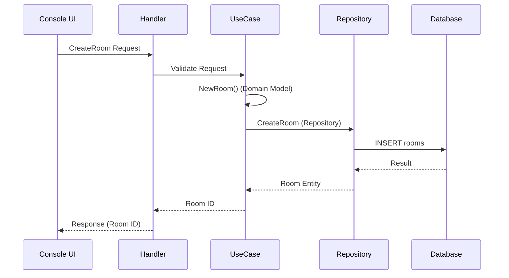
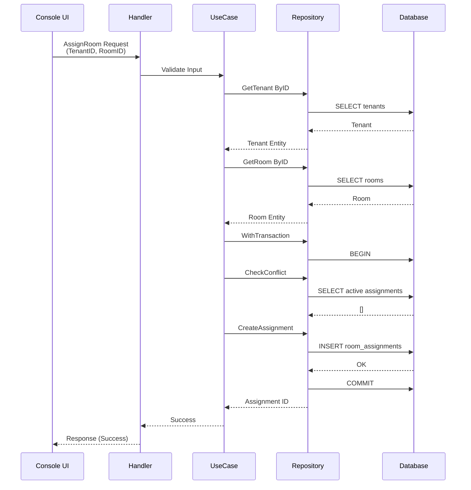
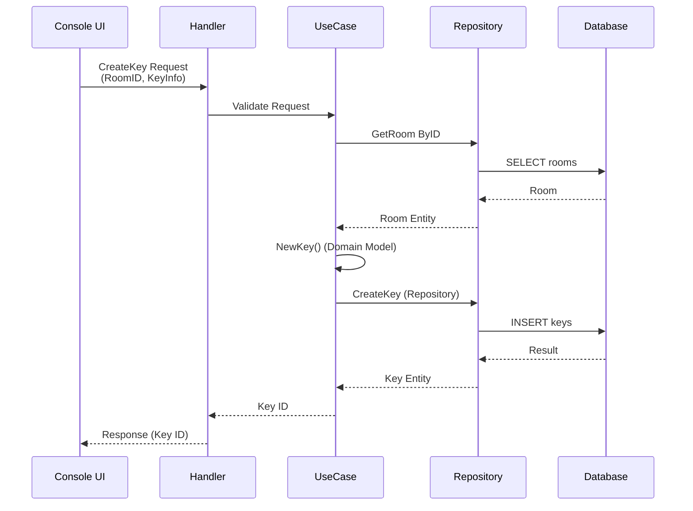
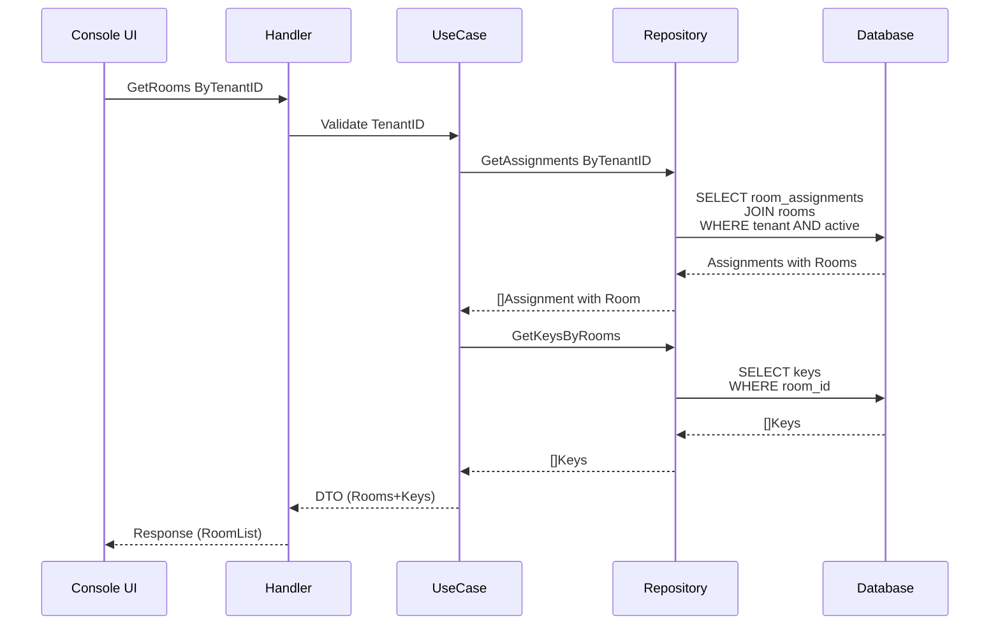

# シーケンス図

## 1. 部屋作成フロー

```mermaid
sequenceDiagram
    participant UI as Console UI
    participant H as Handler
    participant UC as UseCase
    participant R as Repository
    participant DB as Database

    UI->>H: CreateRoom Request
    H->>UC: Validate Request
    UC->>UC: NewRoom() (Domain Model)
    UC->>R: CreateRoom (Repository)
    R->>DB: INSERT rooms
    DB-->>R: Result
    R-->>UC: Room Entity
    UC-->>H: Room ID
    H-->>UI: Response (Room ID)
```

## 2. 部屋割り当てフロー（テナントへの割り当て）

```mermaid
sequenceDiagram
    participant UI as Console UI
    participant H as Handler
    participant UC as UseCase
    participant R as Repository
    participant DB as Database

    UI->>H: AssignRoom Request<br/>(TenantID, RoomID)
    H->>UC: Validate Input

    UC->>R: GetTenant ByID
    R->>DB: SELECT tenants
    DB-->>R: Tenant
    R-->>UC: Tenant Entity

    UC->>R: GetRoom ByID
    R->>DB: SELECT rooms
    DB-->>R: Room
    R-->>UC: Room Entity

    UC->>R: WithTransaction
    R->>DB: BEGIN

    UC->>R: CheckConflict
    R->>DB: SELECT active assignments
    DB-->>R: []

    UC->>R: CreateAssignment
    R->>DB: INSERT room_assignments
    DB-->>R: OK

    R->>DB: COMMIT
    R-->>UC: Assignment ID

    UC-->>H: Success
    H-->>UI: Response (Success)
```

## 3. 鍵作成と部屋への関連付けフロー

```mermaid
sequenceDiagram
    participant UI as Console UI
    participant H as Handler
    participant UC as UseCase
    participant R as Repository
    participant DB as Database

    UI->>H: CreateKey Request<br/>(RoomID, KeyInfo)
    H->>UC: Validate Request

    UC->>R: GetRoom ByID
    R->>DB: SELECT rooms
    DB-->>R: Room
    R-->>UC: Room Entity

    UC->>UC: NewKey() (Domain Model)
    UC->>R: CreateKey (Repository)
    R->>DB: INSERT keys
    DB-->>R: Result
    R-->>UC: Key Entity

    UC-->>H: Key ID
    H-->>UI: Response (Key ID)
```

## 4. テナントの部屋一覧取得フロー（割り当てられた部屋）

```mermaid
sequenceDiagram
    participant UI as Console UI
    participant H as Handler
    participant UC as UseCase
    participant R as Repository
    participant DB as Database

    UI->>H: GetRooms ByTenantID
    H->>UC: Validate TenantID

    UC->>R: GetAssignments ByTenantID
    R->>DB: SELECT room_assignments<br/>JOIN rooms<br/>WHERE tenant AND active
    DB-->>R: Assignments with Rooms
    R-->>UC: []Assignment with Room

    UC->>R: GetKeysByRooms
    R->>DB: SELECT keys<br/>WHERE room_id
    DB-->>R: []Keys
    R-->>UC: []Keys

    UC-->>H: DTO (Rooms+Keys)
    H-->>UI: Response (RoomList)
```
