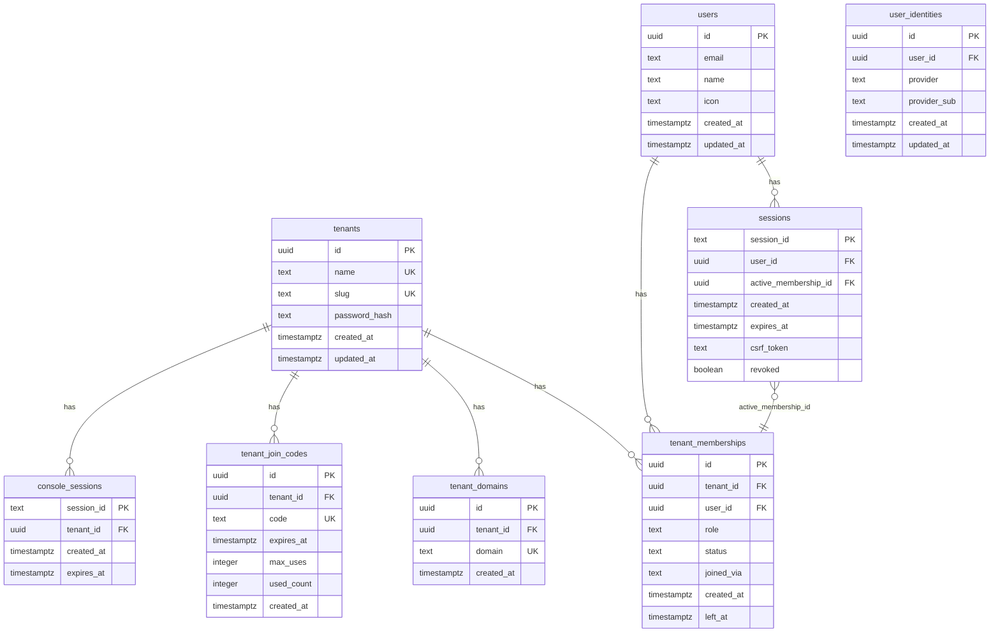

### ER 図（マルチテナント拡張）

```mermaid
erDiagram
  tenants {
    uuid id PK
    text name UK
    text slug UK
    text password_hash
    timestamptz created_at
    timestamptz updated_at
  }

  tenant_domains {
    uuid id PK
    uuid tenant_id FK
    text domain UK
    timestamptz created_at
  }

  tenant_join_codes {
    uuid id PK
    uuid tenant_id FK
    text code UK
    timestamptz expires_at
    integer max_uses
    integer used_count
    timestamptz created_at
  }

  tenant_memberships {
    uuid id PK
    uuid tenant_id FK
    uuid user_id FK
    text role
    text status
    text joined_via
    timestamptz created_at
    timestamptz left_at
  }

  users {
    uuid id PK
    text email
    text name
    text icon
    timestamptz created_at
    timestamptz updated_at
  }

  user_identities {
    uuid id PK
    uuid user_id FK
    text provider
    text provider_sub
    timestamptz created_at
    timestamptz updated_at
  }

  sessions {
    text session_id PK
    uuid user_id FK
    uuid active_membership_id FK
    timestamptz created_at
    timestamptz expires_at
    text csrf_token
    boolean revoked
  }


  console_sessions {
    text session_id PK
    uuid tenant_id FK
    timestamptz created_at
    timestamptz expires_at
  }

  tenants ||--o{ tenant_domains : has
  tenants ||--o{ tenant_join_codes : has
  tenants ||--o{ tenant_memberships : has
  users ||--o{ tenant_memberships : has
  users ||--o{ sessions : has
  tenants ||--o{ console_sessions : has
  sessions }o--|| tenant_memberships : active_membership_id

```

